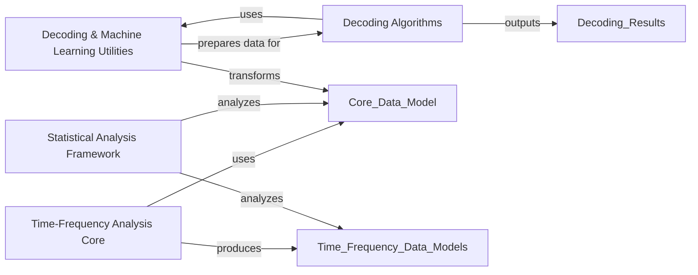

## Details

The `Advanced Analysis & Decoding` component in MNE-Python is a crucial part of the `Neuroscience Data Analysis Library`, providing sophisticated tools for in-depth neurophysiological data analysis. It aligns with the `Modular Design` and `Data-Centric Architecture` patterns by offering specialized modules that operate on core MNE data structures.

### Time-Frequency Analysis Core

This component provides the foundational data structures and algorithms for time-frequency analysis. It includes classes for representing time-frequency data (e.g., `AverageTFR`, `EpochsTFR`) and functions for decomposing signals into their time-frequency representations using various methods like Morlet wavelets, multitapers, and Stockwell transforms. This component is fundamental for understanding the spectral dynamics of neural activity.

**Related Classes/Methods**:

- <a href="https://github.com/mne-tools/mne-python/blob/main/mne/time_frequency/tfr.py#L1-L1" target="_blank" rel="noopener noreferrer">`mne.time_frequency.tfr` (1:1)</a>

- <a href="https://github.com/mne-tools/mne-python/blob/main/mne/time_frequency/spectrum.py#L1-L1" target="_blank" rel="noopener noreferrer">`mne.time_frequency.spectrum` (1:1)</a>

- <a href="https://github.com/mne-tools/mne-python/blob/main/mne/time_frequency/multitaper.py#L1-L1" target="_blank" rel="noopener noreferrer">`mne.time_frequency.multitaper` (1:1)</a>

- <a href="https://github.com/mne-tools/mne-python/blob/main/mne/time_frequency/_stockwell.py#L1-L1" target="_blank" rel="noopener noreferrer">`mne.time_frequency._stockwell` (1:1)</a>

- <a href="https://github.com/mne-tools/mne-python/blob/main/mne/time_frequency/csd.py#L1-L1" target="_blank" rel="noopener noreferrer">`mne.time_frequency.csd` (1:1)</a>

### Statistical Analysis Framework

This component offers a comprehensive suite of statistical tools, including parametric tests (t-tests, F-tests), non-parametric permutation tests, and methods for multiple comparison correction (FDR, Bonferroni). A key feature is cluster-level statistical analysis, which is essential for addressing the multiple comparisons problem in neuroimaging data by identifying significant spatio-temporal clusters. This component is fundamental for drawing statistically sound conclusions from neurophysiological data.

**Related Classes/Methods**:

- <a href="https://github.com/mne-tools/mne-python/blob/main/mne/stats/parametric.py#L1-L1" target="_blank" rel="noopener noreferrer">`mne.stats.parametric` (1:1)</a>

- <a href="https://github.com/mne-tools/mne-python/blob/main/mne/stats/multi_comp.py#L1-L1" target="_blank" rel="noopener noreferrer">`mne.stats.multi_comp` (1:1)</a>

- <a href="https://github.com/mne-tools/mne-python/blob/main/mne/stats/permutations.py#L1-L1" target="_blank" rel="noopener noreferrer">`mne.stats.permutations` (1:1)</a>

- <a href="https://github.com/mne-tools/mne-python/blob/main/mne/stats/cluster_level.py#L1-L1" target="_blank" rel="noopener noreferrer">`mne.stats.cluster_level` (1:1)</a>

### Decoding & Machine Learning Utilities

This component provides a set of utility classes and functions for preparing neurophysiological data for machine learning and decoding analyses. It includes transformers for data scaling, vectorization, Power Spectral Density (PSD) estimation, and filtering. These utilities are crucial preprocessing steps that ensure data is in an optimal format for subsequent decoding algorithms. This component is fundamental for applying machine learning techniques to extract information from neural signals.

**Related Classes/Methods**:

- <a href="https://github.com/mne-tools/mne-python/blob/main/mne/decoding/transformer.py#L1-L1" target="_blank" rel="noopener noreferrer">`mne.decoding.transformer` (1:1)</a>

### Decoding Algorithms

This component implements various machine learning algorithms specifically tailored for decoding neurophysiological data. This includes spatial filtering techniques like Common Spatial Patterns (CSP) and Spatially Patterned Covariance (SPoC), as well as estimators for time-resolved and generalization decoding (e.g., `SlidingEstimator`, `GeneralizingEstimator`). It also encompasses models for continuous data, such as receptive field and time-delaying ridge regression. This component is fundamental for building predictive models of brain activity and understanding neural representations.

**Related Classes/Methods**:

- <a href="https://github.com/mne-tools/mne-python/blob/main/mne/decoding/csp.py#L1-L1" target="_blank" rel="noopener noreferrer">`mne.decoding.csp` (1:1)</a>

- <a href="https://github.com/mne-tools/mne-python/blob/main/mne/decoding/search_light.py#L1-L1" target="_blank" rel="noopener noreferrer">`mne.decoding.search_light` (1:1)</a>

- <a href="https://github.com/mne-tools/mne-python/blob/main/mne/decoding/receptive_field.py#L1-L1" target="_blank" rel="noopener noreferrer">`mne.decoding.receptive_field` (1:1)</a>

- <a href="https://github.com/mne-tools/mne-python/blob/main/mne/decoding/time_delaying_ridge.py#L1-L1" target="_blank" rel="noopener noreferrer">`mne.decoding.time_delaying_ridge` (1:1)</a>

### [FAQ](https://github.com/CodeBoarding/GeneratedOnBoardings/tree/main?tab=readme-ov-file#faq)