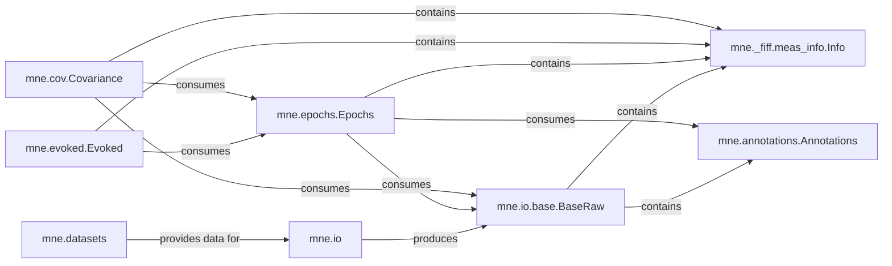

## Details

The `Data Management & Core Models` component in MNE-Python is fundamental to the library's operation, serving as the backbone for all neuroimaging data handling. It adheres to the "Data-Centric Architecture" pattern, where core data objects are central, and other components interact with these objects. The "Modular Design" pattern is also evident, as different data formats are handled by specific sub-modules within `mne.io`, and each core data structure is encapsulated in its own module.

### mne.io

This component is responsible for reading and writing various neuroimaging data formats (e.g., FIF, EDF, BrainVision, KIT). It acts as a facade for different raw data readers, providing a unified interface for loading diverse datasets.

**Related Classes/Methods**:

- `mne.io` (1:1)

- <a href="https://github.com/mne-tools/mne-python/blob/main/mne/io/fiff/raw.py#L1-L1" target="_blank" rel="noopener noreferrer">`mne.io.fiff.raw` (1:1)</a>

- <a href="https://github.com/mne-tools/mne-python/blob/main/mne/io/edf/edf.py#L1-L1" target="_blank" rel="noopener noreferrer">`mne.io.edf.edf` (1:1)</a>

### mne.io.base.BaseRaw

This is the foundational abstract class for representing continuous raw neurophysiological data. It provides common methods and attributes for all raw data types, ensuring consistency across different acquisition systems.

**Related Classes/Methods**:

- <a href="https://github.com/mne-tools/mne-python/blob/main/mne/io/base.py#L107-L2564" target="_blank" rel="noopener noreferrer">`mne.io.base.BaseRaw` (107:2564)</a>

### mne._fiff.meas_info.Info

This class stores comprehensive metadata about a neuroimaging recording, including channel names, types, sampling frequency, sensor locations, and acquisition parameters. It's crucial for correctly interpreting and processing the data.

**Related Classes/Methods**:

- <a href="https://github.com/mne-tools/mne-python/blob/main/mne/_fiff/meas_info.py#L1170-L1966" target="_blank" rel="noopener noreferrer">`mne._fiff.meas_info.Info` (1170:1966)</a>

### mne.annotations.Annotations

This component manages annotations and events within the data, such as bad segments, experimental events, or physiological markers. These annotations are critical for data cleaning, epoching, and event-related analysis.

**Related Classes/Methods**:

- <a href="https://github.com/mne-tools/mne-python/blob/main/mne/annotations.py#L216-L915" target="_blank" rel="noopener noreferrer">`mne.annotations.Annotations` (216:915)</a>

### mne.epochs.Epochs

This class represents data segmented into trials or epochs, typically extracted around specific events. It's a key data structure for event-related potential (ERP) and event-related field (ERF) analysis.

**Related Classes/Methods**:

- <a href="https://github.com/mne-tools/mne-python/blob/main/mne/epochs.py#L3418-L3667" target="_blank" rel="noopener noreferrer">`mne.epochs.Epochs` (3418:3667)</a>

### mne.evoked.Evoked

This class represents averaged data across multiple epochs, typically used to visualize and analyze event-related potentials/fields. Averaging improves the signal-to-noise ratio.

**Related Classes/Methods**:

- <a href="https://github.com/mne-tools/mne-python/blob/main/mne/evoked.py#L96-L1400" target="_blank" rel="noopener noreferrer">`mne.evoked.Evoked` (96:1400)</a>

### mne.cov.Covariance

This component handles the noise covariance matrix, which is essential for source localization and inverse modeling. It characterizes the noise present in the data.

**Related Classes/Methods**:

- <a href="https://github.com/mne-tools/mne-python/blob/main/mne/cov.py#L99-L471" target="_blank" rel="noopener noreferrer">`mne.cov.Covariance` (99:471)</a>

- <a href="https://github.com/mne-tools/mne-python/blob/main/mne/cov.py#L1-L1" target="_blank" rel="noopener noreferrer">`mne.cov.cov` (1:1)</a>

### mne.datasets

This component provides access to various publicly available neuroimaging datasets. These datasets are invaluable for examples, tutorials, testing, and demonstrating MNE-Python's capabilities.

**Related Classes/Methods**:

- `mne.datasets` (1:1)

### [FAQ](https://github.com/CodeBoarding/GeneratedOnBoardings/tree/main?tab=readme-ov-file#faq)