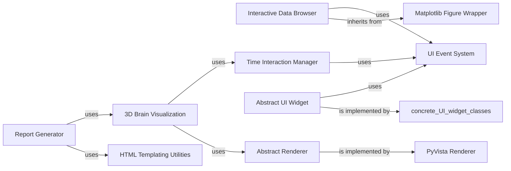

## Details

One paragraph explaining the functionality which is represented by this graph. What the main flow is and what is its purpose.

### Report Generator

This is the primary component for creating rich, interactive HTML reports that summarize MNE-Python analysis results. It acts as a high-level interface to aggregate various data objects, figures, and textual information into a single, shareable document.

**Related Classes/Methods**:

- <a href="https://github.com/mne-tools/mne-python/blob/main/mne/report/report.py#L701-L4502" target="_blank" rel="noopener noreferrer">`mne.report.Report` (701:4502)</a>

### Interactive Data Browser

This component offers a dynamic and interactive graphical user interface for exploring raw, epoch, and evoked neuroscience data. Users can scroll through time series, mark bad channels or epochs, and view associated plots, making it crucial for data inspection and quality control.

**Related Classes/Methods**:

- <a href="https://github.com/mne-tools/mne-python/blob/main/mne/viz/_mpl_figure.py#L1-L1" target="_blank" rel="noopener noreferrer">`mne.viz._mpl_figure.MNEBrowseFigure` (1:1)</a>

### 3D Brain Visualization

This component is dedicated to rendering and interacting with 3D brain models. It allows for the visualization of source estimates, anatomical labels, and other volumetric or surface-based data, providing a crucial tool for spatial analysis in neuroimaging.

**Related Classes/Methods**:

- <a href="https://github.com/mne-tools/mne-python/blob/main/mne/viz/_brain/_brain.py#L90-L4037" target="_blank" rel="noopener noreferrer">`mne.viz._brain._brain.Brain` (90:4037)</a>

### Abstract Renderer

This abstract component defines a standardized interface for all rendering operations, regardless of whether they are 2D (e.g., Matplotlib) or 3D (e.g., PyVista). It ensures that higher-level visualization components can interact with different graphics backends consistently, promoting modularity and extensibility.

**Related Classes/Methods**:

- <a href="https://github.com/mne-tools/mne-python/blob/main/mne/viz/backends/_abstract.py#L56-L612" target="_blank" rel="noopener noreferrer">`mne.viz.backends._abstract._AbstractRenderer` (56:612)</a>

### Abstract UI Widget

This abstract base class provides a unified API for creating and managing interactive user interface elements such as buttons, sliders, checkboxes, and text inputs. Concrete implementations exist for different UI toolkits (e.g., Jupyter's ipywidgets, PyQt6), ensuring consistent interaction across environments.

**Related Classes/Methods**:

- <a href="https://github.com/mne-tools/mne-python/blob/main/mne/viz/backends/_abstract.py#L620-L679" target="_blank" rel="noopener noreferrer">`mne.viz.backends._abstract._AbstractWidget` (620:679)</a>

### Matplotlib Figure Wrapper

This is a foundational component that encapsulates Matplotlib figures, providing common functionalities and integrating them seamlessly into the MNE-Python visualization framework. Other Matplotlib-based figures, like MNEBrowseFigure, inherit from this class.

**Related Classes/Methods**:

- <a href="https://github.com/mne-tools/mne-python/blob/main/mne/viz/_mpl_figure.py#L1-L1" target="_blank" rel="noopener noreferrer">`mne.viz._mpl_figure.MNEFigure` (1:1)</a>

### PyVista Renderer

A concrete implementation of the Abstract Renderer that utilizes the PyVista library for high-performance 3D visualization, particularly for brain surfaces and volumetric data.

**Related Classes/Methods**:

- <a href="https://github.com/mne-tools/mne-python/blob/main/mne/viz/backends/_pyvista.py#L1-L1" target="_blank" rel="noopener noreferrer">`mne.viz.backends._pyvista._PyVistaRenderer` (1:1)</a>

### HTML Templating Utilities

This component provides the underlying HTML structure and rendering logic for generating rich, interactive reports. It defines templates and helper functions to embed various data representations and plots into HTML documents.

**Related Classes/Methods**:

- `mne.html_templates` (1:1)

### UI Event System

This module implements an event-driven mechanism for managing and dispatching custom UI events. It enables decoupled communication between different interactive components within the visualization subsystem, promoting flexibility and extensibility.

**Related Classes/Methods**:

- <a href="https://github.com/mne-tools/mne-python/blob/main/mne/viz/ui_events.py#L1-L1" target="_blank" rel="noopener noreferrer">`mne.viz.ui_events.UIEvent` (1:1)</a>

### Time Interaction Manager

This component is responsible for controlling and synchronizing time-based aspects across various visualizations. It manages functionalities like playback, time-point selection, and animation, which are critical for exploring dynamic neuroscience data.

**Related Classes/Methods**:

- <a href="https://github.com/mne-tools/mne-python/blob/main/mne/viz/backends/renderer.py#L411-L586" target="_blank" rel="noopener noreferrer">`mne.viz.backends.renderer._TimeInteraction` (411:586)</a>

### [FAQ](https://github.com/CodeBoarding/GeneratedOnBoardings/tree/main?tab=readme-ov-file#faq)