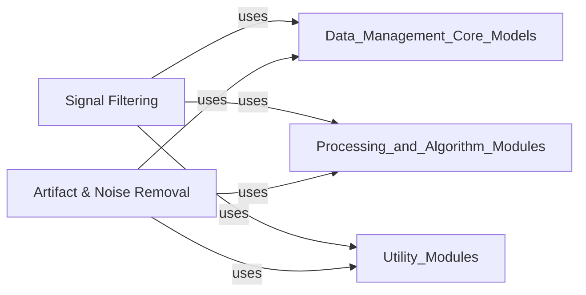

## Details

This document provides an overview of the `Signal Preprocessing` component, detailing its sub-components, their responsibilities, and their relationships within a Neuroscience Data Analysis Library.

### Signal Filtering

This component provides core functionalities for applying various digital filters (e.g., band-pass, low-pass, high-pass, notch) to neurophysiological data. It leverages a `FilterMixin` to integrate filtering directly into core data structures like `Raw`, `Epochs`, and `Evoked` objects, allowing for efficient in-place data manipulation. This ensures that filtering is a seamlessly integrated and fundamental operation on the primary data models.

**Related Classes/Methods**:

- <a href="https://github.com/mne-tools/mne-python/blob/main/mne/filter.py#L2369-L2778" target="_blank" rel="noopener noreferrer">`mne.filter.FilterMixin` (2369:2778)</a>

- <a href="https://github.com/mne-tools/mne-python/blob/main/mne/filter.py#L928-L1033" target="_blank" rel="noopener noreferrer">`mne.filter.filter_data` (928:1033)</a>

- <a href="https://github.com/mne-tools/mne-python/blob/main/mne/filter.py#L1420-L1585" target="_blank" rel="noopener noreferrer">`mne.filter.notch_filter` (1420:1585)</a>

- <a href="https://github.com/mne-tools/mne-python/blob/main/mne/filter.py#L1799-L1891" target="_blank" rel="noopener noreferrer">`mne.filter.resample` (1799:1891)</a>

### Artifact & Noise Removal

This component encompasses a comprehensive suite of advanced techniques for detecting, characterizing, and removing various biological and environmental artifacts and noise components from neurophysiological data. This includes methods for ocular (EOG) and cardiac (ECG) artifact removal, muscle artifact suppression, Independent Component Analysis (ICA) for source separation, Maxwell filtering (SSS) for MEG noise reduction, and bad channel interpolation. It aims to clean the data to improve the signal-to-noise ratio for subsequent analyses.

**Related Classes/Methods**:

- <a href="https://github.com/mne-tools/mne-python/blob/main/mne/preprocessing/ica.py#L201-L2682" target="_blank" rel="noopener noreferrer">`mne.preprocessing.ica.ICA` (201:2682)</a>

- `mne.preprocessing.create_ecg_epochs` (1:1)

- `mne.preprocessing.create_eog_epochs` (1:1)

- `mne.preprocessing.maxwell_filter` (1:1)

- `mne.preprocessing.interpolate_bad_channels` (1:1)

- `mne.preprocessing.compute_proj_ecg` (1:1)

- `mne.preprocessing.compute_proj_eog` (1:1)

### [FAQ](https://github.com/CodeBoarding/GeneratedOnBoardings/tree/main?tab=readme-ov-file#faq)