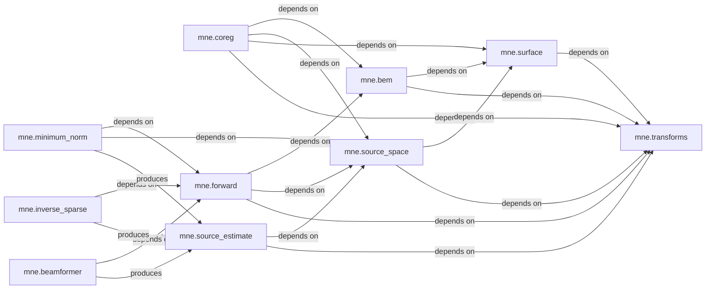

## Details

The `Source Analysis` component in MNE-Python is a critical part of the neuroscience data analysis pipeline, focusing on localizing neural activity within the brain. It integrates several sub-components to achieve this, moving from anatomical data processing to the final estimation of brain activity. This analysis details the core components, their responsibilities, and interactions within the Source Analysis pipeline, highlighting their fundamental roles and interdependencies. The pipeline follows a clear flow from anatomical data processing to final source estimation, aligning with 'Layered Architecture', 'Modular Design', and 'Data-Centric Architecture' patterns where `SourceEstimate` serves as a central data model for the output.

### mne.bem

This component is responsible for creating and managing Boundary Element Models (BEMs). BEMs are crucial for forward modeling as they represent the different tissue layers of the head (e.g., inner skull, outer skull, scalp). These models define the conductivity properties of the head, which are essential for accurately calculating how neural currents propagate to the sensors.

**Related Classes/Methods**:

- <a href="https://github.com/mne-tools/mne-python/blob/main/mne/bem.py#L1-L1" target="_blank" rel="noopener noreferrer">`mne.bem` (1:1)</a>

### mne.surface

This component handles operations related to brain surfaces, typically derived from FreeSurfer reconstructions (e.g., cortical surfaces). It provides functionalities for reading, writing, and manipulating surface geometries, which are often used to define the potential locations of neural activity (source space).

**Related Classes/Methods**:

- <a href="https://github.com/mne-tools/mne-python/blob/main/mne/surface.py#L1-L1" target="_blank" rel="noopener noreferrer">`mne.surface` (1:1)</a>

### mne.transforms

This component provides a robust framework for handling and applying coordinate transformations between various anatomical and sensor coordinate systems (e.g., MRI, head, MEG/EEG device). It is vital for integrating data from different modalities and ensuring that all data are aligned in a common reference frame.

**Related Classes/Methods**:

- <a href="https://github.com/mne-tools/mne-python/blob/main/mne/transforms.py#L1-L1" target="_blank" rel="noopener noreferrer">`mne.transforms` (1:1)</a>

### mne.coreg

This component focuses on aligning the coordinate frames of the MEG/EEG sensor data with the MRI anatomical data. This coregistration step is critical to accurately map sensor measurements to their corresponding brain locations. It often involves interactive graphical user interfaces to refine the alignment.

**Related Classes/Methods**:

- <a href="https://github.com/mne-tools/mne-python/blob/main/mne/coreg.py#L1-L1" target="_blank" rel="noopener noreferrer">`mne.coreg` (1:1)</a>

### mne.source_space

This component defines the set of discrete locations (vertices on a surface or voxels in a volume) within the brain where neural activity is assumed to originate. It handles the creation and manipulation of these source spaces, which can be defined on the cortical surface, in the brain volume, or as a combination.

**Related Classes/Methods**:

- `mne.source_space` (1:1)

### mne.forward

This component computes the forward solution, also known as the leadfield matrix. The leadfield matrix mathematically describes how a current dipole at each source location would be measured by each sensor. It is the crucial link between the unobservable brain activity and the observable sensor data.

**Related Classes/Methods**:

- `mne.forward` (1:1)

### mne.minimum_norm

This component implements various minimum norm inverse methods (e.g., MNE, dSPM, sLORETA) to estimate the distributed neural activity in the brain from sensor data. These methods aim to find the simplest source distribution that explains the observed sensor data, often favoring solutions with minimum overall energy.

**Related Classes/Methods**:

- `mne.minimum_norm` (1:1)

### mne.inverse_sparse

This component provides algorithms for sparse inverse solutions (e.g., L1-based methods like MxNE, Gamma-MAP). These methods promote focal source estimates, which can be beneficial for identifying discrete active brain regions by encouraging sparsity in the estimated source activity.

**Related Classes/Methods**:

- `mne.inverse_sparse` (1:1)

### mne.beamformer

This component implements beamforming techniques (e.g., LCMV, DICS, RAP-MUSIC) for source localization. Beamformers act as spatial filters, optimally suppressing noise and interference to estimate activity at specific brain locations. They are particularly effective at localizing deep sources and handling correlated noise.

**Related Classes/Methods**:

- `mne.beamformer` (1:1)

### mne.source_estimate

This component defines the `SourceEstimate` class and related utilities for representing the estimated neural activity in source space. This is the primary data structure for the output of source localization. It encapsulates the estimated amplitudes/currents over time and across source locations, providing a standardized way to store and manipulate source-level results.

**Related Classes/Methods**:

- <a href="https://github.com/mne-tools/mne-python/blob/main/mne/source_estimate.py#L1-L1" target="_blank" rel="noopener noreferrer">`mne.source_estimate` (1:1)</a>

### [FAQ](https://github.com/CodeBoarding/GeneratedOnBoardings/tree/main?tab=readme-ov-file#faq)