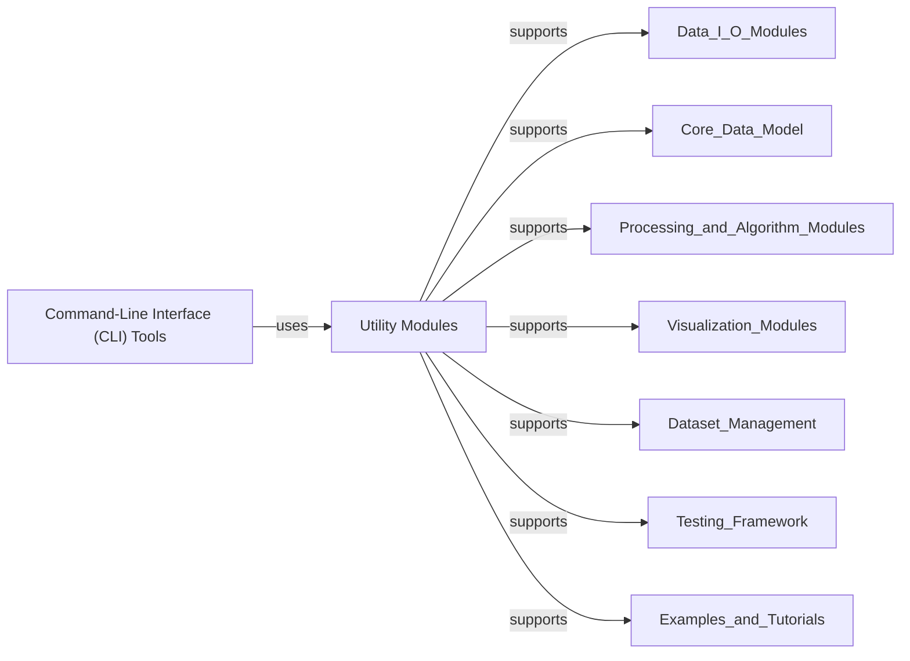

## Details

This overarching component provides essential support services and user interaction mechanisms for the entire MNE-Python library. It is divided into two fundamental sub-components: Utility Modules and Command-Line Interface (CLI) Tools.

### Utility Modules

This component serves as the foundational backbone of the MNE-Python library, offering a comprehensive collection of general-purpose helper functions, classes, and mixins. Its functionalities span critical areas such as input validation, configuration management, robust logging, testing utilities, numerical operations, and compatibility fixes. The `mne.parallel` sub-module, a key part of this component, provides tools for parallelizing computations, which is vital for performance in a neuroscience data analysis library dealing with large datasets.

**Related Classes/Methods**:

- <a href="https://github.com/mne-tools/mne-python/blob/main/mne/utils/_bunch.py#L12-L17" target="_blank" rel="noopener noreferrer">`mne.utils._bunch.Bunch` (12:17)</a>

- <a href="https://github.com/mne-tools/mne-python/blob/main/mne/utils/_logging.py#L299-L307" target="_blank" rel="noopener noreferrer">`mne.utils._logging.ClosingStringIO` (299:307)</a>

- <a href="https://github.com/mne-tools/mne-python/blob/main/mne/utils/progressbar.py#L21-L191" target="_blank" rel="noopener noreferrer">`mne.utils.progressbar.ProgressBar` (21:191)</a>

- <a href="https://github.com/mne-tools/mne-python/blob/main/mne/utils/mixin.py#L492-L574" target="_blank" rel="noopener noreferrer">`mne.utils.mixin.TimeMixin` (492:574)</a>

- <a href="https://github.com/mne-tools/mne-python/blob/main/mne/parallel.py#L23-L153" target="_blank" rel="noopener noreferrer">`mne.parallel.parallel_func` (23:153)</a>

### Command-Line Interface (CLI) Tools

This component provides a user-friendly command-line interface to various MNE-Python functionalities. It enables users to perform common neuroimaging operations directly from the terminal, facilitating scripting, automation, and seamless integration into larger data processing workflows. Acting as a facade, it simplifies complex library operations into straightforward commands, abstracting away the underlying complexities of the core MNE-Python library.

**Related Classes/Methods**:

- <a href="https://github.com/mne-tools/mne-python/blob/main/mne/commands/mne_anonymize.py#L25-L56" target="_blank" rel="noopener noreferrer">`mne.commands.mne_anonymize` (25:56)</a>

- <a href="https://github.com/mne-tools/mne-python/blob/main/mne/commands/mne_browse_raw.py#L1-L1" target="_blank" rel="noopener noreferrer">`mne.commands.mne_browse_raw` (1:1)</a>

- <a href="https://github.com/mne-tools/mne-python/blob/main/mne/commands/mne_compute_proj_ecg.py#L1-L1" target="_blank" rel="noopener noreferrer">`mne.commands.mne_compute_proj_ecg` (1:1)</a>

- <a href="https://github.com/mne-tools/mne-python/blob/main/mne/commands/mne_setup_forward_model.py#L1-L1" target="_blank" rel="noopener noreferrer">`mne.commands.mne_setup_forward_model` (1:1)</a>

- <a href="https://github.com/mne-tools/mne-python/blob/main/mne/commands/utils.py#L1-L1" target="_blank" rel="noopener noreferrer">`mne.commands.utils.run` (1:1)</a>

### [FAQ](https://github.com/CodeBoarding/GeneratedOnBoardings/tree/main?tab=readme-ov-file#faq)