```mermaid

graph LR

    Data_Management_Core_Models["Data Management & Core Models"]

    Signal_Preprocessing["Signal Preprocessing"]

    Source_Analysis["Source Analysis"]

    Advanced_Analysis_Decoding["Advanced Analysis & Decoding"]

    Data_Simulation["Data Simulation"]

    Output_Visualization["Output & Visualization"]

    System_Utilities_CLI["System Utilities & CLI"]

    Data_Management_Core_Models -- "provides raw/processed data to" --> Signal_Preprocessing

    Data_Management_Core_Models -- "provides raw/processed data to" --> Source_Analysis

    Data_Management_Core_Models -- "provides raw/processed data to" --> Advanced_Analysis_Decoding

    Data_Management_Core_Models -- "provides raw/processed data to" --> Output_Visualization

    Signal_Preprocessing -- "outputs processed data to" --> Data_Management_Core_Models

    Source_Analysis -- "outputs source estimates to" --> Data_Management_Core_Models

    Data_Simulation -- "outputs simulated data to" --> Data_Management_Core_Models

    Data_Management_Core_Models -- "interacts with" --> System_Utilities_CLI

    Data_Management_Core_Models -- "receives raw data from" --> Data_Management_Core_Models

    Signal_Preprocessing -- "provides processed data to" --> Source_Analysis

    Signal_Preprocessing -- "provides processed data to" --> Advanced_Analysis_Decoding

    Signal_Preprocessing -- "provides processed data to" --> Output_Visualization

    Signal_Preprocessing -- "interacts with" --> System_Utilities_CLI

    Data_Management_Core_Models -- "receives data from" --> Data_Management_Core_Models

    Signal_Preprocessing -- "receives processed data from" --> Data_Management_Core_Models

    Source_Analysis -- "provides source estimates/models to" --> Advanced_Analysis_Decoding

    Source_Analysis -- "provides source estimates/models to" --> Data_Simulation

    Source_Analysis -- "provides anatomical/source info to" --> Output_Visualization

    Source_Analysis -- "interacts with" --> System_Utilities_CLI

    Advanced_Analysis_Decoding -- "outputs analysis results to" --> Output_Visualization

    Advanced_Analysis_Decoding -- "interacts with" --> System_Utilities_CLI

    Data_Management_Core_Models -- "receives data from" --> Data_Management_Core_Models

    Signal_Preprocessing -- "receives processed data from" --> Data_Management_Core_Models

    Source_Analysis -- "receives source estimates from" --> Data_Management_Core_Models

    Data_Simulation -- "outputs simulated data to" --> Data_Management_Core_Models

    Data_Simulation -- "interacts with" --> System_Utilities_CLI

    Output_Visualization -- "interacts with" --> System_Utilities_CLI

    System_Utilities_CLI -- "provides support services to" --> Data_Management_Core_Models

    System_Utilities_CLI -- "provides support services to" --> Signal_Preprocessing

    System_Utilities_CLI -- "provides support services to" --> Source_Analysis

    System_Utilities_CLI -- "provides support services to" --> Advanced_Analysis_Decoding

    System_Utilities_CLI -- "provides support services to" --> Data_Simulation

    System_Utilities_CLI -- "provides support services to" --> Output_Visualization

    click Data_Management_Core_Models href "https://github.com/mne-tools/mne-python/blob/main/.codeboarding//Data_Management_Core_Models.md" "Details"

    click Signal_Preprocessing href "https://github.com/mne-tools/mne-python/blob/main/.codeboarding//Signal_Preprocessing.md" "Details"

    click Source_Analysis href "https://github.com/mne-tools/mne-python/blob/main/.codeboarding//Source_Analysis.md" "Details"

    click Advanced_Analysis_Decoding href "https://github.com/mne-tools/mne-python/blob/main/.codeboarding//Advanced_Analysis_Decoding.md" "Details"

    click Output_Visualization href "https://github.com/mne-tools/mne-python/blob/main/.codeboarding//Output_Visualization.md" "Details"

    click System_Utilities_CLI href "https://github.com/mne-tools/mne-python/blob/main/.codeboarding//System_Utilities_CLI.md" "Details"

```

## Details

The `mne-python` architecture is designed as a comprehensive neuroscience data analysis library, emphasizing modularity, clear data flow, and specialized processing stages. The core of the system revolves around central data models that are progressively transformed and analyzed by distinct functional components.

### Data Management & Core Models [[Expand]](./Data_Management_Core_Models.md)

This foundational component is responsible for all aspects of data input/output (reading/writing various neuroimaging formats like FIF, EDF, BrainVision) and the definition of core in-memory data structures. It provides access to example datasets and defines the fundamental data objects (`Info`, `Annotations`, `Epochs`, `Evoked`, `Covariance`, `Raw`) that serve as the central data model for all subsequent processing and analysis stages.

**Related Classes/Methods**:

- `mne.io`

- `mne.datasets`

- <a href="https://github.com/mne-tools/mne-python/blob/main/mne/_fiff/meas_info.py" target="_blank" rel="noopener noreferrer">`mne._fiff.meas_info`</a>

- <a href="https://github.com/mne-tools/mne-python/blob/main/mne/annotations.py" target="_blank" rel="noopener noreferrer">`mne.annotations`</a>

- <a href="https://github.com/mne-tools/mne-python/blob/main/mne/epochs.py" target="_blank" rel="noopener noreferrer">`mne.epochs`</a>

- <a href="https://github.com/mne-tools/mne-python/blob/main/mne/evoked.py" target="_blank" rel="noopener noreferrer">`mne.evoked`</a>

- <a href="https://github.com/mne-tools/mne-python/blob/main/mne/cov.py" target="_blank" rel="noopener noreferrer">`mne.cov`</a>

### Signal Preprocessing [[Expand]](./Signal_Preprocessing.md)

This component focuses on cleaning and preparing neurophysiological data for analysis. It includes functionalities for filtering (e.g., band-pass, notch), artifact detection and removal (e.g., ECG, EOG, muscle artifacts), Independent Component Analysis (ICA), Maxwell filtering (SSS), and bad channel interpolation. It takes raw or epoched data and outputs processed data, often updating the core data structures within the `Data Management & Core Models`.

**Related Classes/Methods**:

- <a href="https://github.com/mne-tools/mne-python/blob/main/mne/filter.py" target="_blank" rel="noopener noreferrer">`mne.filter`</a>

- `mne.preprocessing`

### Source Analysis [[Expand]](./Source_Analysis.md)

This comprehensive component handles the entire pipeline for localizing neural activity within the brain. It integrates functionalities for Head Modeling & Coregistration (managing anatomical data, BEM, coregistration), Source Space Definition (defining potential neural activity locations), Forward Modeling (computing the leadfield matrix), Inverse Modeling & Source Localization (estimating neural activity from sensor data), and Source Estimate Representation (defining data structures like `SourceEstimate`). It relies on anatomical information and sensor data to produce brain activity estimates.

**Related Classes/Methods**:

- <a href="https://github.com/mne-tools/mne-python/blob/main/mne/bem.py" target="_blank" rel="noopener noreferrer">`mne.bem`</a>

- <a href="https://github.com/mne-tools/mne-python/blob/main/mne/coreg.py" target="_blank" rel="noopener noreferrer">`mne.coreg`</a>

- <a href="https://github.com/mne-tools/mne-python/blob/main/mne/surface.py" target="_blank" rel="noopener noreferrer">`mne.surface`</a>

- <a href="https://github.com/mne-tools/mne-python/blob/main/mne/transforms.py" target="_blank" rel="noopener noreferrer">`mne.transforms`</a>

- `mne.source_space`

- `mne.forward`

- `mne.minimum_norm`

- `mne.inverse_sparse`

- `mne.beamformer`

- <a href="https://github.com/mne-tools/mne-python/blob/main/mne/source_estimate.py" target="_blank" rel="noopener noreferrer">`mne.source_estimate`</a>

### Advanced Analysis & Decoding [[Expand]](./Advanced_Analysis_Decoding.md)

This component provides specialized tools for in-depth analysis of neurophysiological data beyond basic preprocessing. It includes Time-Frequency Analysis (decomposing signals into time-frequency representations), Statistical Analysis (performing statistical tests like permutation testing and cluster-level statistics), and Machine Learning & Decoding (applying machine learning techniques for decoding and encoding models). It operates on processed sensor data or source estimates to derive higher-level insights.

**Related Classes/Methods**:

- `mne.time_frequency`

- `mne.stats`

- `mne.decoding`

### Data Simulation

This component allows users to generate synthetic M/EEG data. It can simulate raw data, evoked responses, or source activity based on specified forward models, noise characteristics, and source dynamics. This is valuable for testing algorithms, validating methods, and exploring theoretical scenarios. It often uses models from `Source Analysis` and outputs data into the `Data Management & Core Models`.

**Related Classes/Methods**:

- `mne.simulation`

### Output & Visualization [[Expand]](./Output_Visualization.md)

This component is responsible for presenting processed data and analysis results in various visual and report formats. It offers extensive plotting capabilities for 2D (e.g., topomaps, time courses) and 3D (e.g., brain surfaces, source activations) visualization of M/EEG data, anatomical structures, and source estimates. Additionally, it facilitates the generation of comprehensive HTML reports that summarize data processing and analysis workflows, including embedded plots and metadata.

**Related Classes/Methods**:

- `mne.viz`

- `mne.report`

### System Utilities & CLI [[Expand]](./System_Utilities_CLI.md)

This overarching component provides essential support services and user interaction mechanisms for the entire library. It includes a collection of general-purpose helper functions, configuration management, logging, testing utilities, and compatibility fixes. The Command-Line Interface (CLI) sub-component offers a set of command-line tools for common MNE-Python operations, enabling scripting, automation, and integration into larger workflows. It supports and interacts with all other components.

**Related Classes/Methods**:

- `mne.utils`

- <a href="https://github.com/mne-tools/mne-python/blob/main/mne/parallel.py" target="_blank" rel="noopener noreferrer">`mne.parallel`</a>

- `mne.commands`

### [FAQ](https://github.com/CodeBoarding/GeneratedOnBoardings/tree/main?tab=readme-ov-file#faq)