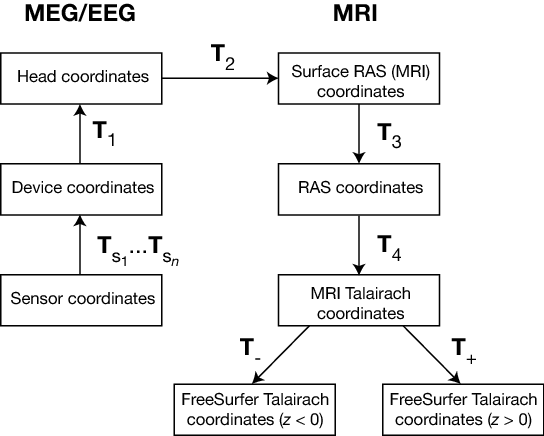
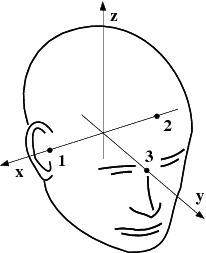

:orphan:

The forward solution
====================

This page covers the definitions of different coordinate systems employed in
MNE software and FreeSurfer, the details of the computation of the forward
solutions, and the associated low-level utilities.

.. contents:: Page contents
   :local:
   :depth: 2

.. NOTE: part of this file is included in doc/overview/implementation.rst.
   Changes here are reflected there. If you want to link to this content, link
   to :ref:`ch_forward` to link to that section of the implementation.rst page.
   The next line is a target for :start-after: so we can omit the title from
   the include:
   forward-begin-content

.. _coordinate_systems:

MEG/EEG and MRI coordinate systems
~~~~~~~~~~~~~~~~~~~~~~~~~~~~~~~~~~

.. sidebar:: Coordinate systems in MNE-Python

   In some MNE-Python objects (e.g., :class:`~mne.Forward`,
   :class:`~mne.SourceSpaces`, etc), information about the coordinate frame is
   encoded as a constant integer value. The meaning of those integers is
   determined `in the source code
   <https://github.com/mne-tools/mne-python/blob/master/mne/io/constants.py#L186-L197>`__.

The coordinate systems used in MNE software (and FreeSurfer) and their
relationships are depicted in :ref:`coordinate_system_figure`. Except for the
*sensor coordinates*, all of the coordinate systems are Cartesian and have the
"RAS" (Right-Anterior-Superior) orientation, *i.e.*, the :math:`x` axis points
to the right, the :math:`y` axis to the front, and the :math:`z` axis up.

.. _coordinate_system_figure:

    MEG/EEG and MRI coordinate systems

    The coordinate transforms present in the fif files in MNE and the
    FreeSurfer files as well as those set to fixed values are indicated with
    :math:`T_x`, where :math:`x` identifies the transformation.

The coordinate systems related to MEG/EEG data are:

**Head coordinates**

    This is a coordinate system defined with help of the fiducial landmarks
    (nasion and the two auricular points). In fif files, EEG electrode
    locations are given in this coordinate system. In addition, the head
    digitization data acquired in the beginning of an MEG, MEG/EEG, or EEG
    acquisition are expressed in head coordinates. For details, see
    :ref:`coordinate_systems`.

**Device coordinates**

    This is a coordinate system tied to the MEG device. The relationship of the
    Device and Head coordinates is determined during an MEG measurement by
    feeding current to three to five head-position indicator (HPI) coils and by
    determining their locations with respect to the MEG sensor array from the
    magnetic fields they generate.

**Sensor coordinates**

    Each MEG sensor has a local coordinate system defining the orientation and
    location of the sensor. With help of this coordinate system, the numerical
    integration data needed for the computation of the magnetic field can be
    expressed conveniently as discussed in :ref:`coil_geometry_information`.
    The channel information data in the fif files contain the information to
    specify the coordinate transformation between the coordinates of each
    sensor and the MEG device coordinates.

The coordinate systems related to MRI data are:

**Surface RAS coordinates**

    The FreeSurfer surface data are expressed in this coordinate system. The
    origin of this coordinate system is at the center of the conformed
    FreeSurfer MRI volumes (usually 256 x 256 x 256 isotropic 1-mm3  voxels)
    and the axes are oriented along the axes of this volume. The BEM surface
    and the locations of the sources in the source space are usually expressed
    in this coordinate system in the fif files. In this manual, the *Surface
    RAS coordinates* are usually referred to as *MRI coordinates* unless there
    is need to specifically discuss the different MRI-related coordinate
    systems.

**RAS coordinates**

    This coordinate system has axes identical to the Surface RAS coordinates
    but the location of the origin is different and defined by the original MRI
    data, i.e. , the origin is in a scanner-dependent location. There is hardly
    any need to refer to this coordinate system explicitly in the analysis with
    the MNE software. However, since the Talairach coordinates, discussed
    below, are defined with respect to *RAS coordinates* rather than the
    *Surface RAS coordinates*, the RAS coordinate system is implicitly involved
    in the transformation between Surface RAS coordinates and the two
    *Talairach* coordinate systems.

**MNI Talairach coordinates**

    The definition of this coordinate system is discussed, e.g., in
    http://imaging.mrc-cbu.cam.ac.uk/imaging/MniTalairach. This transformation
    is determined during the FreeSurfer reconstruction process. These
    coordinates are in MNI305 space.

**FreeSurfer Talairach coordinates**

    The problem with the MNI Talairach coordinates is that the linear MNI
    Talairach transform does not match the brains completely to the Talairach
    brain. This is probably because the Talairach atlas brain is a rather odd
    shape, and as a result, it is difficult to match a standard brain to the
    atlas brain using an affine transform. As a result, the MNI brains are
    slightly larger (in particular higher, deeper and longer) than the
    Talairach brain. The differences are larger as you get further from the
    middle of the brain, towards the outside. The FreeSurfer Talairach
    coordinates mitigate this problem by additing a an additional
    transformation, defined separately for negatice and positive MNI Talairach
    :math:`z` coordinates. These two transformations, denoted by :math:`T_-`
    and :math:`T_+` in :ref:`coordinate_system_figure`, are fixed as discussed in
    http://imaging.mrc-cbu.cam.ac.uk/imaging/MniTalairach (*Approach 2*).

The different coordinate systems are related by coordinate transformations
depicted in :ref:`coordinate_system_figure`. The arrows and coordinate
transformation symbols (:math:`T_x`) indicate the transformations actually
present in the FreeSurfer files. Generally,

.. math::    \begin{bmatrix}
		x_2 \\
		y_2 \\
		z_2 \\
		1
	        \end{bmatrix} = T_{12} \begin{bmatrix}
		x_1 \\
		y_1 \\
		z_1 \\
		1
	        \end{bmatrix} = \begin{bmatrix}
		R_{11} & R_{12} & R_{13} & x_0 \\
		R_{21} & R_{22} & R_{23} & y_0 \\
		R_{31} & R_{32} & R_{33} & z_0 \\
		0 & 0 & 0 & 1
	        \end{bmatrix} \begin{bmatrix}
		x_1 \\
		y_1 \\
		z_1 \\
		1
	        \end{bmatrix}\ ,

where :math:`x_k`, :math:`y_k`,and :math:`z_k` are the location coordinates in
two coordinate systems, :math:`T_{12}` is the coordinate transformation from
coordinate system "1" to "2", :math:`x_0`, :math:`y_0`, and :math:`z_0` is the
location of the origin of coordinate system "1" in coordinate system "2", and
:math:`R_{jk}` are the elements of the rotation matrix relating the two
coordinate systems. The coordinate transformations are present in different
files produced by FreeSurfer and MNE.
The fixed transformations :math:`T_-` and :math:`T_+` are:

.. math::    T_{-} = \begin{bmatrix}
		0.99 & 0 & 0 & 0 \\
		0 & 0.9688 & 0.042 & 0 \\
		0 & -0.0485 & 0.839 & 0 \\
		0 & 0 & 0 & 1
	        \end{bmatrix}

and

.. math::    T_{+} = \begin{bmatrix}
		0.99 & 0 & 0 & 0 \\
		0 & 0.9688 & 0.046 & 0 \\
		0 & -0.0485 & 0.9189 & 0 \\
		0 & 0 & 0 & 1
	        \end{bmatrix}

.. note::
   This section does not discuss the transformation between the MRI voxel
   indices and the different MRI coordinates. However, it is important to note
   that in FreeSurfer, MNE, as well as in Neuromag software an integer voxel
   coordinate corresponds to the location of the center of a voxel. Detailed
   information on the FreeSurfer MRI systems can be found at
   https://surfer.nmr.mgh.harvard.edu/fswiki/CoordinateSystems.
   The symbols :math:`T_x` are defined in :ref:`coordinate_system_figure`.

.. tabularcolumns:: |p{0.2\linewidth}|p{0.3\linewidth}|p{0.5\linewidth}|
.. table:: Coordinate transformations in FreeSurfer and MNE software packages.

    +------------------------------+-------------------------------+-------------------------------------------------+
    | Transformation               | FreeSurfer                    | MNE                                             |
    +------------------------------+-------------------------------+-------------------------------------------------+
    | :math:`T_1`                  | Not present                   | | Measurement data files                        |
    |                              |                               | | Forward solution files (`*fwd.fif`)           |
    |                              |                               | | Inverse operator files (`*inv.fif`)           |
    +------------------------------+-------------------------------+-------------------------------------------------+
    | :math:`T_{s_1}\dots T_{s_n}` | Not present                   | Channel information in files                    |
    |                              |                               | containing :math:`T_1`.                         |
    +------------------------------+-------------------------------+-------------------------------------------------+
    | :math:`T_2`                  | Not present                   | | MRI description filesSeparate                 |
    |                              |                               | | Separate ``-trans.fif`` files                 |
    |                              |                               | | from :ref:`gen_mne_coreg`                     |
    |                              |                               | | Forward solution files                        |
    |                              |                               | | Inverse operator files                        |
    +------------------------------+-------------------------------+-------------------------------------------------+
    | :math:`T_3`                  | `mri/*mgz` files              | :class:`nibabel.freesurfer.mghformat.MGHImage`  |
    +------------------------------+-------------------------------+-------------------------------------------------+
    | :math:`T_4`                  | mri/transforms/talairach.xfm  | Internal reading                                |
    +------------------------------+-------------------------------+-------------------------------------------------+
    | :math:`T_-`                  | Hardcoded in software         | Hardcoded in software.                          |
    +------------------------------+-------------------------------+-------------------------------------------------+
    | :math:`T_+`                  | Hardcoded in software         | Hardcoded in software.                          |
    +------------------------------+-------------------------------+-------------------------------------------------+

.. _head_device_coords:

The head and device coordinate systems
~~~~~~~~~~~~~~~~~~~~~~~~~~~~~~~~~~~~~~

    The head coordinate system

The MEG/EEG head coordinate system employed in the MNE software is a
right-handed Cartesian coordinate system. The direction of :math:`x` axis is
from left to right, that of :math:`y` axis to the front, and the :math:`z` axis
thus points up.

The :math:`x` axis of the head coordinate system passes through the two
periauricular or preauricular points digitized before acquiring the data with
positive direction to the right. The :math:`y` axis passes through the nasion
and is normal to the :math:`x` axis. The :math:`z` axis points up according to
the right-hand rule and is normal to the :math:`xy` plane.

The origin of the MEG device coordinate system is device dependent. Its origin
is located approximately at the center of a sphere which fits the occipital
section of the MEG helmet best with :math:`x` axis axis going from left to
right and :math:`y` axis pointing front. The :math:`z` axis is, again, normal
to the :math:`xy` plane with positive direction up.

.. note::
   The above definition is identical to that of the Neuromag MEG/EEG (head)
   coordinate system. However, in 4-D Neuroimaging and CTF MEG systems the head
   coordinate frame definition is different. The origin of the coordinate
   system is at the midpoint of the left and right auricular points. The
   :math:`x` axis passes through the nasion and the origin with positive
   direction to the front. The :math:`y` axis is perpendicular to the :math:`x`
   axis on the and lies in the plane defined by the three fiducial landmarks,
   positive direction from right to left. The :math:`z` axis is normal to the
   plane of the landmarks, pointing up. Note that in this convention the
   auricular points are not necessarily located on :math:`y` coordinate axis.
   The file conversion utilities take care of these idiosyncrasies and convert
   all coordinate information to the MNE software head coordinate frame.

Creating a surface-based source space
~~~~~~~~~~~~~~~~~~~~~~~~~~~~~~~~~~~~~

The fif format source space files containing the dipole locations and
orientations are created with :func:`mne.setup_source_space`.

Creating a volumetric or discrete source space
~~~~~~~~~~~~~~~~~~~~~~~~~~~~~~~~~~~~~~~~~~~~~~

In addition to source spaces confined to a surface, the MNE software provides
some support for three-dimensional source spaces bounded by a surface as well
as source spaces comprised of discrete, arbitrarily located source points. The
:func:`mne.setup_volume_source_space` utility assists in generating such source
spaces.

Creating the BEM meshes
~~~~~~~~~~~~~~~~~~~~~~~

See :ref:`bem-model`.

Topology checks
---------------

The following topology checks are performed during the creation of BEM models:

- The completeness of each surface is confirmed by calculating the total solid
  angle subtended by all triangles from a point inside the triangulation. The
  result should be very close to :math:`4 \pi`. If the result is :math:`-4 \pi`
  instead, it is conceivable that the ordering of the triangle vertices is
  incorrect and the ``--swap`` option should be specified.

- The correct ordering of the surfaces is verified by checking that the
  surfaces are inside each other as expected. This is accomplished by checking
  that the sum solid angles subtended by triangles of a surface :math:`S_k` at
  all vertices of another surface :math:`S_p` which is supposed to be inside it
  equals :math:`4 \pi`. Naturally, this check is applied only if the model has
  more than one surface. Since the surface relations are transitive, it is
  enough to check that the outer skull surface is inside the skin surface and
  that the inner skull surface is inside the outer skull one.

- The extent of each of the triangulated volumes is checked. If the extent is
  smaller than 50mm, an error is reported. This may indicate that the vertex
  coordinates have been specified in meters instead of millimeters.

Computing the BEM geometry data
~~~~~~~~~~~~~~~~~~~~~~~~~~~~~~~

The utility :func:`mne.make_bem_solution` computes the geometry information for
BEM.

.. _coil_geometry_information:

Coil geometry information
~~~~~~~~~~~~~~~~~~~~~~~~~

This Section explains the presentation of MEG detection coil geometry
information the approximations used for different detection coils in MNE
software. Two pieces of information are needed to characterize the detectors:

- The location and orientation a local coordinate system for each detector.

- A unique identifier, which has an one-to-one correspondence to the
  geometrical description of the coil.

.. note:: MNE ships with several coil geometry configurations. They can be
          found in ``mne/data``. See :ref:`ex-plot-meg-sensors` for a
          comparison between different coil geometries, and
          :ref:`implemented_coil_geometries` for detailed information regarding
          the files describing Neuromag coil geometries.

The sensor coordinate system
----------------------------

The sensor coordinate system is completely characterized by the location of its
origin and the direction cosines of three orthogonal unit vectors pointing to
the directions of the x, y, and z axis. In fact, the unit vectors contain
redundant information because the orientation can be uniquely defined with
three angles. The measurement fif files list these data in MEG device
coordinates. Transformation to the MEG head coordinate frame can be easily
accomplished by applying the device-to-head coordinate transformation matrix
available in the data files provided that the head-position indicator was used.
Optionally, the MNE software forward calculation applies another coordinate
transformation to the head-coordinate data to bring the coil locations and
orientations to the MRI coordinate system.

If :math:`r_0` is a row vector for the origin of the local sensor coordinate
system and :math:`e_x`, :math:`e_y`, and :math:`e_z` are the row vectors for
the three orthogonal unit vectors, all given in device coordinates, a location
of a point :math:`r_C` in sensor coordinates is transformed to device
coordinates (:math:`r_D`) by

.. math::    [r_D 1] = [r_C 1] T_{CD}\ ,

where

.. math::    T = \begin{bmatrix}
		e_x & 0 \\
		e_y & 0 \\
		e_z & 0 \\
		r_{0D} & 1
	        \end{bmatrix}\ .

Calculation of the magnetic field
---------------------------------

The forward calculation in the MNE software computes the signals detected by
each MEG sensor for three orthogonal dipoles at each source space location.
This requires specification of the conductor model, the location and
orientation of the dipoles, and the location and orientation of each MEG sensor
as well as its coil geometry.

The output of each SQUID sensor is a weighted sum of the magnetic fluxes
threading the loops comprising the detection coil. Since the flux threading a
coil loop is an integral of the magnetic field component normal to the coil
plane, the output of the k :sup:`th` MEG channel, :math:`b_k` can be
approximated by:

.. math::    b_k = \sum_{p = 1}^{N_k} {w_{kp} B(r_{kp}) \cdot n_{kp}}

where :math:`r_{kp}` are a set of :math:`N_k` integration points covering the
pickup coil loops of the sensor, :math:`B(r_{kp})` is the magnetic field due to
the current sources calculated at :math:`r_{kp}`, :math:`n_{kp}` are the coil
normal directions at these points, and :math:`w_{kp}` are the weights
associated to the integration points. This formula essentially presents
numerical integration of the magnetic field over the pickup loops of sensor
:math:`k`.

There are three accuracy levels for the numerical integration expressed above.
The *simple* accuracy means the simplest description of the coil. This accuracy
is not used in the MNE forward calculations. The *normal* or *recommended*
accuracy typically uses two integration points for planar gradiometers, one in
each half of the pickup coil and four evenly distributed integration points for
magnetometers. This is the default accuracy used by MNE. If the ``--accurate``
option is specified, the forward calculation typically employs a total of eight
integration points for planar gradiometers and sixteen for magnetometers.
Detailed information about the integration points is given in the next section.

.. _implemented_coil_geometries:

Implemented coil geometries
---------------------------

This section describes the coil geometries currently implemented
in MNE. The coil types fall in two general categories:

- Axial gradiometers and planar gradiometers
  and

- Planar magnetometers.

For axial sensors, the *z* axis of the local coordinate system is parallel to
the field component detected, *i.e.*, normal to the coil plane.For circular
coils, the orientation of the *x* and *y* axes on the plane normal to the z
axis is irrelevant. In the square coils employed in the Vectorview (TM) system
the *x* axis is chosen to be parallel to one of the sides of the magnetometer
coil. For planar sensors, the *z* axis is likewise normal to the coil plane and
the x axis passes through the centerpoints of the two coil loops so that the
detector gives a positive signal when the normal field component increases
along the *x* axis.

:ref:`normal_coil_descriptions` lists the parameters of the *normal* coil
geometry descriptions :ref:`accurate_coil_descriptions` lists the *accurate*
descriptions. For simple accuracy, please consult the coil definition file, see
:ref:`coil_definition_file`. The columns of the tables contain the following
data:

- The number identifying the coil id.
  This number is used in the coil descriptions found in the FIF files.

- Description of the coil.

- Number of integration points used

- The locations of the integration points in sensor coordinates.

- Weights assigned to the field values at the integration points.
  Some formulas are listed instead of the numerical values to demonstrate
  the principle of the calculation. For example, in the normal coil
  descriptions of the planar gradiometers the weights are inverses
  of the baseline of the gradiometer to show that the output is in
  T/m.

.. note:: The coil geometry information is stored in the file
          :file:`mne/data/coil_def.dat`, which is
          automatically created by the MNE-C utility ``mne_list_coil_def``.

.. tabularcolumns:: |p{0.1\linewidth}|p{0.3\linewidth}|p{0.1\linewidth}|p{0.25\linewidth}|p{0.2\linewidth}|
.. _normal_coil_descriptions:
.. table:: Normal coil descriptions.

    +------+-------------------------+----+----------------------------------+----------------------+
    | Id   | Description             | n  | r/mm                             | w                    |
    +======+=========================+====+==================================+======================+
    | 2    | Neuromag-122            | 2  | (+/-8.1, 0, 0) mm                | +/-1 ⁄ 16.2mm        |
    |      | planar gradiometer      |    |                                  |                      |
    +------+-------------------------+----+----------------------------------+----------------------+
    | 2000 | A point magnetometer    | 1  | (0, 0, 0)mm                      | 1                    |
    +------+-------------------------+----+----------------------------------+----------------------+
    | 3012 | Vectorview type 1       | 2  | (+/-8.4, 0, 0.3) mm              | +/-1 ⁄ 16.8mm        |
    |      | planar gradiometer      |    |                                  |                      |
    +------+-------------------------+----+----------------------------------+----------------------+
    | 3013 | Vectorview type 2       | 2  | (+/-8.4, 0, 0.3) mm              | +/-1 ⁄ 16.8mm        |
    |      | planar gradiometer      |    |                                  |                      |
    +------+-------------------------+----+----------------------------------+----------------------+
    | 3022 | Vectorview type 1       | 4  | (+/-6.45, +/-6.45, 0.3)mm        | 1/4                  |
    |      | magnetometer            |    |                                  |                      |
    +------+-------------------------+----+----------------------------------+----------------------+
    | 3023 | Vectorview type 2       | 4  | (+/-6.45, +/-6.45, 0.3)mm        | 1/4                  |
    |      | magnetometer            |    |                                  |                      |
    +------+-------------------------+----+----------------------------------+----------------------+
    | 3024 | Vectorview type 3       | 4  | (+/-5.25, +/-5.25, 0.3)mm        | 1/4                  |
    |      | magnetometer            |    |                                  |                      |
    +------+-------------------------+----+----------------------------------+----------------------+
    | 2000 | An ideal point          | 1  | (0.0, 0.0, 0.0)mm                | 1                    |
    |      | magnetometer            |    |                                  |                      |
    +------+-------------------------+----+----------------------------------+----------------------+
    | 4001 | Magnes WH               | 4  | (+/-5.75, +/-5.75, 0.0)mm        | 1/4                  |
    |      | magnetometer            |    |                                  |                      |
    +------+-------------------------+----+----------------------------------+----------------------+
    | 4002 | Magnes WH 3600          | 8  | (+/-4.5, +/-4.5, 0.0)mm          | 1/4                  |
    |      | axial gradiometer       |    | (+/-4.5, +/-4.5, 50.0)mm         | -1/4                 |
    +------+-------------------------+----+----------------------------------+----------------------+
    | 4003 | Magnes reference        | 4  | (+/-7.5, +/-7.5, 0.0)mm          | 1/4                  |
    |      | magnetometer            |    |                                  |                      |
    +------+-------------------------+----+----------------------------------+----------------------+
    | 4004 | Magnes reference        | 8  | (+/-20, +/-20, 0.0)mm            | 1/4                  |
    |      | gradiometer measuring   |    | (+/-20, +/-20, 135)mm            | -1/4                 |
    |      | diagonal gradients      |    |                                  |                      |
    +------+-------------------------+----+----------------------------------+----------------------+
    | 4005 | Magnes reference        | 8  | (87.5, +/-20, 0.0)mm             | 1/4                  |
    |      | gradiometer measuring   |    | (47.5, +/-20, 0.0)mm             | -1/4                 |
    |      | off-diagonal gradients  |    | (-87.5, +/-20, 0.0)mm            | 1/4                  |
    |      |                         |    | (-47.5, +/-20, 0.0)mm            | -1/4                 |
    +------+-------------------------+----+----------------------------------+----------------------+
    | 5001 | CTF 275 axial           | 8  | (+/-4.5, +/-4.5, 0.0)mm          | 1/4                  |
    |      | gradiometer             |    | (+/-4.5, +/-4.5, 50.0)mm         | -1/4                 |
    +------+-------------------------+----+----------------------------------+----------------------+
    | 5002 | CTF reference           | 4  | (+/-4, +/-4, 0.0)mm              | 1/4                  |
    |      | magnetometer            |    |                                  |                      |
    +------+-------------------------+----+----------------------------------+----------------------+
    | 5003 | CTF reference           | 8  | (+/-8.6, +/-8.6, 0.0)mm          | 1/4                  |
    |      | gradiometer measuring   |    | (+/-8.6, +/-8.6, 78.6)mm         | -1/4                 |
    |      | diagonal gradients      |    |                                  |                      |
    +------+-------------------------+----+----------------------------------+----------------------+

.. note:: If a plus-minus sign occurs in several coordinates, all possible
          combinations have to be included.

.. tabularcolumns:: |p{0.1\linewidth}|p{0.3\linewidth}|p{0.05\linewidth}|p{0.25\linewidth}|p{0.15\linewidth}|
.. _accurate_coil_descriptions:
.. table:: Accurate coil descriptions

    +------+-------------------------+----+----------------------------------+----------------------+
    | Id   | Description             | n  | r/mm                             | w                    |
    +======+=========================+====+==================================+======================+
    | 2    | Neuromag-122 planar     | 8  | +/-(8.1, 0, 0) mm                | +/-1 ⁄ 16.2mm        |
    |      | gradiometer             |    |                                  |                      |
    +------+-------------------------+----+----------------------------------+----------------------+
    | 2000 | A point magnetometer    | 1  | (0, 0, 0) mm                     | 1                    |
    +------+-------------------------+----+----------------------------------+----------------------+
    | 3012 | Vectorview type 1       | 2  | (+/-8.4, 0, 0.3) mm              | +/-1 ⁄ 16.8mm        |
    |      | planar gradiometer      |    |                                  |                      |
    +------+-------------------------+----+----------------------------------+----------------------+
    | 3013 | Vectorview type 2       | 2  | (+/-8.4, 0, 0.3) mm              | +/-1 ⁄ 16.8mm        |
    |      | planar gradiometer      |    |                                  |                      |
    +------+-------------------------+----+----------------------------------+----------------------+
    | 3022 | Vectorview type 1       | 4  | (+/-6.45, +/-6.45, 0.3)mm        | 1/4                  |
    |      | magnetometer            |    |                                  |                      |
    +------+-------------------------+----+----------------------------------+----------------------+
    | 3023 | Vectorview type 2       | 4  | (+/-6.45, +/-6.45, 0.3)mm        | 1/4                  |
    |      | magnetometer            |    |                                  |                      |
    +------+-------------------------+----+----------------------------------+----------------------+
    | 3024 | Vectorview type 3       | 4  | (+/-5.25, +/-5.25, 0.3)mm        | 1/4                  |
    |      | magnetometer            |    |                                  |                      |
    +------+-------------------------+----+----------------------------------+----------------------+
    | 4001 | Magnes WH magnetometer  | 4  | (+/-5.75, +/-5.75, 0.0)mm        | 1/4                  |
    +------+-------------------------+----+----------------------------------+----------------------+
    | 4002 | Magnes WH 3600          | 4  | (+/-4.5, +/-4.5, 0.0)mm          | 1/4                  |
    |      | axial gradiometer       |    | (+/-4.5, +/-4.5, 0.0)mm          | -1/4                 |
    +------+-------------------------+----+----------------------------------+----------------------+
    | 4004 | Magnes reference        | 8  | (+/-20, +/-20, 0.0)mm            | 1/4                  |
    |      | gradiometer measuring   |    | (+/-20, +/-20, 135)mm            | -1/4                 |
    |      | diagonal gradients      |    |                                  |                      |
    +------+-------------------------+----+----------------------------------+----------------------+
    | 4005 | Magnes reference        | 8  | (87.5, +/-20, 0.0)mm             | 1/4                  |
    |      | gradiometer measuring   |    | (47.5, +/-20, 0.0)mm             | -1/4                 |
    |      | off-diagonal gradients  |    | (-87.5, +/-20, 0.0)mm            | 1/4                  |
    |      |                         |    | (-47.5, +/-20, 0.0)mm            | -1/4                 |
    +------+-------------------------+----+----------------------------------+----------------------+
    | 5001 | CTF 275 axial           | 8  | (+/-4.5, +/-4.5, 0.0)mm          | 1/4                  |
    |      | gradiometer             |    | (+/-4.5, +/-4.5, 50.0)mm         | -1/4                 |
    +------+-------------------------+----+----------------------------------+----------------------+
    | 5002 | CTF reference           | 4  | (+/-4, +/-4, 0.0)mm              | 1/4                  |
    |      | magnetometer            |    |                                  |                      |
    +------+-------------------------+----+----------------------------------+----------------------+
    | 5003 | CTF 275 reference       | 8  | (+/-8.6, +/-8.6, 0.0)mm          | 1/4                  |
    |      | gradiometer measuring   |    | (+/-8.6, +/-8.6, 78.6)mm         | -1/4                 |
    |      | diagonal gradients      |    |                                  |                      |
    +------+-------------------------+----+----------------------------------+----------------------+
    | 5004 | CTF 275 reference       | 8  | (47.8, +/-8.5, 0.0)mm            | 1/4                  |
    |      | gradiometer measuring   |    | (30.8, +/-8.5, 0.0)mm            | -1/4                 |
    |      | off-diagonal gradients  |    | (-47.8, +/-8.5, 0.0)mm           | 1/4                  |
    |      |                         |    | (-30.8, +/-8.5, 0.0)mm           | -1/4                 |
    +------+-------------------------+----+----------------------------------+----------------------+
    | 6001 | MIT KIT system axial    | 8  | (+/-3.875, +/-3.875, 0.0)mm      | 1/4                  |
    |      | gradiometer             |    | (+/-3.875, +/-3.875, 0.0)mm      | -1/4                 |
    +------+-------------------------+----+----------------------------------+----------------------+

.. _coil_definition_file:

The coil definition file
------------------------

The coil geometry information is stored in the text file
:file:`{$MNE_ROOT}/share/mne/coil_def.dat`. In this file, any lines starting
with the pound sign (#) are comments. A coil definition starts with a
description line containing the following fields:

- :samp:`{<class>}`: A number indicating class of this coil.

- :samp:`{<id>}`: Coil ID value. This value is listed in the first column of
  Tables :ref:`normal_coil_descriptions` and :ref:`accurate_coil_descriptions`.

- :samp:`{<accuracy>}`: The coil representation accuracy. Possible values and
  their meanings are listed in :ref:`coil_accuracies`.

- :samp:`{<np>}`: Number of integration points in this representation.

- :samp:`{<size/m>}`: The size of the coil. For circular coils this is the
  diameter of the coil and for square ones the side length of the square. This
  information is mainly included to facilitate drawing of the coil geometry. It
  should not be employed to infer a coil approximation for the forward
  calculations.

- :samp:`{<baseline/m>}`: The baseline of a this kind of a coil. This will be
  zero for magnetometer coils. This information is mainly included to
  facilitate drawing of the coil geometry. It should not be employed to infer
  a coil approximation for the forward calculations.

- :samp:`{<description>}`: Short description of this kind of a coil. If the
  description contains several words, it is enclosed in quotes.

.. tabularcolumns:: |p{0.1\linewidth}|p{0.5\linewidth}|
.. _coil_accuracies:
.. table:: Coil representation accuracies.

    =======  ====================================================================================
    Value    Meaning
    =======  ====================================================================================
    1        The simplest representation available
    2        The standard or *normal* representation (see :ref:`normal_coil_descriptions`)
    3        The most *accurate* representation available (see :ref:`accurate_coil_descriptions`)
    =======  ====================================================================================

Each coil description line is followed by one or more integration point lines,
consisting of seven numbers:

- :samp:`{<weight>}`: Gives the weight for this integration point (last column
  in Tables :ref:`normal_coil_descriptions` and
  :ref:`accurate_coil_descriptions`).

- :samp:`{<x/m>} {<y/m>} {<z/m>}`: Indicates the location of the integration
  point (fourth column in Tables :ref:`normal_coil_descriptions` and
  :ref:`accurate_coil_descriptions`).

- :samp:`{<nx>} {<ny>} {<nz>}`: Components of a unit vector indicating the
  field component to be selected. Note that listing a separate unit vector for
  each integration points allows the implementation of curved coils and coils
  with the gradiometer loops tilted with respect to each other.

Computing the forward solution
~~~~~~~~~~~~~~~~~~~~~~~~~~~~~~

Purpose
-------

Examples on how to compute the forward solution in MNE-Python using
:func:`mne.make_forward_solution` can be found
:ref:`plot_forward_compute_forward_solution` and
:ref:`computing_the_forward_solution`.

Implementation of software gradient compensation
------------------------------------------------

Accounting for noise cancellation in MNE-Python is accomplished in
:meth:`mne.io.Raw.apply_gradient_compensation`. See
:ref:`plot_brainstorm_phantom_ctf` for an example.

CTF and 4D Neuroimaging data may have been subjected to noise cancellation
employing the data from the reference sensor array. Even though these sensor
are rather far away from the brain sources, :func:`mne.make_forward_solution`
takes them into account in the computations. If the data file has software
gradient compensation activated, it computes the field of at the reference
sensors in addition to the main MEG sensor array and computes a compensated
forward solution.

The EEG sphere model definition file
------------------------------------

In MNE-Python, different sphere models can be specified through
:func:`mne.make_sphere_model`. The default model has the following structure:

.. tabularcolumns:: |p{0.1\linewidth}|p{0.25\linewidth}|p{0.2\linewidth}|
.. table:: Structure of the default EEG model

    ========  =======================  =======================
    Layer     Relative outer radius    :math:`\sigma` (S/m)
    ========  =======================  =======================
    Head      1.0                      0.33
    Skull     0.97                     0.04
    CSF       0.92                     1.0
    Brain     0.90                     0.33
    ========  =======================  =======================

Although it is not BEM model per se the ``sphere`` structure describes the head
geometry so it can be passed as ``bem`` parameter in MNE-Python functions such
as :func:`mne.fit_dipole`, :func:`mne.viz.plot_alignment` or
:func:`mne.make_forward_solution`.

.. _eeg_sphere_model:

EEG forward solution in the sphere model
----------------------------------------

.. sidebar:: Sphere-model examples in MNE-Python

   For examples of using the sphere model when computing the forward model
   (using :func:`mne.make_forward_solution`), see :ref:`Brainstorm CTF phantom
   dataset tutorial <plt_brainstorm_phantom_ctf_eeg_sphere_geometry>`,
   :ref:`Brainstorm Elekta phantom dataset tutorial
   <plt_brainstorm_phantom_elekta_eeg_sphere_geometry>`, and
   :ref:`plot_source_alignment_without_mri`.

When the sphere model is employed, the computation of the EEG solution can be
substantially accelerated by using approximation methods described by Mosher
:footcite:`MosherEtAl1999`, Zhang :footcite:`Zhang1995`, and Berg
:footcite:`BergScherg1994`.
:func:`mne.make_forward_solution` approximates the solution with three dipoles
in a homogeneous sphere whose locations and amplitudes are determined by
minimizing the cost function:

.. math::
   S(r_1,\dotsc,r_m\ ,\ \mu_1,\dotsc,\mu_m) = \int_{scalp} {(V_{true} - V_{approx})}\,dS

where :math:`r_1,\dotsc,r_m` and :math:`\mu_1,\dotsc,\mu_m` are the locations
and amplitudes of the approximating dipoles and :math:`V_{true}` and
:math:`V_{approx}` are the potential distributions given by the true and
approximative formulas, respectively. It can be shown that this integral can be
expressed in closed form using an expansion of the potentials in spherical
harmonics. The formula is evaluated for the most superficial dipoles, *i.e.*,
those lying just inside the inner skull surface.

Averaging forward solutions
~~~~~~~~~~~~~~~~~~~~~~~~~~~

One possibility to make a grand average over several runs of a experiment is to
average the data across runs and average the forward solutions accordingly. For
this purpose, :func:`mne.average_forward_solutions` computes a weighted average
of several forward solutions. The function averages both MEG and EEG forward
solutions. Usually the EEG forward solution is identical across runs because
the electrode locations do not change.

.. target for :end-before: forward-end-content

References
~~~~~~~~~~

.. footbibliography::
