:orphan:

.. _funding:

Sponsors
========

Maintenance and development of MNE-Python is currently supported by the following funding agencies and partners:

.. rst-class:: list-unstyled funders

- |nih| **National Institutes of Health:**
  `R01-NS104585 <https://reporter.nih.gov/project-details/10175064>`_
- |nsf| **US National Science Foundation:**
  `2449064 <https://www.nsf.gov/awardsearch/showAward?AWD_ID=2449064>`_

Past sponsors
-------------

.. rst-class:: list-unstyled funders

- |nih| **National Institutes of Health:**
  `R01-EB009048 <https://reporter.nih.gov/project-details/9053482>`_,
  `R01-EB006385 <https://reporter.nih.gov/project-details/8105475>`_,
  `R01-HD040712 <https://reporter.nih.gov/project-details/8511739>`_,
  `R01-NS044319 <https://reporter.nih.gov/project-details/6924553>`_,
  `R01-NS037462 <https://reporter.nih.gov/project-details/9083237>`_,
  `P41-EB015896 <https://reporter.nih.gov/project-details/9518908>`_,
  `P41-RR014075 <https://reporter.nih.gov/project-details/8098820>`_
- |nsf| **US National Science Foundation:**
  `0958669 <https://www.nsf.gov/awardsearch/showAward?AWD_ID=0958669>`_,
  `1042134 <https://www.nsf.gov/awardsearch/showAward?AWD_ID=1042134>`_
- |erc| |ercdk| **European Research Council:**
  `YStG-263584 <https://erc.easme-web.eu/?p=263584>`_,
  `YStG-676943 <https://erc.easme-web.eu/?p=676943>`_
- |doe| **US Department of Energy:** DE-FG02-99ER62764 (MIND)
- |anr| **Agence Nationale de la Recherche:**
  `14-NEUC-0002-01 <https://anr.fr/Project-ANR-14-NEUC-0002>`_,
  **IDEX** Paris-Saclay
  `11-IDEX-0003-02 <https://anr.fr/ProjetIA-11-IDEX-0003>`_
- |cds| |cdsdk| **Paris-Saclay Center for Data Science:**
  `PARIS-SACLAY <http://www.datascience-paris-saclay.fr>`_
- |goo| **Google:**
  Summer of code (×8 years)
- |ama| **Amazon:**
  AWS Research Grants
- |czi| **Chan Zuckerberg Initiative:**
  `EOSS2`_,
  `EOSS4`_

.. _supporting-institutions:

Supporting institutions
=======================

Some institutions support their employees’ contributions to MNE-Python as part of normal work duties. Current supporting institutions include:

.. rst-class:: list-unstyled funders

- |aalto| |aalto_dk| `Aalto-yliopiston perustieteiden korkeakoulu <https://sci.aalto.fi/>`_ (Marijn van Vliet)
- |donders| `Donders Institute for Brain, Cognition and Behaviour at Radboud University <https://www.ru.nl/donders/>`_ (Britta Westner)
- |graz| `Karl-Franzens-Universität Graz <https://www.uni-graz.at/>`_ (Clemens Brunner)
- |uw| |uw_dk| `Institute for Learning & Brain Sciences at University of Washington <https://ilabs.uw.edu/>`_ (Daniel McCloy, Eric Larson)

Past supporting institutions
----------------------------

.. rst-class:: centerlast

|{{ inst.name }}| 

.. ↑↑↑ We need to do this roundabout approach of using substitutions here
..     (and defining them below in another loop) so that the resulting images end up
..     wrapped in a 
 tag, which can then get the `centerlast` class.

.. FUNDERS

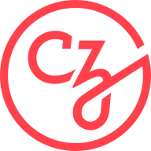
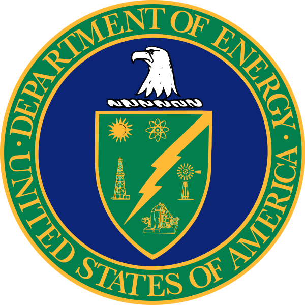
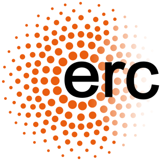
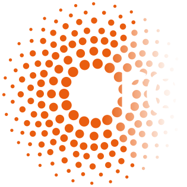

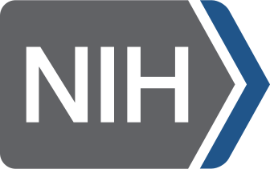
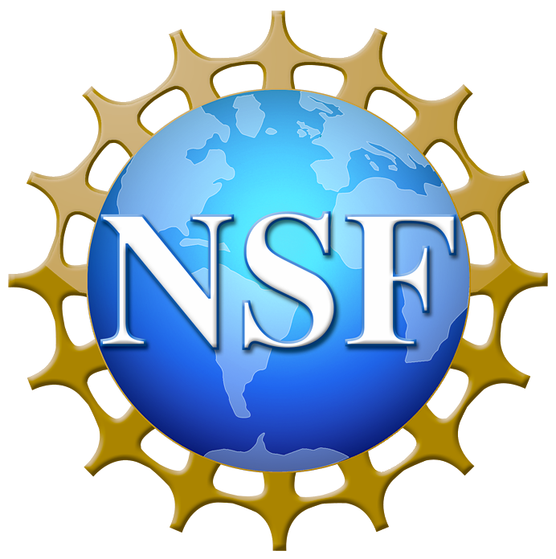

.. INSTITUTIONS

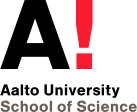
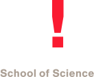
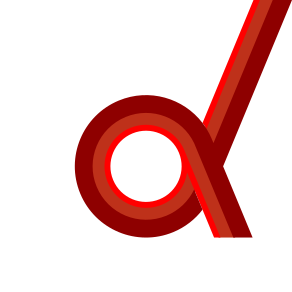
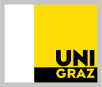
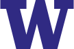



.. |{{ inst.name }}| image:: ../_static/institution_logos/{{ inst.img }}
    :alt: {{ inst.title }}
    :target: {{ inst.url }}
    :width: {{ inst.size }} rem
    :class: instlogo {{ inst.klass }}


