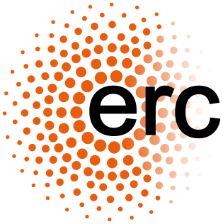

:orphan:

Direct financial support
========================

Development of MNE-Python has been supported by:

.. rst-class:: list-unstyled funders

- |nih| **National Institutes of Health:** R01-EB009048, R01-EB009048, R01-EB006385, R01-HD40712, R01-NS44319, R01-NS37462, R01-NS104585, P41-EB015896, P41-RR14075-06
- |nsf| **US National Science Foundation:** 0958669, 1042134
- |erc| **European Research Council:** YStG-263584, YStG-676943
- |doe| **US Department of Energy:** DE-FG02-99ER62764 (MIND)
- |anr| **Agence Nationale de la Recherche:** `14-NEUC-0002-01 <https://anr.fr/Project-ANR-14-NEUC-0002>`_, **IDEX** Paris-Saclay `11-IDEX-0003-02 <https://anr.fr/ProjetIA-11-IDEX-0003>`_
- |cds| **Paris-Saclay Center for Data Science:** `PARIS-SACLAY <http://www.datascience-paris-saclay.fr>`_
- |goo| **Google:** Summer of code (×6)
- |ama| **Amazon:** AWS Research Grants
- |czi| **Chan Zuckerberg Initiative:** `EOSS2 <https://chanzuckerberg.com/eoss/proposals/improving-usability-of-core-neuroscience-analysis-tools-with-mne-python>`_

Additionally, many universities or research institutions have supported their employees’ contributions to MNE-Python as part of normal work duties. These institutions are:

.. rst-class:: list-unstyled institutions

- |mgh| `Massachusetts General Hospital <https://www.massgeneral.org/>`_
- |aam| `Athinoula A. Martinos Center for Biomedical Imaging <https://martinos.org/>`_
- |hms| `Harvard Medical School <https://hms.harvard.edu/>`_
- |mit| `Massachusetts Institute of Technology <https://web.mit.edu/>`_
- |nyu| `New York University <https://www.nyu.edu/>`_
- |cea| `Commissariat à l´énergie atomique et aux énergies alternatives <http://www.cea.fr/>`_
- |aal| `Aalto-yliopiston perustieteiden korkeakoulu <https://sci.aalto.fi/>`_
- |tpt| `Télécom ParisTech <https://www.telecom-paris.fr/>`_
- |uw| `University of Washington <https://www.washington.edu/>`_
- |icm| `Institut du Cerveau et de la Moelle épinière <https://icm-institute.org/>`_
- |bu| `Boston University <https://www.bu.edu/>`_
- |inserm| `Institut national de la santé et de la recherche médicale <https://www.inserm.fr/>`_
- |fj| `Forschungszentrum Jülich <https://www.fz-juelich.de/>`_
- |tui| `Technische Universität Ilmenau <https://www.tu-ilmenau.de/>`_
- |bids| `Berkeley Institute for Data Science <https://bids.berkeley.edu/>`_
- |inria| `Institut national de recherche en informatique et en automatique <https://www.inria.fr/>`_
- |aar| `Aarhus Universitet <https://www.au.dk/>`_
- |kfug| `Karl-Franzens-Universität Graz <https://www.uni-graz.at/>`_

.. |nih| image:: _static/funding/nih.png
.. |nsf| image:: _static/funding/nsf.png

.. |doe| image:: _static/funding/doe.svg
.. |anr| image:: _static/funding/anr.svg
.. |cds| image:: _static/funding/cds.png
.. |goo| image:: _static/funding/google.svg

.. |czi| image:: _static/funding/czi.svg

.. |mgh| image:: _static/institution_logos/MGH.svg
.. |aam| image:: _static/institution_logos/Martinos.png
.. |hms| image:: _static/institution_logos/Harvard.png
.. |mit| image:: _static/institution_logos/MIT.svg
.. |nyu| image:: _static/institution_logos/NYU.png
.. |cea| image:: _static/institution_logos/CEA.png
.. |aal| image:: _static/institution_logos/Aalto.svg
.. |tpt| image:: _static/institution_logos/Telecom_Paris_Tech.png
.. |uw| image:: _static/institution_logos/Washington.png
.. |icm| image:: _static/institution_logos/ICM.jpg
.. |bu| image:: _static/institution_logos/BU.svg
.. |inserm| image:: _static/institution_logos/Inserm.svg
.. |fj| image:: _static/institution_logos/Julich.svg
.. |tui| image:: _static/institution_logos/Ilmenau.gif
.. |bids| image:: _static/institution_logos/BIDS.png
.. |inria| image:: _static/institution_logos/inria.png
.. |aar| image:: _static/institution_logos/Aarhus.png
.. |kfug| image:: _static/institution_logos/Graz.jpg
