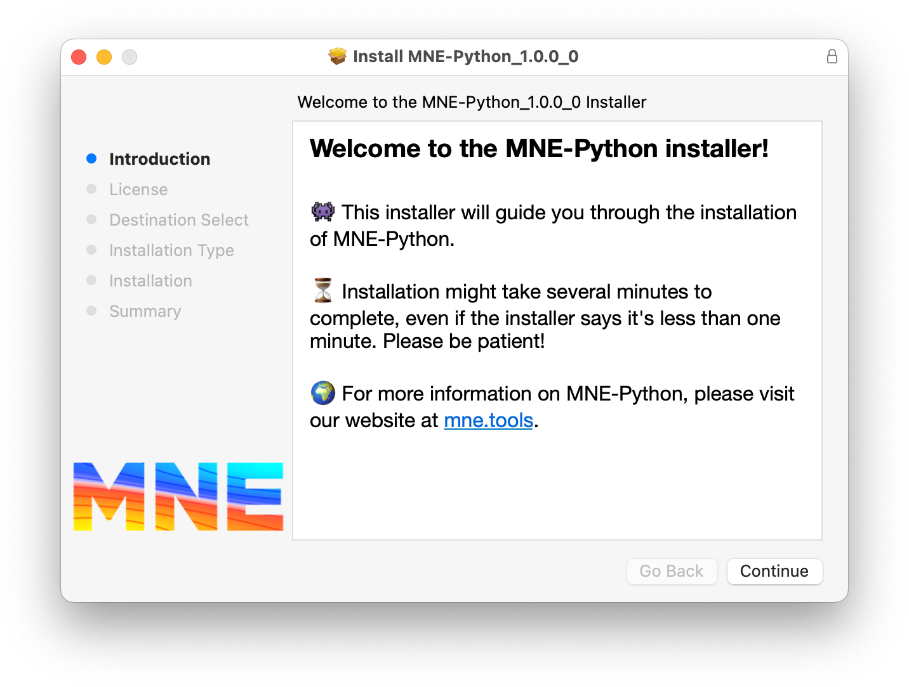

.. include:: ../links.inc

MNE-Python installers
=====================

MNE-Python installers are the easiest way to install MNE-Python and
all dependencies. They also provide many additional
Python packages and tools, including the `Spyder`_ development environment.
Got any questions? Let us know on the `MNE Forum`_!

.. raw:: html
    :file: install_doc_component.html
