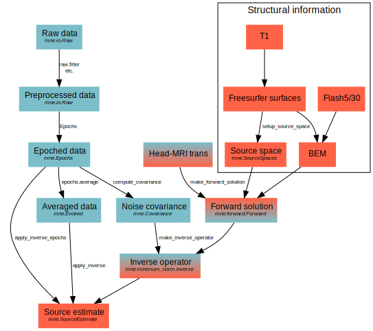

.. _cookbook:

===========================
A standard MEG/EEG workflow
===========================

.. contents:: Contents
   :local:
   :depth: 2

Overview
========

This section describes a typical MEG/EEG workflow, eventually up to source
reconstruction. The workflow is summarized in :ref:`flow_diagram`.
References below refer to Python functions and objects.

.. _flow_diagram:

    **Workflow of the MNE software**

Preprocessing
=============
The following MEG and EEG data preprocessing steps are recommended:

- Bad channels in the MEG and EEG data must be identified, see :ref:`BABBHCFG`.

- The data has to be filtered to the desired passband.

- Artifacts should be suppressed (e.g., using ICA or SSP).

.. note:: For older systems, coding problems on the trigger channel
  STI 014 and EEG/MEG information may need to be fixed, see
  :ref:`BABCDBDI` and :ref:`BABCDFJH`.

.. _BABBHCFG:

Marking bad channels
--------------------

Sometimes some MEG or EEG channels are not functioning properly
for various reasons. These channels should be excluded from
analysis by marking them bad as::

    >>> raw.info['bads'] = ['MEG2443']

Especially if a channel does not show
a signal at all (flat) it is important to exclude it from the
analysis, since its noise estimate will be unrealistically low and
thus the current estimate calculations will give a strong weight
to the zero signal on the flat channels and will essentially vanish.
It is also important to exclude noisy channels because they can
possibly affect others when signal-space projections or EEG average electrode
reference is employed. Noisy bad channels can also adversely affect
averaging and noise-covariance matrix estimation by causing
unnecessary rejections of epochs.

Recommended ways to identify bad channels are:

- Observe the quality of data during data
  acquisition and make notes of observed malfunctioning channels to
  your measurement protocol sheet.

- View the on-line averages and check the condition of the channels.

- Compute preliminary off-line averages with artefact rejection,
  SSP/ICA, and EEG average electrode reference computation
  off and check the condition of the channels.

- View raw data with :func:`mne.io.Raw.plot` without SSP/ICA
  enabled and identify bad channels.

.. note:: It is strongly recommended that bad channels are identified and
          marked in the original raw data files. If present in the raw data
          files, the bad channel selections will be automatically transferred
          to averaged files, noise-covariance matrices, forward solution
          files, and inverse operator decompositions.

Artifact suppression
--------------------

SSP
###

The Signal-Space Projection (SSP) is one approach to rejection
of external disturbances in software. Unlike many other
noise-cancellation approaches, SSP does
not require additional reference sensors to record the disturbance
fields. Instead, SSP relies on the fact that the magnetic field
distributions generated by the sources in the brain have spatial
distributions sufficiently different from those generated by external
noise sources. Furthermore, it is implicitly assumed that the linear
space spanned by the significant external noise patters has a low
dimension.

SSP-based rejection is often done using the
:func:`mne.preprocessing.compute_proj_ecg` and
:func:`mne.preprocessing.compute_proj_eog` methods, see :ref:`ssp`
section for more information.

ICA
###

Many M/EEG signals including biological artifacts reflect non-Gaussian
processes. Therefore PCA-based artifact rejection will likely perform worse at
separating the signal from noise sources.

ICA-based artifact rejection is done using the :class:`mne.preprocessing.ICA`
class, see the :ref:`ica` section for more information.

Epoching and evoked data
========================

Epoching of raw data is done using events, which define a ``t=0`` for your
data chunks. Event times stamped to the acquisition software can be extracted
using :func:`mne.find_events`::

    >>> events = mne.find_events(raw)

The ``events`` array can then be modified, extended, or changed if necessary.
If the original trigger codes and trigger times are correct for the analysis
of interest, :class:`mne.Epochs` for the first event type (``1``) can be
constructed using::

    >>> reject = dict(grad=4000e-13, mag=4e-12, eog=150e-6)
    >>> epochs = mne.Epochs(raw, events, event_id=1, tmin=-0.2, tmax=0.5,
    >>>                     proj=True, picks=picks, baseline=(None, 0),
    >>>                     preload=True, reject=reject)

.. note:: The rejection thresholds (set with argument ``reject``) are defined
          in T / m for gradiometers, T for magnetometers and V for EEG and EOG
          channels.

Rejection using annotations
---------------------------

The reject keyword of :class:`mne.Epochs` is used for rejecting bad epochs
based on peak-to-peak thresholds. Bad segments of data can also be rejected
by marking segments of raw data with annotations. See
:ref:`tut_artifacts_reject` and :class:`mne.Annotations` for more
information.

Once the :class:`mne.Epochs` are constructed, they can be averaged to obtain
:class:`mne.Evoked` data as::

    >>> evoked = epochs.average()

Source localization
===================

MNE makes extensive use of the FreeSurfer file structure for analysis.
Before starting data analysis, we recommend setting up the environment
variable ``SUBJECTS_DIR`` (or set it permanently using :func:`mne.set_config`)
to select the directory under which the anatomical MRI data are stored.
This makes it so that the ``subjects_dir`` argument does not need to
be passed to many functions.

Anatomical information
----------------------

.. _CHDBBCEJ:

Cortical surface reconstruction with FreeSurfer
###############################################

The first processing stage is the creation of various surface
reconstructions with FreeSurfer. The recommended FreeSurfer workflow
is summarized on the `FreeSurfer wiki pages <https://surfer.nmr.mgh.harvard.edu/fswiki/RecommendedReconstruction>`_.

.. _setting_up_source_space:

Setting up the source space
###########################

This stage consists of the following:

- Creating a suitable decimated dipole grid on the white matter surface.

- Creating the source space file in fif format.

This is accomplished with using :func:`mne.setup_source_space` and
:func:`mne.write_source_spaces`. These assume that the anatomical MRI processing
has been completed as described in :ref:`CHDBBCEJ`.

.. _BABGCDHA:

.. table:: Recommended subdivisions of an icosahedron and an octahedron for
           the creation of source spaces. The approximate source spacing and
           corresponding surface area have been calculated assuming a
           1000-cm2 surface area per hemisphere.

    ===========  ======================  ===================  =============================
    ``spacing``  Sources per hemisphere  Source spacing / mm  Surface area per source / mm2
    ===========  ======================  ===================  =============================
    ``'oct5'``   1026                    9.9                  97
    ``'ico4'``   2562                    6.2                  39
    ``'oct6'``   4098                    4.9                  24
    ``'ico5'``   10242                   3.1                  9.8
    ===========  ======================  ===================  =============================

For example, to create the reconstruction geometry for ``subject='sample'``
with a ~5-mm spacing between the grid points, say::

    >>> src = setup_source_space('sample', spacing='oct6')
    >>> write_source_spaces('sample-oct6-src.fif', src)

This creates the source spaces and writes them to disk.

.. _CHDBJCIA:

Creating the BEM model meshes
#############################

Calculation of the forward solution using the boundary-element
model (BEM) requires that the surfaces separating regions of different
electrical conductivities are tessellated with suitable surface
elements. Our BEM software employs triangular tessellations. Therefore,
prerequisites for BEM calculations are the segmentation of the MRI
data and the triangulation of the relevant surfaces.

For MEG computations, a reasonably accurate solution can
be obtained by using a single-compartment BEM assuming the shape
of the intracranial volume. For EEG, the standard model contains
the intracranial space, the skull, and the scalp.

At present, no bulletproof method exists for creating the
triangulations. Feasible approaches are described in :ref:`create_bem_model`.

.. _BABDBBFC:

Setting up the head surface triangulation files
###############################################

The segmentation algorithms described in :ref:`create_bem_model` produce
either FreeSurfer surfaces or triangulation
data in text. Before proceeding to the creation of the boundary
element model, standard files for FreeSurfer surfaces must be present:

1. **inner_skull.surf** contains the inner skull triangulation.

2. **outer_skull.surf** contains the outer skull triangulation.

3. **outer_skin.surf** contains the head surface triangulation.

.. _CIHDBFEG:

Setting up the boundary-element model
#####################################

This stage sets up the subject-dependent data for computing
the forward solutions:"

    >>> model = make_bem_model('sample')
    >>> write_bem_surfaces('sample-5120-5120-5120-bem.fif', model)

Where ``surfaces`` is a list of BEM surfaces that have each been read using
:func:`mne.read_surface`. This step also checks that the input surfaces
are complete and that they are topologically correct, *i.e.*,
that the surfaces do not intersect and that the surfaces are correctly
ordered (outer skull surface inside the scalp and inner skull surface
inside the outer skull).

This step assigns the conductivity values to the BEM compartments.
For the scalp and the brain compartments, the default is 0.3 S/m.
The default skull conductivity is 50 times smaller, *i.e.*,
0.006 S/m. Recent publications, see :ref:`CEGEGDEI`, report
a range of skull conductivity ratios ranging from 1:15 (Oostendorp *et
al.*, 2000) to 1:25 - 1:50 (Slew *et al.*,
2009, Conçalves *et al.*, 2003). The
MNE default ratio 1:50 is based on the typical values reported in
(Conçalves *et al.*, 2003), since their
approach is based comparison of SEF/SEP measurements in a BEM model.
The variability across publications may depend on individual variations
but, more importantly, on the precision of the skull compartment
segmentation.

.. note:: To produce single layer BEM models (--homog flag in the C command
          line tools) pass a list with one single conductivity value,
          e.g. ``conductivities=[0.3]``.

Using this model, the BEM solution can be computed using
:func:`mne.make_bem_solution` as::

    >>> bem_sol = make_bem_solution(model)
    >>> write_bem_solution('sample-5120-5120-5120-bem-sol.fif', bem_sol)

After the BEM is set up it is advisable to check that the
BEM model meshes are correctly positioned using *e.g.*, :class:`mne.Report`.

.. note:: Up to this point all processing stages depend on the
          anatomical (geometrical) information only and thus remain
          identical across different MEG studies.

.. note:: If you use custom head models you might need to set the ``ico=None`` 
          parameter to ``None`` and skip subsampling of the surface.

.. _CHDBEHDC:

Aligning coordinate frames
--------------------------

The calculation of the forward solution requires knowledge
of the relative location and orientation of the MEG/EEG and MRI
coordinate systems (see :ref:`BJEBIBAI`). The head coordinate
frame is defined by identifying the fiducial landmark locations,
making the origin and orientation of the head coordinate system
slightly user dependent. As a result, it is safest to reestablish
the definition of the coordinate transformation computation
for each experimental session, *i.e.*, each time when new head
digitization data are employed.

The interactive source analysis software :ref:`mne_analyze` provides
tools for coordinate frame alignment, see :ref:`ch_interactive_analysis`.
:ref:`CHDIJBIG` also contains tips for using :ref:`mne_analyze` for
this purpose.

.. warning:: This step is important. If the alignment of the
             coordinate frames is inaccurate all subsequent processing
             steps suffer from the error. Therefore, this step should be
             performed by the person in charge of the study or by a trained
             technician. Written or photographic documentation of the alignment
             points employed during the MEG/EEG acquisition can also be
             helpful.

.. _BABCHEJD:

Computing the forward solution
------------------------------

After the MRI-MEG/EEG alignment has been set, the forward
solution, *i.e.*, the magnetic fields and electric
potentials at the measurement sensors and electrodes due to dipole
sources located on the cortex, can be calculated with help of
:func:`mne.make_forward_solution` as::

    >>> fwd = make_forward_solution(raw.info, fname_trans, src, bem_sol)

.. _BABDEEEB:

Computing the noise-covariance matrix
-------------------------------------

The MNE software employs an estimate of the noise-covariance
matrix to weight the channels correctly in the calculations. The
noise-covariance matrix provides information about field and potential
patterns representing uninteresting noise sources of either human
or environmental origin.

The noise covariance matrix can be calculated in several
ways:

- Employ the individual epochs during
  off-line averaging to calculate the full noise covariance matrix.
  This is the recommended approach for evoked responses, *e.g.* using
  :func:`mne.compute_covariance`::

      >>> cov = mne.compute_covariance(epochs, method='auto')

- Employ empty room data (collected without the subject) to
  calculate the full noise covariance matrix. This is recommended
  for analyzing ongoing spontaneous activity. This can be done using
  :func:`mne.compute_raw_covariance` as::

      >>> cov = mne.compute_raw_covariance(raw_erm)

- Employ a section of continuous raw data collected in the presence
  of the subject to calculate the full noise covariance matrix. This
  is the recommended approach for analyzing epileptic activity. The
  data used for this purpose should be free of technical artifacts
  and epileptic activity of interest. The length of the data segment
  employed should be at least 20 seconds. One can also use a long
  (``*> 200 s``) segment of data with epileptic spikes present provided
  that the spikes occur infrequently and that the segment is apparently
  stationary with respect to background brain activity. This can also
  use :func:`mne.compute_raw_covariance`.

.. _CIHCFJEI:

Calculating the inverse operator
--------------------------------

The MNE software doesn't calculate the inverse operator
explicitly but rather computes an SVD of a matrix composed of the
noise-covariance matrix, the result of the forward calculation,
and the source covariance matrix. This approach has the benefit
that the regularization parameter ('SNR') can
be adjusted easily when the final source estimates or dSPMs are
computed. For mathematical details of this approach,
please consult :ref:`CBBDJFBJ`.

This computation stage can be done by using
:func:`mne.minimum_norm.make_inverse_operator` as::

    >>> inv = mne.minimum_norm.make_inverse_operator(raw.info, fwd, cov, loose=0.2)

Creating source estimates
-------------------------

Once all the preprocessing steps described above have been
completed, the inverse operator computed can be applied to the MEG
and EEG data as::

    >>> stc = mne.minimum_norm.apply_inverse(evoked, inv, lambda2=1. / 9.)

And the results can be viewed as::

    >>> stc.plot()

The interactive analysis tool :ref:`mne_analyze` can also
be used to explore the data and to produce quantitative analysis
results, screen snapshots, and QuickTime (TM) movie files,
see :ref:`ch_interactive_analysis`.

Group analyses
--------------

Group analysis is facilitated by morphing source estimates, which can be
done *e.g.*, to ``subject='fsaverage'`` as::

    >>> stc_fsaverage = stc.morph('fsaverage')

See :ref:`ch_morph` for more information.
