.. _ch_interactive_analysis:

=====================================
Interactive analysis with mne_analyze
=====================================

.. contents:: Contents
   :local:
   :depth: 2

Overview
########

Interactive analysis of the MEG/EEG data and source estimates
is facilitated by the :ref:`mne_analyze` tool.
Its features include:

- Viewing of evoked-response data or data
  segments in a topographical layout.

- Alignment of MEG and head coordinate frames.

- Display of maps of the magnetic field and electric potentials.

- Computation and display of cortically-constrained minimum-norm current
  estimates and statistical maps derived from them. The solutions can
  be displayed on folded and inflated cortical surfaces as well as
  on curved and flattened surface patches.

- Fitting of current dipoles to the data.

- Connection to tkmedit (part
  of FreeSurfer) to display data on MRI slices.

- Production of QuickTime (TM) movies and graphics snapshots
  in several image file formats.

- Connection to cliplab (part of Elekta-Neuromag software) to
  produce graphics reports, see :ref:`CACJEFAI`.

- Inquiry and saving of source waveforms at selected surface
  points or within ROIs defined by label files.

- On-line morphing of the current distributions.

- Output of snapshots in w file format.

- Display of overlay data delivered in w and stc file formats.

- Creation of ROI (label) files.

- Viewing of continuous head-position data delivered by Elekta-Neuromag
  software.

See :ref:`mne_analyze` for command line options.

.. note:: Before starting mne_analyze the ``SUBJECTS_DIR`` environment variable has to be set.

The main window
###############

.. _CACJABJI:

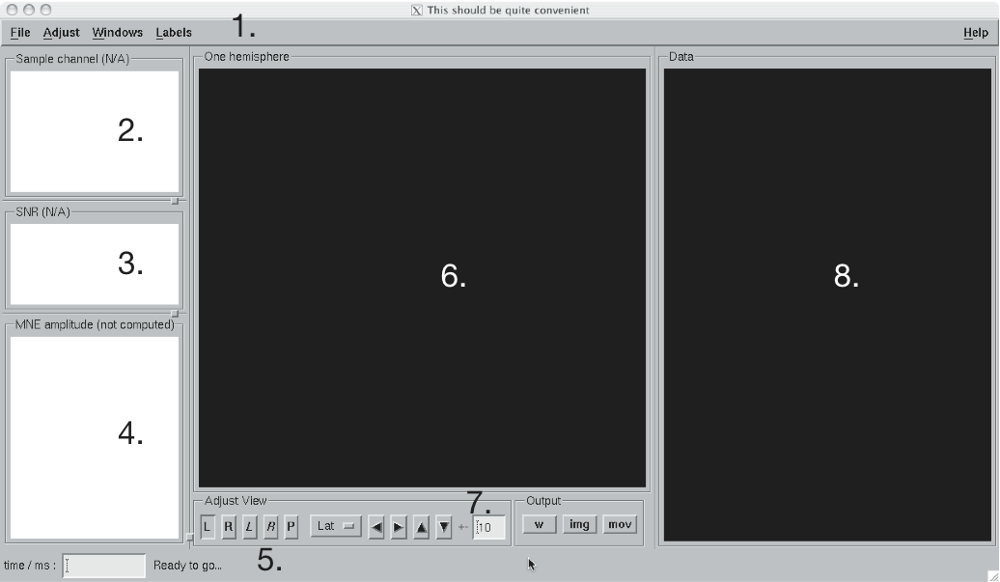

    The main window of mne_analyze.

The main window of mne_analyze shown
in :ref:`CACJABJI` has the following components:

- The menu bar;

- Display area for a sample response;

- Display of the estimated SNR, see :ref:`CACJFFEE`;

- Display of a source waveform;

- Message area, time-point selection text field, an ECD fit
  button, a text field for selecting a vertex on the surface, and
  a message text label;

- Display area for the current estimates;

- Controls for the current estimate display;

- Topographical display of data.

The menus
#########

The File menu
=============

The File shown in :ref:`CACJCBFI` contains the following items:

.. _CACJCBFI:

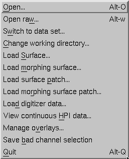

    The file menu

**Open...**

    Load a new data set and an inverse operator. For details, see :ref:`CACBACHB`.

**Open raw...**

    Load epoch data from a raw data file. For details, see :ref:`CACDEDBI`.

**Switch to data set...**

    If multiple data sets or epochs from a raw data file are loaded,
    this menu item brings up a list to switch between the data sets
    or epochs.

**Change working directory...**

    Change the working directory of this program. This will usually
    be the directory where your MEG/EEG data and inverse operator are located.

**Load surface...**

    Load surface reconstructions for the subject whose data you are analyzing,
    see :ref:`CACFJICC`.

**Load morphing surface...**

    Load surface reconstructions of another subject for morphing, see :ref:`CACGBEIB`.

**Load surface patch...**

    Load a curved or flattened surface patch, see :ref:`CACFJICC`.

**Load morphing surface patch...**

    Load a curved or flattened surface patch for morphing, see :ref:`CACGBEIB`.

**Load digitizer data...**

    Load digitizer data for coordinate frame alignment, see :ref:`CACEHGCD`.

**View continuous HPI data...**

    Load a data file containing continuous head position information, see :ref:`CACIADAI`.

**Manage overlays...**

    Bring up the overlay manager to import data from stc and w files, see :ref:`CACFCHEC`.

**Save bad channel selection**

    Save the current bad channel selection created in the topographical data
    display, see :ref:`CACEFBDE`.

**Quit**

    Quit the program.

The Adjust menu
===============

The contents of the Adjust menu
is shown in :ref:`CACFDIJJ`:

.. _CACFDIJJ:

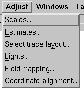

    The Adjust menu.

**Scales**

    Adjust the scales of the data display.

**Estimates...**

    Adjust the properties of the displayed current estimates, see :ref:`CACBHDBF`.

**Select trace layout...**

    Select the layout for the topographical display, see :ref:`CACEFBDE`.

**Lights...**

    Adjust the lighting of the scenes in the main display and the viewer, see
    :ref:`CACBHDBF` and :ref:`CACEFFJF`.

**Field mapping...**

    Adjust the field mapping preferences, see :ref:`CACICDGA`.

**Coordinate alignment...**

    Establish a coordinate transformation between the MEG and MRI coordinate
    frames, see :ref:`CACEHGCD`.

The View menu
=============

The contents of the file menu is shown in :ref:`CACBFCGF`:

.. _CACBFCGF:

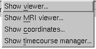

    The View menu.

**Show viewer...**

    Loads additional surfaces and pops up the viewer window. The functions
    available in the viewer are discussed in :ref:`CACEFFJF`.

**Show MRI viewer...**

    Bring up the tkmedit program
    to view MRI slices, see :ref:`CACCHCBF`.

**Show coordinates...**

    Show the coordinates of a vertex, see :ref:`CHDIEHDH`.

**Show timecourse manager...**

    Brings up the timecourse manager if some timecourses are available.
    Timecourses are discussed in :ref:`CACCCFHH`.

The Labels menu
===============

The contents of the Labels menu
is shown in :ref:`CACHCDCF`. ROI analysis with help of labels
is discussed in detail in :ref:`CACCCFHH`.

.. _CACHCDCF:

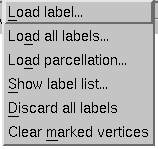

    The Labels menu.

The label menu contains the following
items:

**Load label...**

    Loads one label file for ROI analysis.

**Load all labels...**

    Loads all label files available in a directory for ROI analysis.

**Load parcellation...**

    Load cortical parcellation data produced by FreeSurfer from
    directory $SUBJECTS_DIR/$SUBJECT/label and add the cortical regions
    defined to the label list.

**Show label list...**

    Shows a list of all currently loaded labels for ROI analysis.

**Discard all labels**

    Discard all labels loaded so far. The label list window will be
    hidden.

**Clear marked vertices**

    Clear the label outline or a label created interactively.

The Dipoles menu
================

The contents of the dipoles menu is shown in :ref:`CACCJDAF`:

.. _CACCJDAF:

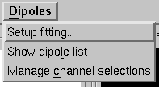

    The dipole fitting menu.

**Setup fitting...**

    Define the dipole fitting parameters, see :ref:`CACEDEGA`.

**Show dipole list...**

    Show the list of imported and fitted dipoles, see :ref:`CACGGAIA`.

**Manage channel selections...**

    Manage the selections of channels used in dipole fitting, see :ref:`CACIBHCI`.

The Help menu
=============

The contents of the Help menu is shown in :ref:`help_menu_analyze`:

.. _help_menu_analyze:

    The Help menu.

**On version...**

    Displays the version and compilation date of the program.

**On license...**

    Displays the license information.

**On GLX...**

    Displays information about the OpenGL rendering context. If you experience
    poor graphics performance, check that the window that pops up from
    here says that you have a Direct rendering context .
    If not, either your graphics card or driver software needs an update.

**Why the beep?**

    In some simple error situations, mne_analyze does
    not popup an error dialog but refuses the action and rings the bell.
    The reason for this can be displayed through this help menu item.

.. _CACBACHB:

Loading data
############

When you select Open... from
the File menu the data loading
dialog shown in :ref:`CACFHAIH` appears. It has four sections:

- A standard file selection box.

- List of available data sets. This part is automatically filled
  in when a proper data file is selected from the file list. You can
  select one or more data sets from this list. Multiple selection
  works with help of the shift and control keys. If multiple data
  sets are selected, the data set to be analyzed can be changed from
  the data set list accessible through Switch to data set... in the File menu.

- List of available inverse operator decompositions in the current
  directory and its subdirectory called ``inv`` .

- List of options:

  - MRI/head transform source specifies a file to read the MRI/MEG coordinate
    transformation information from. This is usually the inverse operator
    file. However, you can also load data with inverse operator set
    to <*none*> to view the data
    as well as field and potential maps derived thereof. In this case
    you need to specify the coordinate transformation file using the Select... button,
    usually located in ``mri/T1-neuromag/sets`` under the subject's
    FreeSurfer directory. The Default button
    uses the default transformation file which must be called ``$SUBJECTS_DIR/$SUBJECT/bem/$SUBJECT-trans.fif`` .
    This can be one of the MRI description files in  ``mri/T1-neuromag/sets`` or
    a transformation file stored from mne_analyze ,
    see :ref:`CACEHGCD`.

  - Use EEG average electrode ref. selects
    whether the average electrode reference is applied to the data.
    This is only available if the inverse operator is set to <*none*> .

  - nave specifies the effective
    number of averages to compute the SNR correctly. Usually your measurement
    file contains this information.

.. _CACFHAIH:

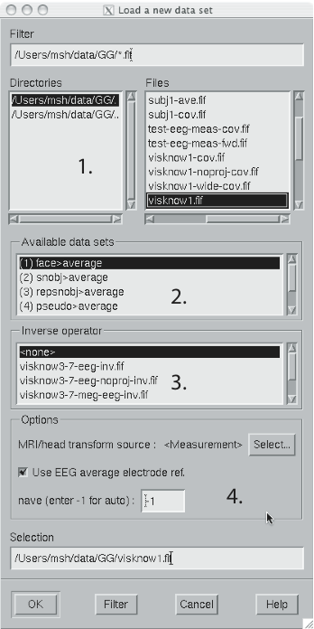

    The open dialog.

After the data set(s) has been selected, the following actions
will take place:

- The inverse operator will be loaded.

- Baselines will be applied as specified in the scales dialog.

- Projection will be applied to the data. If no inverse operator
  is specified, the source for the projection data will be the data
  file and the average EEG reference setting in the options. If an
  inverse operator is included, the projection will be read from the
  data file.

- If an inverse operator is loaded, whitened data will be computed.

- If an inverse operator is loaded, the SNR estimate as well
  as the effective SNR will be computed from the whitened data and
  displayed in the SNR window.

- Waveforms will be shown in the topographical display as well
  as in the sample channel display.

If multiple data sets are loaded each data set has the following
individual settings:

- Amplitude and time scale settings,

- Baseline,

- Picked time point,

- Sample channel to be displayed, and

- MNE display preferences, see :ref:`CACHFFIJ`.

If a data set has not been previously displayed, the currently
active settings are copied to the data set.

.. note:: If you double click on an inverse operator file    name displayed in the Inverse operator list,    the command used to produced this file will be displayed in a message    dialog.

.. _CACDEDBI:

Loading epochs from a raw data file
###################################

Instead of an evoked-response data file it is possible to
load epochs of data (single trials) from a raw data file. This option
is invoked from File/Open raw... .
The file selection box is identical to the one used for evoked responses
(:ref:`CACFHAIH`) except that data set selector is replaced
by the epoch selector show in :ref:`CACDCGIB`.

.. _CACDCGIB:

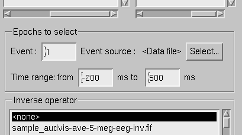

    The raw data epoch selector.

The epoch selector contains the following controls:

- The event specifier. Only events matching
  this number are going to be considered.

- The event source specifier. The event source can be either
  the data file, *i.e.,* the digital trigger channel or
  a event data file produced with mne_browse_raw or mne_process_raw ,
  see :ref:`CACJGIFA`. Using an event data file is useful
  if, *e.g.*, the epochs to be processed epileptic spikes.

- The time range specification. This determines the length of
  the epoch with respect to the selected event.

Once the settings have been accepted by clicking OK ,
the first matching epoch will be displayed. You can switch between
epochs using the data set list accessible through Switch to data set... in the File menu.

.. _CACEFBDE:

Data displays
#############

The MEG and EEG signals can be viewed in two ways:

- A selection of MEG or EEG channel is
  shown in a topographical layout.

- One representative channel can be selected to the Sample channel display by clicking on a channel in the
  topographical display.

In both the sample channel display and the topographical
display, current time point can be selected with a left mouse click.
In addition, time point of interest can be entered numerically in
the text box at the bottom left corner of the main display.

.. _CACHBJAC:

The topographical display
=========================

A selection of channels is always shown in the right most
part of the main display. The topographical layout to use is selected
from Adjust/Select trace layout... ,
which brings up a window with a list of available layouts. The system-wide
layouts reside in $MNE_ROOT/share/mne_analyze/lout. In addition
any layout files residing in $HOME/.mne/lout are listed. The format
of the layout files and selection of the default layout is discussed
in :ref:`CACFGGCF`.

Several actions can be performed with the mouse in the topographical data
display:

**Left button click**

    Selects a time point of interest.

**Left button click with control key**

    Selects a time point of interest and selects the channel under the pointer
    to the sample channel display.

**Left button drag with shift key**

    Enlarges the view to contain only channels in the selected area.

**Middle button click or drag**

    Marks this channel as bad and clears all previously marked bad channel.
    This action is only available if an inverse operator is *not* loaded.
    An inverse operator dictates the selection of bad channels. The
    current bad channel selection can be applied to the data from File/Save bad channel selection .

**Middle button click or drag with control key**

    Extends the bad channel selection without clearing the previously active
    bad channels.

**Right button**

    Adjusts the channel selection used for dipole fitting in the same
    way as the middle button selects bad channels. For more information
    on channel selections, see :ref:`CACIBHCI`.

.. _CACFGHBJ:

The sample channel display
==========================

The sample channel display shows one of the measurement channels
at the upper left corner of the mne_analyze user
interface. A time point can be selected with a left mouse click.
In addition, the following keyboard functions are associated with
the sample channel display:

**Down**

    Change the sample channel to the next channel in the scanning order.

**Up**

    Change the sample channel to the previous channel in the scanning order.

**Right**

    Move forward in time by 1 ms.

**Control Right**

    Move forward in time by 5 ms.

**Left**

    Move backward in time by 1 ms.

**Control Left**

    Move backward in time by 5 ms.

Scale settings
==============

The scales of the topographical and sample channel display
can be adjusted from the Scales dialog
which is invoked by selecting Adjust/Scales... from
the menus. The Scales dialog
shown in :ref:`CACJJCGD` has the following entries:

**Analyze range min [ms]**

    Specifies the lower limit of the time range of data to be shown.

**Analyze range max [ms]**

    Specifies the upper limit of the time range of data to be shown.

**Use full time range**

    If this box is checked, all data available in the data file will
    be shown.

**Baseline min [ms]**

    Specifies the lower time limit of the baseline.

**Baseline max [ms]**

    Specifies the upper time limit of the baseline.

**Baseline in use**

    Baseline subtraction can be switched on and off from this button.

**MEG amp min [fT/cm]**

    Lower limit of the vertical scale of planar gradiometer MEG channels.

**MEG amp max [fT/cm]**

    Upper limit of the vertical scale of planar gradiometer MEG channels.

**MEG axmult [cm]**

    The vertical scale of MEG magnetometers and axial gradiometers will
    be obtained by multiplying the planar gradiometer vertical scale
    limits by this value, given in centimeters.

**EEG amp min [muV]**

    Lower limit of the vertical scale of EEG channels.

**EEG amp max [muV]**

    Upper limit of the vertical scale of EEG channels.

**Show stimulus channel**

    Show the digital trigger channel data in the sample view together with
    the sample channel.

.. _CACJJCGD:

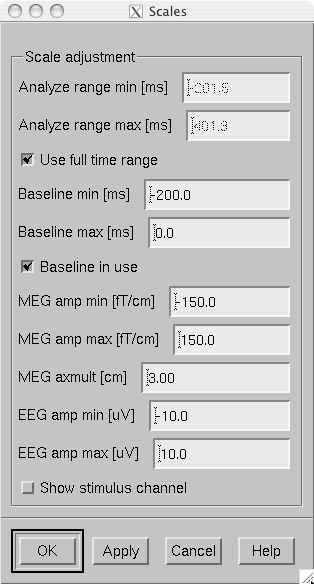

    The Scales dialog.

.. _CACFJICC:

The surface display
###################

In mne_analyze , the current
estimates are visualized on inflated or folded cortical surfaces.
There are two visualization displays: the surface display, which
is always visible, and the 3D viewer which is invoked from the Windows/Show viewer... menu selection, see :ref:`CACEFFJF`.

A total of eight surfaces or patches can be assigned to the
surface display:

- The left and right hemisphere cortical
  surfaces for the subject whose data you are analyzing. These surfaces
  can be the inflated, white-matter, or pial surfaces. They are loaded
  through the File/Load surface... menu
  selection,

- The left and right hemisphere cortical surfaces of another
  subject or an alternative representation of the cortical surface
  of the actual subject. For example, you can switch between the inflated
  and folded (pial or white matter) cortical surfaces very easily.
  These surfaces are loaded from the File/Load morphing surface... menu selection.

- Left and right hemisphere curved or flat cortical patches
  for the subject you are analyzing. This patch is loaded from the File/Load surface patch... menu selection. The full cortical
  surfaces must be loaded first before loading the patches.

- Patches for an another subject or another pair of patches
  for the same subject through the File/Load morphing surface patch... menu selection. Again, the full
  cortical surfaces must have been loaded first.

.. _CHDIFFHJ:

The surface selection dialog
============================

When File/Load surface... or File/Load morphing surface... is invoked, the surface selection dialog
shown in :ref:`CACDGJDC` appears.

.. _CACDGJDC:

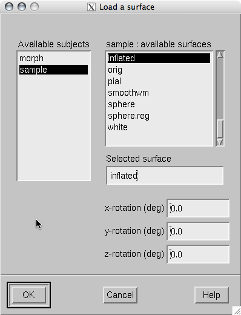

    The surface selection dialog.

The dialog has the following components:

**List of subjects**

    This list contains the subjects available in the directory set with
    the ``SUBJECTS_DIR`` environment variable.

**List of available surfaces for the selected subject**

    Lists the surfaces available for the current subject. When you click on
    an item in this list, it appears in the Selected surface text field.

**x-rotation (deg)**

    Specifies the initial rotation of the surface around the *x* (left
    to right) axis. Positive angle means a counterclockwise rotation
    when the surface is looked at from the direction of the positive *x* axis.
    Sometimes a more pleasing visualization is obtained when this rotations are
    specified when the surface is loaded.

**y-rotation (deg)**

    Specifies the initial rotation of the surface around the *y* (back
    to front) axis.

**z-rotation (deg)**

    Specifies the initial rotation of the surface around the *z* (bottom
    to up) axis.

The patch selection dialog
==========================

The surface patches are loaded with help of the patch selection
dialog, which appears when File/Load surface patch... or File/Load morphing surface patch... is selected. This dialog,
shown in :ref:`CACHEEJD`, contains a list of available patches
and the possibility to rotate the a flat patch counterclockwise
by the specified number of degrees from its original orientation.
The patch is automatically associated with the correct hemisphere
on the basis of the two first letters in the patch name (lh = left
hemisphere, rh = right hemisphere).

.. _CACHEEJD:

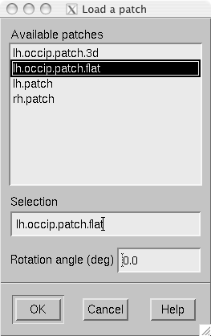

    The patch selection dialog.

.. _CACCABEA:

Controlling the surface display
===============================

The main surface display has a section called Adjust view , which has the controls shown in :ref:`CACCFCGJ`:

**L and R**

    Select the left or right hemisphere surface loaded through File/Load surface... .

**B**

    Display the surfaces for both hemispheres.

**M**

    Display the surfaces loaded File/Load morphing surface... according to the L, R, and B hemisphere
    selectors

**P**

    Select the patch associated with the currently selected surface. For this
    to work, either L or R must be selected.

**Option menu**

    Select one of the predefined view orientations, see :ref:`CACCCGDB`, below.

**Arrow buttons**

    Rotate the surface by increments specified in degrees in the text
    box next to the arrows.

.. _CACCFCGJ:

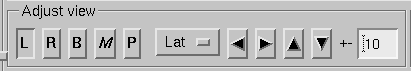

    Surface controls.

The display can be also adjusted
using keyboard shortcuts, which are available once you click in
the main surface display with the left mouse button to make it active:

**Arrow keys**

    Rotate the surface by increments specified in degrees in the Adjust View section.

**+**

    Enlarge the image.

**-**

    Reduce the image.

**=**

    Return to the default size.

**r**

    Rotate the image one full revolution around z axis using the currently
    specified rotation step. This is useful for producing a sequence
    of images when automatic image saving is on, see :ref:`CACBEBGC`.

**s**

    Produces a raster image file which contains a snapshot of the currently
    displayed image. For information on snapshot mode, see :ref:`CACBEBGC`.

**.**

    Stops the rotation invoked with the 'r' key, see
    above.

In addition, the mouse wheel or trackball can be used to
rotate the image. If a trackball is available, *e.g.*,
with the Apple MightyMouse, the image can be rotated up and down
or left and right with the trackball. With a mouse wheel the image
will rotated up and down when the wheel is rotated. Image rotation
in the left-right direction is achieved by holding down the shift key
when rotating the wheel. The shift key
has the same effect on trackball operation.

.. note:: The trackball and mouse wheel functionality    is dependent on your X server settings. On Mac OSX these settings    are normally correct by default but on a LINUX system some adjustments    to the X server settings maybe necessary. Consult your system administrator    or Google for details.

.. _CHDIEHDH:

Selecting vertices
==================

When you click on the surface with the left mouse button,
the corresponding vertex number and the associated value will be
displayed on the message line at the bottom of the display. In addition,
the time course at this vertex will be shown, see :ref:`CHDGHDGE`.
You can also select a vertex by entering the vertex number to the
text field at the bottom of the display. If the MRI viewer is displayed and Track surface location in MRI is selected in the MRI viewer control dialog, the cursor in the MRI slices
will also follow the vertex selection, see :ref:`CACCHCBF`.

The View menu choice Show coordinates... brings up a window which shows
the coordinates of the selected vertex on the *white matter* surface, *i.e.*,
lh.white and rh.white FreeSurfer surfaces. If morphing surfaces
have been loaded, the coordinates of both the subject being analyzed
and those of the morphing subject will be shown. The Coordinates window
includes the following lines:

**MEG head**

    Indicates the vertex location in the *MEG head* coordinates.
    This entry will be present only if MEG/EEG data have been loaded.

**Surface RAS (MRI)**

    Indicates the vertex location in the *Surface RAS* coordinates.
    This is the native coordinate system of the surfaces and this entry
    will always be present.

**MNI Talairach**

    Shows the location in MNI Talairach coordinates. To be present,
    the MRI data of the subject must be in the mgz format (usually true with
    any recent FreeSurfer version) and the Talairach transformation
    must be appropriately defined during the *FreeSurfer* reconstruction
    workflow.

**Talairach**

    Shows the location in the *FreeSurfer* Talairach
    coordinates which give a better match to the Talairach atlas.

The above coordinate systems are discussed in detail in :ref:`CHDEDFIB`.

.. note:: By default, the tksurfer program,    part of the FreeSurfer package, shows    the vertex locations on the *orig* rather than *white* surfaces.    Therefore, the coordinates shown in mne_analyze and tksurfer are    by default slightly different (usually by < 1 mm). To make the    two programs consistent, you can start tksurfer with    the ``-orig white`` option.

.. _CACCCGDB:

Defining viewing orientations
=============================

The list of viewing orientations available in the Adjust View section of the main surface display is controlled
by a text file. The system-wide defaults reside in ``$MNE_ROOT/share/mne/mne_analyze/eyes`` .
If the file ``$HOME/.mne/eyes`` exists, it is used instead.

All lines in the eyes file starting with # are comments.
The view orientation definition lines have the format:

<*name*>:<*Left*>:<*Right*>:<*Left up*>:<*Right up*> ,

where

**<*name*>**

    is the name of this viewing orientation,

**<*Left*>**

    specifies the coordinates of the viewing 'eye' location
    for the left hemisphere, separated by spaces,

**<*Right*>**

    specifies the coordinates of the viewing location for the right
    hemisphere,

**<*Left up*>**

    specifies the direction which is pointing up in the image for left hemisphere,
    and

**<*Right up*>**

    is the corresponding up vector for the right hemisphere.

All values are given in a coordinate system where positive *x* points
to the right, positive *y* to the front, and
positive *z* up. The lengths of the vectors specified
for each of the four items do not matter, since parallel projection is
used and the up vectors will be automatically normalized. The up
vectors are usually 0 0 1, *i.e.*, pointing to
the positive *z* direction unless the view is
directly from above or below or if some special effect is desired.

The names of viewing orientations should be less than 9 characters
long. Otherwise, the middle pane of the main display will not be
able to accommodate all the controls. The widths of the main window
panes can be adjusted from the squares at the vertical sashes separating
the panes.

Adjusting lighting
==================

The scenes shown in the main surface display and the viewer,
described in :ref:`CACEFFJF`, are lit by fixed diffuse ambient
lighting and a maximum of eight light sources. The states, locations,
and colors of these light sources can be adjusted from the lighting
adjustment dialog shown in :ref:`CACDDHAI`, which can be
accessed through the Adjust/Lights... menu
choice. The colors of the lights can be adjusted numerically or
using a color adjustment dialog accessible through the Color... buttons.

.. _CACDDHAI:

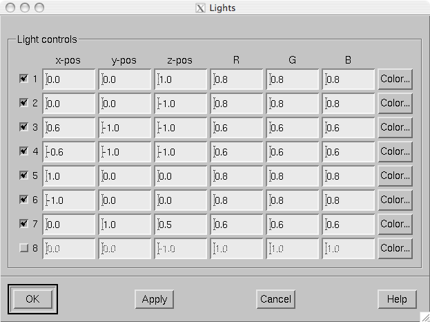

    The lighting adjustment dialog.

.. _CACBEBGC:

Producing output files
======================

.. _CACFBIHD:

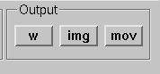

    Graphics output controls.

Three types of output files can be produced from the main
surface display using the graphics output buttons shown in :ref:`CACFBIHD`:

**w files (w button)**

    These files are simple binary files, which contain a list of vertex numbers
    on the cortical surface and their current data values. The w files
    will be automatically tagged with ``-lh.w`` and ``-rh.w`` .
    They will only contain vertices which currently have a nonzero value.

**Graphics snapshots (img button)**

    These files will contain an exact copy of the image in tif or rgb
    formats. The output format and the output mode is selected from
    the image saving dialog shown in :ref:`CACCEFGI`. For more
    details, see :ref:`CACIJFII`. If snapshot or automatic image
    saving mode is in effect, thee img button
    terminates this mode.

**QuickTime (TM) movies (mov button)**

    These files will contain a sequence of images as a QuickTime (TM) movie
    file. The movie saving dialog shown in :ref:`CACFFBBD` specifies the
    time range and the interval between the frames as well as the quality
    of the movies, which is restricted to the range 25...100. The size
    of the QuickTime file produced is approximately proportional to
    the quality.

.. _CACCEFGI:

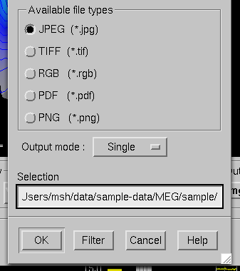

    File type selection in the image saving dialog.

.. _CACFFBBD:

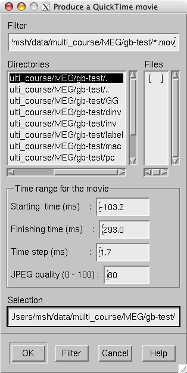

    The controls in the movie saving dialog.

.. _CACIJFII:

Image output modes
==================

The image saving dialog shown in :ref:`CACCEFGI` selects
the format of the image files produced and the image output mode.
The buttons associated with different image format change the file
name filter in the dialog to display files of desired type. However,
the final output format is defined by the ending of the file name
in the Selection text field as
follows:

**jpg**

    JPEG (Joint Photographic Experts Group) format. Best quality jpeg is
    always produced.

**tif or tiff**

    Uncompressed TIFF (Tagged Image File Format).

**rgb**

    RGB format.

**pdf**

    Portable Document File format.

**png**

    Portable Network Graphics format.

.. note:: Only TIFF and RGB output routines are compiled    into mne_analyze . For other output    formats to work, the following programs must be present in your    system: tifftopdf, tifftopnm, pnmtojpeg, and pnmtopng.

There are three image saving modes which can be selected
from the option menu labelled Output mode :

**Single**

    When OK is clicked one file containing
    the present image is output.

**Snapshot**

    A new image file is produced every time ``s`` is pressed
    in the image window, see :ref:`CACCABEA` and :ref:`CACFDDCB`. The image file name is used as the stem of
    the output files. For example, if the name is, ``sample.jpg`` ,
    the output files will be ``sample_shot_001.jpg`` , ``sample_shot_002.jpg`` , *etc.*

**Automatic**

    A new image file is produced every time the image window changes.
    The image file name is used as the stem of the output files. For
    example, if the name is, ``sample.jpg`` , the output files
    will be ``sample_001.jpg`` , ``sample_002.jpg`` , *etc.*

.. _CACGBEIB:

Morphing
########

The displayed surface distributions can be morphed to another
subject's brain using the spherical morphing procedure,
see :ref:`ch_morph`. In addition to the morphing surfaces loaded
through File/Load morphing surface... surface
patches for the same subject can be loaded through File/Load morphing surface patch... . Switching between main and morphing
surfaces is discussed in :ref:`CACCABEA`.

Any labels displayed are visible on any of the surfaces displayed
in the main surface display. Time points can be picked in any of
the surfaces. As a result, the corresponding timecourses will be
shown in the MNE amplitude window, see :ref:`CACCCFHH`.

.. _CACEFFJF:

The viewer
##########

.. _CACFDDCB:

Overview
========

.. _CACJDFFH:

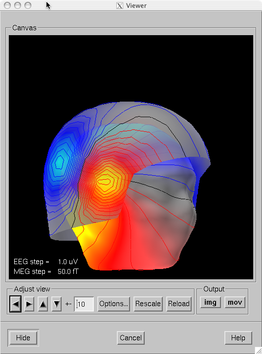

    The viewer window with a visualization of MEG and EEG contour maps.

When Windows/Show viewer... is
selected, the following additional surfaces will be loaded:

- The left and right hemisphere pial surfaces,

- The surface representing the inner helmet shaped wall of the
  dewar on which the MEG sensors are located,

- The scalp surface, and

- The BEM surfaces.

The scalp surface is loaded from the file ``bem/`` <*subject*>``-head.fif`` under
the subject's FreeSurfer directory. This surface is automatically
prepared if you use the watershed algorithm as described in :ref:`BABBDHAG`.
If you have another source for the head triangulation you can use
the utility mne_surf2bem to create
the fif format scalp surface file, see :ref:`BEHCACCJ`.

If a file called ``bem/`` <*subject*>``-bem.fif`` under
the subject's FreeSurfer directory is present, mne_analyze tries
to load the BEM surface triangulations from there. This file can
be a symbolic link to one of the ``-bem.files`` created
by mne_prepare_bem_model , see :ref:`CHDJFHEB`.
If the BEM file contains a head surface triangulation, it will be
used instead of the one present in the ``bem/`` <*subject*>``-head.fif`` file.

Once all required surfaces have been loaded, the viewer window
shown in :ref:`CACJDFFH` pops up. In addition to the display
canvas, the viewer has Adjust view controls
similar to the main surface display and options for graphics output.
The Adjust view controls do not
have the option menu for standard viewpoints and has two additional
buttons:

The output options only include graphics output as snapshots
(img ) or as movies (mov ).

**Options...**

    This button pops up the viewer options window which controls the appearance
    of the viewer window.

**Rescale**

    This button adjusts the contour level spacing in the magnetic field and
    electric potential contour maps so that the number of contour lines
    is reasonable.

**Reload**

    Checks the modification dates of the surface files loaded to viewer and
    reloads the data if the files have been changed. This is useful, *e.g.*,
    for display of different BEM tessellations.

The display can be also adjusted
using keyboard shortcuts, which are available once you click in
the viewer display with the left mouse button:

**Arrow keys**

    Rotate the surface by increments specified in degrees in the Adjust View section.

**+**

    Enlarge the image.

**-**

    Reduce the image.

**=**

    Return to the default size.

**r**

    Rotate the image one full revolution around z axis using the currently
    specified rotation step. This is useful for producing a sequence
    of images when automatic image saving is on, see :ref:`CACBEBGC`.

**s**

    Produces a image file which contains a snapshot of the currently displayed
    image. For information on snapshot mode, see :ref:`CACBEBGC`.

**.**

    Stops the rotation invoked with the 'r' key, see
    above.

The left mouse button can be also used to inquire estimated
magnetic field potential values on the helmet and head surfaces
if the corresponding maps have been calculated and displayed.

In addition, the mouse wheel or trackball can be used to
rotate the image. If a trackball is available, *e.g.*,
with the Apple MightyMouse, the image can be rotated up and down
or left and right with the trackball. With a mouse wheel the image
will rotated up and down when the wheel is rotated. Image rotation
in the left-right direction is achieved by holding down the shift key
when rotating the wheel. The shift key
has the same effect on trackball operation.

.. note:: The trackball and mouse wheel functionality    is dependent on your X server settings. On Mac OSX these settings    are normally correct by default but on a LINUX system some adjustments    to the X server settings maybe necessary. Consult your system administrator    or Google for details.

.. _CACHGDEA:

Viewer options
==============

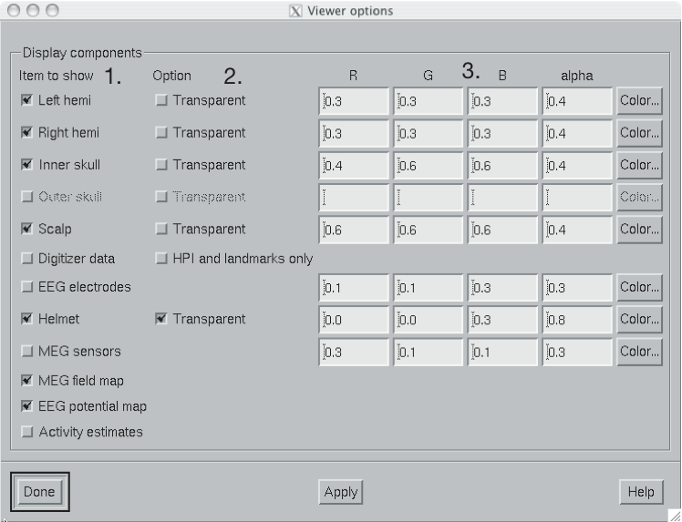

    The viewer options window

The viewer options window shown above contains three main
sections to control the appearance of the viewer:

- Selectors for various items to show,

- Options for some of the items, and

- Control of the color and transparency of the items, if applicable.
  The color can be adjusted either by entering numeric values in the
  range 0...1 or with help of a color editor which appears from the Color... button.
  The transparency value has the same range as the other color components,
  zero indicating a fully transparent (invisible) surface and one a
  fully opaque one.

The available items are:

**Left hemi**

    The pial surface of the left hemisphere. This surface can be made transparent.
    Naturally, this surface will only be visible if the scalp is made
    transparent.

**Right hemi**

    The pial surface of the right hemisphere.

**Inner skull**

    The inner skull surface. This surface can be made transparent. If parts
    of the pial surface are outside of the inner skull surface, they will
    be visible, indicating that the inner skull surface is obviously inside
    the inner skull. Note that this criterion is more conservative than
    the one imposed during the computation of the forward solution since
    the source space points are located on the white matter surface
    rather than on the pial surface. This surface can be displayed only
    if the BEM file is present, see :ref:`CACFDDCB`.

**Outer skull**

    The outer skull surface. This surface can be made transparent. This surface can
    be displayed only if the BEM file is present and contains the outer
    skull surface, see :ref:`CACFDDCB`.

**Scalp**

    The scalp surface. This surface can be made transparent. The display
    of this surface requires that the scalp triangulation file is present,
    see :ref:`CACFDDCB`.

**Digitizer data**

    The 3D digitizer data collected before the MEG/EEG acquisition. These
    data are loaded from File/Load digitizer data... .
    The display can be restricted to HPI coil locations and cardinal
    landmarks with the option. The digitizer points are shown as disks
    whose radius is equal to the distance of the corresponding point
    from the scalp surface. Points outside the scalp are shown in red
    and those inside in blue. Distinct shades of cold and warm colors
    are used for the fiducial landmarks. The HPI coils are shown in
    green. Further information on these data and their use in coordinate
    system alignment is given in :ref:`CACEHGCD`.

**Helmet**

    The MEG measurement surface, *i.e.*, inner surface
    of the dewar.

**EEG electrodes**

    The EEG electrode locations. These will be only available if your data
    set contains EEG channels.

**MEG sensors**

    Outlines of MEG sensors.

**MEG field map**

    Estimated contour map of the magnetic field component normal to the
    helmet surface or normal to the scalp, see :ref:`CACICDGA`.

**EEG potential map**

    Interpolated EEG potential map on the scalp surface, see :ref:`CACICDGA`.

**Activity estimates**

    Current estimates on the pial surface.

.. _CACICDGA:

Magnetic field and electric potential maps
##########################################

Overview
========

In mne_analyze , the magnetic
field and potential maps displayed in the viewer window are computed
using an MNE-based interpolation technique. This approach involves
the following steps:

- Establish an inverse operator to compute
  a minimum norm solution on a spherical surface using a spherically
  symmetric forward model. Instead of assuming a discrete grid of
  sources, a continuous distribution of tangential currents is employed.
  In this case the lead field dot products can be computed in closed
  form. Separate solutions are computed for MEG and EEG.

- The normal component of the magnetic field or the electric
  potential on the helmet or head surface is computed from the MEG-based
  and EEG-based MNE. Since the MNE predicts the original measurements
  accurately, it can also interpolate and extrapolate the data reliably.
  The grid of interpolation or extrapolation points can be located
  on the helmet or scalp surface for MEG and on the scalp surface
  for EEG.

The magnetic field and potential maps appear automatically
whenever they are enabled from the viewer options, see :ref:`CACHGDEA`.

.. _CACGFBCI:

Technical description
=====================

Let :math:`x_k` be an MEG or an EEG
signal at channel :math:`k = 1 \dotso N`. This signal
is related to the primary current distribution :math:`J^p(r)` through
the lead field :math:`L_k(r)`:

.. math::    x_k = \int_G {L_k(r) \cdot J^p(r)}\,dG\ ,

where the integration space :math:`G` in
our case is a spherical surface. The oblique boldface characters
denote three-component locations vectors and vector fields.

The inner product of two leadfields is defined as:

.. math::    \langle L_j \mid L_k \rangle = \int_G {L_j(r) \cdot L_k(r)}\,dG\ ,

These products constitute the Gram matrix :math:`\Gamma_{jk} = \langle L_j \mid L_k \rangle`.
The minimum -norm estimate can be expressed as a weighted sum of
the lead fields:

.. math::    J^* = w^T L\ ,

where :math:`w` is a weight vector
and :math:`L` is a vector composed of the
continuous lead-field functions. The weights are determined by the
requirement

.. math::    x = \langle L \mid J^* \rangle = \Gamma w\ ,

i.e., the estimate must predict the measured signals. Hence,

.. math::    w = \Gamma^{-1} x\ .

However, the Gram matrix is ill conditioned and regularization
must be employed to yield a stable solution. With help of the SVD

.. math::    \Gamma = U \Lambda V^T

a regularized minimum-norm can now found by replacing the
data matching condition by

.. math::    x^{(p)} = \Gamma^{(p)} w^{(p)}\ ,

where

.. math::    x^{(p)} = (U^{(p)})^T x \text{  and  } \Gamma^{(p)} = (U^{(p)})^T \Gamma\ ,

respectively. In the above, the columns of :math:`U^{(p)}` are
the first *k* left singular vectors of :math:`\Gamma`.
The weights of the regularized estimate are

.. math::    w^{(p)} = V \Lambda^{(p)} U^T x\ ,

where :math:`\Lambda^{(p)}` is diagonal with

.. math::    \Lambda_{jj}^{(p)} = \Bigg\{ \begin{array}{l}
		 1/{\lambda_j},j \leq p\\
		 \text{otherwise}
	     \end{array}

:math:`\lambda_j` being the :math:`j` th singular
value of :math:`\Gamma`. The truncation point :math:`p` is
selected in mne_analyze by specifying
a tolerance :math:`\varepsilon`, which is used to
determine :math:`p` such that

.. math::    1 - \frac{\sum_{j = 1}^p {\lambda_j}}{\sum_{j = 1}^N {\lambda_j}} < \varepsilon

The extrapolated and interpolated magnetic field or potential
distribution estimates :math:`\hat{x'}` in a virtual
grid of sensors can be now easily computed from the regularized
minimum-norm estimate. With

.. math::    \Gamma_{jk}' = \langle L_j' \mid L_k \rangle\ ,

where :math:`L_j'` are the lead fields
of the virtual sensors,

.. math::    \hat{x'} = \Gamma' w^{(k)}\ .

Field mapping preferences
=========================

The parameters of the field maps can be adjusted from the Field mapping preferences dialog shown in :ref:`CACGDCGA` which is accessed through the Adjust/Field mapping... menu item.

.. _CACGDCGA:

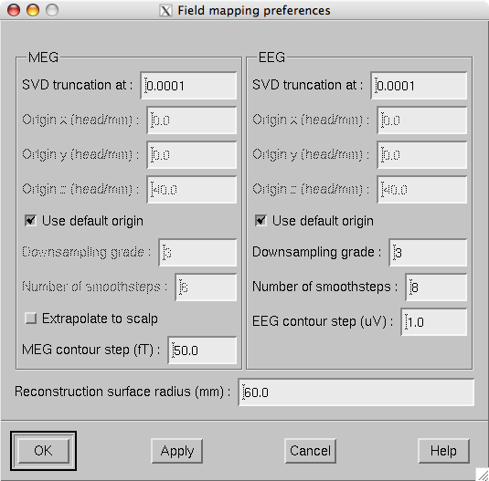

    Field mapping preferences dialog.

The Field mapping preferences dialog
has the following controls, arranged in MEG , EEG ,
and common sections:

**SVD truncation at**

    Adjusts the smoothing of the field and potential patterns. This parameter
    specifies the eigenvalue truncation point as described in :ref:`CACGFBCI`. Smaller values correspond to noisier field
    patterns with less smoothing.

**Use default origin**

    The location of the origin of the spherical head model used in these computations
    defaults to (0 0 40) mm. If this box is unchecked the origin coordinate
    fields are enabled to enter a custom origin location. Usually the
    default origin is appropriate.

**Downsampling grade**

    This option only applies to EEG potential maps and MEG field maps
    extrapolated to the head surface and controls the number of virtual
    electrodes or point magnetometers used in the interpolation. Allowed
    values are: 2 (162 locations), 3 (642 locations), and 4 (2562 locations).
    Usually the default value 3 is appropriate.

**Number of smoothsteps**

    This option controls how much smoothing, see :ref:`CHDEBAHH`,
    is applied to the interpolated data before computing the contours.
    Usually the default value is appropriate.

**Reconstruction surface radius**

    Distance of the spherical reconstruction surface from the sphere model
    origin. Usually default value is appropriate. For children it may
    be necessary to make this value smaller.

.. _CACBHDBF:

Working with current estimates
##############################

.. _CACHFFIJ:

Preferences
===========

The characteristics of the current estimates displayed are
controlled from the MNE preferences dialog
which pops up from Adjust/Estimates... .

This dialog, shown in :ref:`CACJGCDH`, has the following
controls:

**SNR estimate**

    This controls the regularization of the estimate, i.e., the amount
    of allowed mismatch between the measured data and those predicted by
    the estimated current distribution. Smaller SNR means larger allowed
    mismatch. Typical range of SNR values is 1...7. As discussed in :ref:`CBBDJFBJ`,
    the SNR value can be translated to the current variance values expressed
    in the source-covariance matrix R. This translation is presented
    as the equivalent current standard-deviation value

**Show**

    This radio button box selects the quantity to display. MNE is
    the minimum norm estimate (estimated value of the current), dSPM is the
    noise-normalized MNE, and sLORETA is
    another version of the noise-normalized solution which is claimed
    to have a smaller location bias than the dSPM.

**Mask with**

    If MNE is selected in the Show radio
    button box, it is possible to mask the solution with one of the
    statistical maps. The masking map is thresholded at the value given
    in the Threshold text field and
    the MNE is only shown in areas with statistical values above this threshold.

**Value histogram**

    This part of the dialog shows the distribution of the currently
    shown estimate values over the surface. The histogram is colored
    to reflect the current scale settings. The fthresh , fmid ,
    and fmax values are indicated
    with vertical bars. The histogram is updated when the dialog is
    popped up and when the estimate type to show changes, not at every
    new time point selection. The Refresh button
    makes the histogram current at any time.

**Color scale**

    These text fields control the color scale as described in :ref:`CACGGICI`.

**Options**

    Various options controlling the estimates.

.. tabularcolumns:: |p{0.2\linewidth}|p{0.45\linewidth}|
.. _CACGGICI:
.. table:: The color scale parameters.

    +------------+---------------------------------------------------------+
    | Parameter  |   Meaning                                               |
    +============+=========================================================+
    | fthresh    | If the value is below this level, it will not be shown. |
    +------------+---------------------------------------------------------+
    | fmid       | Positive values at this level will show as red.         |
    |            | Negative values will be dark blue.                      |
    +------------+---------------------------------------------------------+
    | fmax       | Positive values at and above this level will be bright  |
    |            | yellow. Negative values will be bright blue.            |
    +------------+---------------------------------------------------------+
    | fmult      | Apply this multiplier to the above thresholds. Default  |
    |            | is :math:`1` for statistical maps and :math:`1^{-10}`   |
    |            | for currents (MNE). The vertical bar locations in the   |
    |            | histogram take this multiplier into account but the     |
    |            | values indicated are the threshold parameters without   |
    |            | the multiplier.                                         |
    +------------+---------------------------------------------------------+
    | tcmult     | The upper limit of the timecourse vertical scale will   |
    |            | be :math:`tc_{mult}f_{mult}f_{max}`.                    |
    +------------+---------------------------------------------------------+

.. _CACJGCDH:

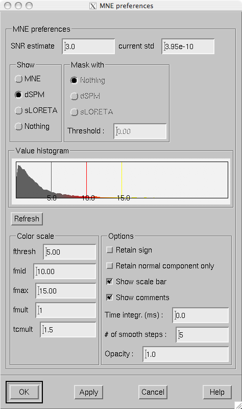

    Estimate preferences dialog.

The optional parameters are:

**Retain sign**

    With this option, the sign of the dot product between the current direction
    and the cortical surface normal will be used as the sign of the
    values to be displayed. This option yields meaningful data only if
    a strict or a loose orientation constraint was used in the computation
    of the inverse operator decomposition.

**Retain normal component only**

    Consider only the current component normal to the cortical mantle. This
    option is not meaningful with completely free source orientations.

**Show scale bar**

    Show the color scale bar at the lower right corner of the display.

**Show comments**

    Show the standard comments at the lower left corner of the display.

**Time integr. (ms)**

    Integration time for each frame (:math:`\Delta t`).
    Before computing the estimates time integration will be performed
    on sensor data. If the time specified for a frame is :math:`t_0`,
    the integration range will be :math:`t_0 - ^{\Delta t}/_2 \leq t \leq t_0 + ^{\Delta t}/_2`.

**# of smooth steps**

    Before display, the data will be smoothed using this number of steps,
    see :ref:`CHDEBAHH`.

**Opacity**

    The range of this parameter is 0...1. The default value 1 means
    that the map overlaid on the cortical surface is completely opaque.
    With lower opacities the color of the cortical surface will be visible
    to facilitate understanding the underlying folding pattern from
    the curvature data displayed.

.. _CACJFFEE:

The SNR display
===============

The SNR estimate display
shows the SNR estimated from the whitened data in red and the apparent
SNR inferred from the mismatch between the measured and predicted
data in green.

The SNR estimate is computed from the whitened data :math:`\tilde{x}(t)`,
related to the measured data :math:`x(t)` by

.. math::    \tilde{x}(t) = C^{-^1/_2} x(t)\ ,

where :math:`C^{-^1/_2}` is the whitening
operator, introduced in :ref:`CHDDHAGE`.

The computation of the apparent SNR will be explained in
future revisions of this manual.

.. _CACCCFHH:

Inquiring timecourses
#####################

.. _CHDGHDGE:

Timecourses at vertices
=======================

Timecourses at individual vertices can be inquired by clicking
on a desired point on the surface with the left mouse button. If
the control key was down at the time of a click, the timecourse
will be added to the timecourse manager but left off. With both
control and shift down, the timecourse will be added to the timecourse
manager and switched on. For more information on the timecourse
manager, see :ref:`CACDIAAD`.

The timecourses are be affected by the Retain sign and Retain normal component only settings in the MNE preferences dialog , see :ref:`CACHFFIJ`.

Timecourses at labels
=====================

The labels provide means to interrogate timecourse information
from ROIs. The label files can be created in mne_analyze ,
see :ref:`CACJCFJJ` or in tksurfer ,
which is part of the FreeSurfer software. For mne_analyze left-hemisphere
and right-hemisphere label files should be named <*name*> ``-lh.label`` and <*name*> ``-rh.label`` ,
respectively.

Individual label files can be loaded from Labels/Load label... . All label files in a directory can be
loaded from Labels/Load all labels... .
Once labels are loaded, the label list shown in :ref:`CACJJGEF` appears. Each
time a new label is added to the list, the names will be reordered
to alphabetical order. This list can be also brought up from Labels/Show label list . The list can be cleared from Labels/Discard all labels .

.. warning:: Because of the format of the label    files mne_analyze can not certify    that the label files loaded belong to the cortical surfaces of the present    subject.

When a label is selected from the label list, the corresponding
timecourse appears. The Keep button
stores the timecourse to the timecourse manager, :ref:`CACDIAAD`.

.. _CACJJGEF:

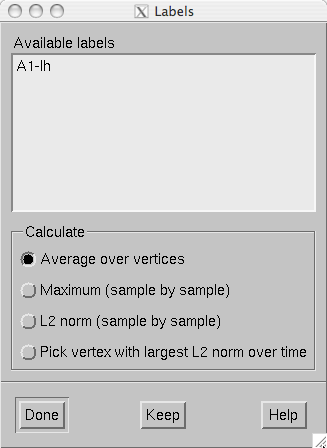

    The label list.

The timecourse shown in the MNE amplitude window
is a compound measure of all timecourses within a label. Two measures
are available:

**Average**

    Compute the average over all label vertices at each time point.

**Maximum**

    Compute the maximum absolute value over all vertices at each time point.
    If the data are signed, the value is assigned the sign of the value
    at the maximum vertex. This may make the timecourse jump from positive
    to negative abruptly if vertices with different signs are included
    in the label.

**L2 norm (sample by sample)**

    Compute the :math:`l_2` norm over the values
    in the vertices at each time point.

**Pick vertex with largest L2 norm over time**

    Compute the :math:`l_2` norm over time in
    each vertex and show the time course at the vertex with the largest
    norm.

.. _CACDIAAD:

The timecourse manager
======================

The timecourse manager shown in :ref:`CACEDEJI` has
the following controls for each timecourse stored:

.. _CACEDEJI:

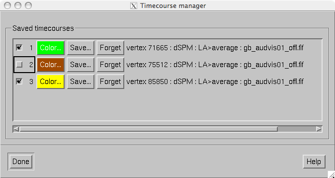

    The timecourse manager.

**Numbered checkbox**

    Switches the display of this timecourse on and off.

**Color...**

    This button shows the color of the timecourse curve. The color can be
    adjusted from the color editor which appears when the button is pressed.

**Save...**

    Saves the timecourse. If a single vertex is selected, the time course file
    will contain some comment lines starting with the the percent sign,
    one row of time point values in seconds and another with the data
    values. The format of the timecourse data is explained in :ref:`CACJJGFA`, below.

**Forget**

    Delete this timecourse from memory.

.. _CACJJGFA:

Label timecourse files
----------------------

When timecourse corresponding to a label is saved, the default
is to save the displayed single timecourse in a format identical
to the vertex timecourses. If Save all timecourses within the label is selected, the Time-by-time output output changes the output to be listed
time by time rather than vertex by vertex, Include coordinates adds the vertex location information to
the output file, and Include vertex numbers adds
the indices of picked vertices to the output, see :ref:`CACHBBFD`.
The vertex-by-vertex output formats is summarized in :ref:`CACEFHIJ`.

.. _CACHBBFD:

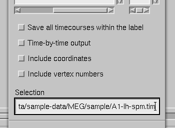

    Label timecourse saving options.

.. _CACEFHIJ:

.. table:: Vertex-by-vertex output format. :math:`n_p` is the number of vertices, :math:`n_t` is the number of time points, :math:`n_{com}` is the number of comment lines, :math:`t_1 \dotso t_{n_t}` indicate the times in milliseconds, :math:`p` is a vertex number, :math:`x_p y_p z_p` are the coordinates of vertex :math:`p` in millimeters, and :math:`v_p^{(1)} \dotso v_p^{(n_t)}` are the values at vertex :math:`p`.  Items in brackets are only included if *Include coordinates* is active. In the time-by-time output format the data portion of the file is transposed.

    ===================================  ======================================================
    Line                                 Contents
    ===================================  ======================================================
    :math:`1-n_{com}`                    Comment lines beginning with %
    :math:`n_{com}+1`                    :math:`\{0.0\}[0.0\ 0.0\ 0.0] t_1 \dotso t_{n_t}`
    :math:`(n_{com}+1)-(n_p+n_{com}+1)`  :math:`\{p\}[x_p y_p z_p]v_p^{(1)} \dotso v_p^{(n_t)}`
    ===================================  ======================================================

.. _CACJCFJJ:

Creating new label files
========================

It is easy to create new label files in mne_analyze.
For this purpose, an inflated surface should be visible in the main
display. Follow these steps:

- Clear all previously selected vertices
  either by choosing Labels/Clear marked vertices or
  do a right button click on the surface display with the shift key
  down.

- Mark vertices on the surface with right button click or by
  right button drag. The vertices should be defined in the desired
  order on the new label outline. The outline will follow the shortest
  path along the surface. The shortest path will be calculated along
  the white matter surface.Note that sometimes the shortest paths
  appear to be un-intuitive on the inflated surface.

- Do a right button click with control key down inside the label.
  The outline will be completed and shown as a yellow line. The inside
  of the label will be filled and shown in green. A file selection
  box will appear to save the label. Enter the stem of the file name
  here. The file name will be augmented with ``-lh.label`` or ``-rh.label`` ,
  depending on the hemisphere on which the label is specified.

.. _CACFCHEC:

Overlays
########

.. _CACIGHEJ:

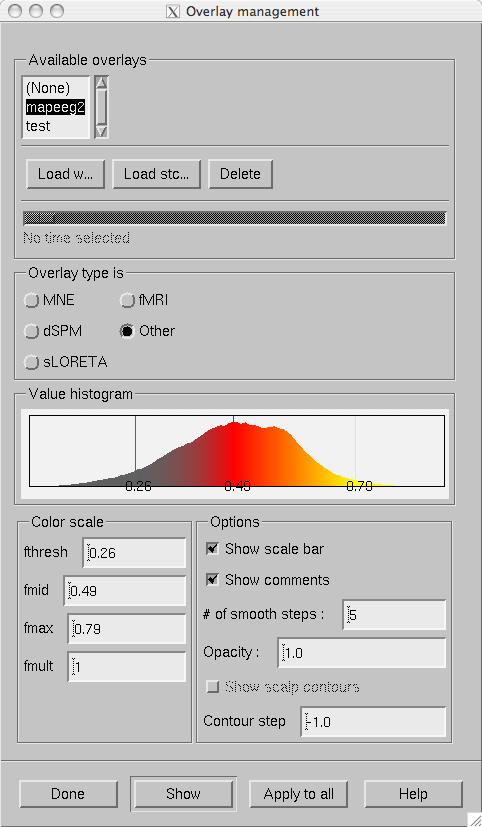

    The overlay management dialog.

In addition to source estimates derived from MEG and EEG
data, mne_analyze can be used
to display other surface-based data. These overlay data can be imported
from w and stc files containing single time slice (static) and dynamic
data (movies), respectively. These data files can be produced by mne_make_movie ,
FreeSurfer software, and custom programs or Matlab scripts.

The names of the files to be imported should end with ``-`` <*hemi*> .<*type*> , where <*hemi*> indicates
the hemisphere (``lh`` or ``rh`` and <*type*> is ``w`` or ``stc`` .

Overlays are managed from the dialog shown in :ref:`CACIGHEJ` which is invoked from File/Manage overlays... .

This dialog contains the following
controls:

**List of overlays loaded**

    Lists the names of the overlays loaded so far.

**Load w...**

    Load a static overlay from a w file. In the open dialog it is possible to
    specify whether this file contains data for the cortical surface
    or for scalp. Scalp overlays can be viewed in the viewer window.

**Load stc...**

    Load a dynamic overlay from an stc file. In the open dialog it is
    possible to specify whether this file contains data for the cortical
    surface or for scalp. Scalp overlays can be viewed in the viewer window.

**Delete**

    Delete the selected overlay from memory.

**Time scale slider**

    Will be activated if a dynamic overlay is selected. Changes the
    current time point.

**Overlay type is**

    Selects the type of the data in the current overlay. Different default color
    scales are provided each overlay type.

**Value histogram**

    Shows the distribution of the values in the current overlay. For
    large stc files this may take a while to compute since all time
    points are included. The histogram is colored to reflect the current
    scale settings. The fthresh , fmid ,
    and fmax values are indicated
    with vertical bars.

**Color scale**

    Sets the color scale of the current overlay. To activate the values, press Show .
    For information on color scale settings, see :ref:`CACGGICI`.

**Options**

    Display options. This a subset of the options in the MNE preferences dialog. For details, see :ref:`CACHFFIJ`.

**Show**

    Show the selected overlay and assign the settings to the current overlay.

**Apply to all**

    Apply the current settings to all loaded overlays.

It is also possible to inquire timecourses of vertices and
labels from dynamic (stc) cortical overlays in the same way as from
original data and store the results in text files. If a static overlay
(w file) or a scalp overlay is selected, the timecourses are picked
from the data loaded, if available.

.. _CHDGHIJJ:

Fitting current dipoles
#######################

Starting from MNE software version 2.6, mne_analyze includes
routines for fitting current dipoles to the data. At present mne_analyze is
limited to fitting single equivalent current dipole (ECD) at one
time point. The parameters affecting the dipole fitting procedure
are described in :ref:`CACEDEGA`. The results are shown in
the dipole list (:ref:`CACGGAIA`). The selection of channels
included can be adjusted interactively or by predefined selections
as described in :ref:`CACIBHCI`.

.. warning:: The current dipole fitting has been    added recently and has not been tested comprehensively. Especially    fitting dipoles to EEG data may be unreliable.

.. _CACEDEGA:

Dipole fitting parameters
=========================

Prior to fitting current dipoles, the fitting parameters
must be set with the Dipole fitting preferences dialog
shown in :ref:`CACFEDEJ`. The dialog is brought up from the Setup fitting... choice in the Dipoles menu.
This dialog contains three sections: Forward model , Modalities ,
and Noise estimate .

The Forward model section
specifies the forward model to be used:

**Sphere model origin x/y/z [mm]**

    Specifies the origin of the spherically symmetric conductor model in
    MEG/EEG head coordinates, see :ref:`BJEBIBAI`.

**EEG scalp radius [mm]**

    Specifies the radius of the outermost shell in the EEG sphere model. For
    details, see :ref:`CHDIAFIG`.

**EEG sphere model name**

    Specifies the name of the EEG sphere model to use. For details,
    see :ref:`CHDIAFIG`.

**BEM model**

    Selects the boundary-element model to use. The button labeled with ... brings
    up a file-selection dialog to select the BEM file. An existing selection
    can be cleared with the Unset button.
    If EEG data are included in fitting, this must be a three-compartment
    model. Note that the sphere model is used even with a BEM model
    in effect, see :ref:`CHDFGIEI`.

**Accurate field calculation**

    Switches on the more accurate geometry definition of MEG coils, see :ref:`BJEIAEIE`.
    In dipole fitting, there is very little difference between the *accurate* and *normal* coil
    geometry definitions.

The Modalities section
defines which kind of data (MEG/EEG) are used in fitting. If an
inverse operator is loaded with the data, this section is fixed and
greyed out. You can further restrict the selection of channels used
in dipole fitting with help of channel selections discussed in :ref:`CACIBHCI`.

The Noise estimate section
of the dialog contains the following items:

**Noise covariance**

    Selects the file containing the noise-covariance matrix. If an inverse operator
    is loaded, the default is the inverse operator file. The button labeled
    with ... brings up a file-selection
    dialog to select the noise covariance matrix file. An existing selection
    can be cleared with the Unset button.

**Omit off-diagonal terms**

    If a noise covariance matrix is selected, this choice omits the
    off-diagonal terms from it. This means that individual noise estimates for
    each channel are used but correlations among channels are not taken
    into account.

**Regularization**

    Regularize the noise covariance before using it in whitening by
    adding a multiple of an identity matrix to the diagonal. This is
    discussed in more detail in :ref:`cov_regularization`. Especially if
    EEG is included in fitting it is advisable to enter a non-zero value
    (around 0.1) here.

**Planar fixed [fT/cm]**

    In the absence of a noise covariance matrix selection, a diagonal noise
    covariance with fixed values on the diagonal is used. This entry
    specifies the fixed value of the planar gradiometers.

**Axial fixed [fT]**

    If a noise covariance matrix file is not specified, this entry specifies a
    fixed diagonal noise covariance matrix value for axial gradiometers
    and magnetometers.

**EEG fixed [muV]**

    If a noise covariance matrix file is not specified, this entry specifies a
    fixed diagonal noise covariance matrix value for axial gradiometers
    and magnetometers..

.. _CACFEDEJ:

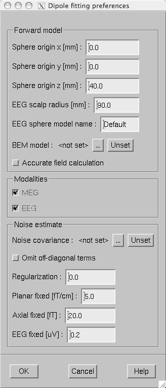

    The dipole fitting preferences dialog.

.. _CHDFGIEI:

The dipole fitting algorithm
============================

When the dipole fitting preferences dialog is closed and
the values have been modified the following preparatory calculations
take place:

- If EEG data are included in fitting
  present, the EEG sphere model specification corresponding to EEG sphere model name is loaded and scaled to the
  the EEG scalp radius .

- If a boundary-element model is used, the additional data depending
  on the sensor locations are computed.

- The noise covariance matrix is composed according to the specifications
  in the Dipole fitting preferences dialog.

- The spatially whitened forward solution is computed in a grid
  of locations to establish the initial guess when a dipole is fitted.
  If a BEM is in use, the grid will be confined to the inner skull
  volume. For a sphere model, a spherical volume with an 80-mm radius,
  centered at the sphere model origin, will be employed. The dipole
  grid will be rectangular with a 10-mm spacing between the closest
  dipole locations. Any locations closer than 20 mm to the center
  of mass of the grid volume will be excluded as well as those closer
  than 10 mm to the surface. Note that this guess grid is only used
  for establishing the initial guess; the actual dipole fitting procedure
  does not constrain the solution to this grid.

When the Fit ECD button
in the tool bar is clicked with a time point selected from the the
response, the optimal Equivalent Current Dipole parameters (location,
orientation, and amplitude) are determined using the following algorithm:

- An initial guess for the location of
  the dipole is determined using the grid of locations determined
  in step 4., above. At each guess dipole location, the least squares
  error between the measured data and a dipole at that location is
  evaluated and the location corresponding to the smallest error is
  used as the initial guess location. In this process, the dipole
  amplitude parameters do not need to be explicitly calculated.

- Using the Nelder-Mead simplex optimization algorithm, an optimal dipole
  location is determined with the sphere model used as the forward
  model. Again, the dipole amplitude parameters are not explicitly present
  in the fitting procedure.

- A second optimization interation using the boundary-element
  model (if available) or the sphere model as the forward model is
  conducted. The reason for repeating the optimization even with the
  sphere model is to reduce the likelihood of having been stuck in
  a local minimum of the least squares error criterion.

- The optimal dipole amplitude parameters are determined for
  the optimal dipole location obtained in steps 2. and 3.

- The dipole parameters are reported in the dipole list discussed
  in :ref:`CACGGAIA`.

Additional notes:

- The noise covariance matrix is always
  applied to the data and the forward solution as appropriate to correctly
  weight the different types of MEG channels and EEG. Depending on
  the dipole fitting settings, the noise covariance may be either
  a diagonal matrix or a full matrix including the correlations.

- Using the SVD of the whitened gain matrix of three dipole
  componets at a given location, the component producing the weakest
  signal amplitude is omitted if the ratio of the smallest and largest
  singular values is less than 0.2.

- The present MNE software package also contains a batch-mode
  dipole fitting program called mne_dipole_fit .
  This piece of software is not yet documented here. However, ``mne_dipole_fit --help`` lists the command-line options which have direct correspondence
  to the interactive dipole fitting options discussed here.

.. _CACGGAIA:

The dipole list
===============

.. _CACGGFEJ:

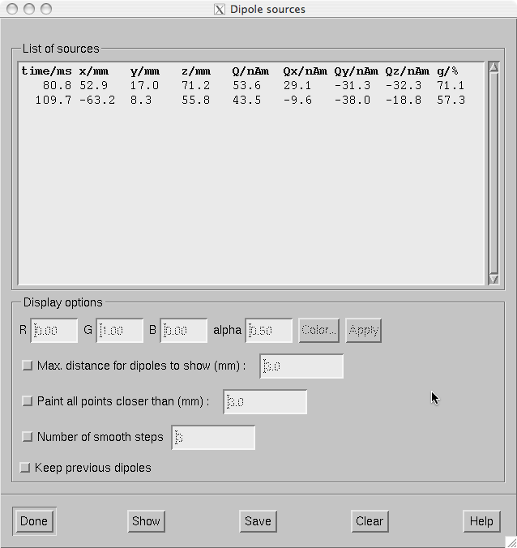

    The dipole list.

The dipole list dialog shown in :ref:`CACGGFEJ` contains
the parameters of the dipoles fitted. In addition, it is possible
to import current dipole locations from the Neuromag source modelling
program xfit to mne_analyze . Dipoles
can be imported in two ways:

- Bring up the dipole list window from Windows/Show dipole list... . Drag and drop selected dipoles
  from one of the xfit dipole list
  to this list using the middle mouse button.

- Drag and drop dipoles from one of the xfit dipole
  lists over the main surface display. The dipole list will appear
  and contain the dropped dipoles.

The buttons at the bottom of the dialog perform the following
functions:

**Done**

    Hide
    the dialog.

**Show**

    Show
    the currently selected dipoles as specified in Display options ,
    see below.

**Save**

    Save the selected (or all) dipoles.
    If the file name specified in the file selection dialog that pops
    up ends with ``.bdip`` , the dipole data will be saved in
    the binary bdip format compatible with
    the Neuromag xfit software, otherwise,
    a text format output will be used. In the text file, comments will
    be included on lines starting with the percent sign so that the
    text format can be easily loaded into Matlab.

**Clear**

    Clear
    the selected dipoles from the list.

When you double click on one of the dipoles or select several
dipoles and click Show points
on the surface displayed in the vicinity of the dipoles will be
painted according to the specifications given in the Options section of
the dialog:

**Color**

    By the default, the dipoles are marked in green with transparency (alpha)
    set to 0.5. I you click on one of the dipoles, you can adjust the
    color of this dipole by editing the color values or from the color editor
    appearing when you click Color... .
    When you click Apply , the new
    color values are attached to the selected dipole.

**Max. distance for dipoles to show (mm)**

    If this option is on, only dipoles which are closer to the surface
    than the distance specified in the adjacent text field are displayed.

**Paint all point closer than (mm)**

    Instead of indicating the point closest to the dipole all points
    closer than the distance given in the text field will be painted
    if this option is on. This choice is useful for understanding the
    shape of the neighborhood of a dipole on the cortical surface.

**Number of smooth steps**

    This option spreads out the dipole marking by the given number of smooth
    steps to make the dipoles more clearly visible. A suitable choice
    is 3 or 4.

**Keep previous dipoles**

    If this option is on, previously marked dipoles are not cleared
    from the display before new ones are shown.

.. note:: The surface must be loaded to display dipole    locations. To calculate the distance from the dipoles to the white    matter surface, the white matter tessellation is loaded as needed.    Depending on the precise location of the fitted dipole, the spot    indicating the dipole site may easily appear on a different wall    of a fissure than could be expected. The fissural walls can be far    apart from each other in the inflated view of the cortex even if    they are physically separated by just a few millimeters. The size    of the spots indicating the dipole locations do not relate to the    dipole strengths or their confidence limits in any way.

.. _CACIBHCI:

Channel selections
==================

As mentioned in :ref:`CACHBJAC`, the right mouse button
in the topographical display of channels can be used to restrict
the selection of channels taken into account in dipole fitting.
In addition, the channel selections can be manipulated in the channel
selection window, which pops up from Dipoles/Manage channel selections... . Initially this dialog contains
the selections defined in or $HOME/.mne/mne_analyze.sel or $MNE_ROOT/share/mne/mne_analyze/mne_analyze.sel,
the personal file taking precedence over the system wide default.
The Save button in this dialog
save the current set of channel selections to the personal selection
file. The format of this file is identical to the channel selection
file in mne_browse_raw .

When a channel selection file is in effect. the variances
of the unselected channels are increased by a factor of 900. This
means that unselected channels receive virtually no weight in the
least-squares error function or, equivalently, that they are considered
to be 30 times more noisy than their true noise value. Since this
implementation of channel selections requires recomputation of the
initial guess candidate data discussed in :ref:`CHDFGIEI`,
above, changing the selection may take a finite amount of time,
especially if a BEM is used for the forward calculation.

.. note:: Please note that when making a channel    selection in the topographical displays, the channels not present    in a particular layout are also affected. For example, if you select    channels in a layout showing the Vectorview planar gradiometers,    the magnetometer channels and EEG channels will be unselected.

.. _CACEHGCD:

Coordinate frame alignment
##########################

The MRI-MEG coordinate frame alignment tools included in mne_analyze utilized
the 3D digitizer (Polhemus) data acquired in the beginning of each
MEG/EEG session and the scalp surface triangulation shown in the
viewer window. To access the coordinate frame alignment tools:

- Load digitizer data. You can either
  load a data set containing digitizer information or load digitizer
  data from a file through the File/Load digitizer data... menu choice.

- Set up the viewer window and make it visible, see :ref:`CACEFFJF`. The viewer options should be set to show the
  digitizer data, see :ref:`CACHGDEA`.

- Bring up the Adjust coordinate alignment dialog from Adjust/Coordinate alignment... .

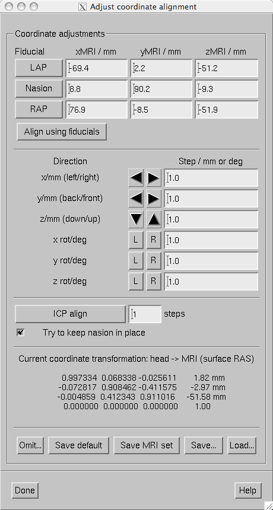

    The coordinate frame alignment dialog.

The coordinate frame alignment dialog contains the following
sections:

- Buttons for picking the fiducial points
  from the scalp surface and one for setting an initial alignment
  using these points. When one of the fiducials is selected, the viewer
  display automatically rotates to a suitable orientation to make
  the corresponding fiducial accessible.

- Controls for fine tuning the alignment. These include movements
  along the three orthogonal coordinate axes and rotations around
  them. The buttons marked L and R indicate
  rotations in counterclockwise and clockwise directions, respectively.
  The amount of movement (mm) or rotation (degrees) is given in the
  text fields next to the adjustment buttons.

- Access to an automatic alignment procedure, which employs
  the Iterative Closest Point (ICP) algorithm.

- Listing of the current coordinate transformation.

- Buttons for discarding outlier points (Discard... ), and for
  saving and loading the coordinate transformation.

The saving and loading choices are:

**Save default**

    Saves a file which contains the MEG/MRI coordinate transformation
    only. The file name is generated from the name of the file from which
    the digitization data were loaded by replacing the ending ``.fif`` with ``-trans.fif`` .
    If this file already exists, it will be overwritten without any
    questions asked.

**Save MRI set**

    This option searches for a file called COR.fif in $SUBJECTS_DIR/$SUBJECT/mri/T1-neuromag/sets.
    The file is copied to COR-<*username*>-<*date*>-<*time*>.fif
    and the current MEG/MRI coordinate transformation as well as the
    fiducial locations in MRI coordinates are inserted.

**Save...**

    Saves a file which contains the MEG/MRI coordinate transformation
    only. The ending ``-trans.fif`` is recommended. The file name
    selection dialog as a button to overwrite.

**Load...**

    Loads the MEG/MRI coordinate transformation from the file specified.

The MEG/MRI coordinate transformation files are employed
in the forward calculations. The convenience script mne_do_forward solution described in :ref:`BABCHEJD` uses
a search sequence which is compatible with the file naming conventions
described above. It is recommended that -trans.fif file
saved with the Save default and Save... options
in the mne_analyze alignment
dialog are used because then the $SUBJECTS_DIR/$SUBJECT directory
will be composed of files which are dependent on the subjects's
anatomy only, not on the MEG/EEG data to be analyzed.

Each iteration step of the Iterative Closest Point (ICP) algorithm consists of
two matching procedures:

- For each digitizer point, transformed
  from MEG to the MRI coordinate frame using the current coordinate
  transformation, the closest point on the triangulated surface is
  determined.

- The best coordinate transformation aligning the digitizer
  points with the closest points on the head surface is computed.

These two steps are iterated the designated number of times.
If the Try to keep nasion in place option
is on, the present location of the nasion receives a strong weight
in the second part of each iteration step so that nasion movements
are discouraged.

.. note:: One possible practical approach to coordinate frame alignment is discussed in :ref:`CHDIJBIG`.

.. _CHDCGHIF:

Using a high-resolution head surface tessellations
==================================================

The newest version of FreeSurfer contains a script called mkheadsurf which
can be used for coordinate alignment purposes. For more information,
try ``mkheadsurf --help`` . This script produces a file
called ``surf/lh.smseghead`` , which can be converted into
a fif file using mne_surf2bem.

Suggested usage:

- Set the SUBJECTS_DIR correctly.

- Run mkheadsurf: ``mkheadsurf -subjid`` <*subject*> .

- Goto the directory ``$SUBJECTS_DIR/`` <*subject*> ``/bem`` .

- Convert the head surface file: ``mne_surf2bem --surf ../surf/lh.smseghead --id 4 --check --fif`` <*subject*> ``-head-dense.fif``

- Rename the existing head surface file to <*subject*> ``-head-sparse.fif``

- Copy <*subject*> ``-head-dense.fif`` to <*subject*> ``-head.fif``

- Click Reload in the viewer
  window.

After this you can switch between the dense and smooth head
surface tessellations by copying either <*subject*> ``-head-dense.fif`` or <*subject*> ``-head-sparse.fif`` to <*subject*> ``-head.fif`` .

If you have Matlab software available on your system, you
can also benefit from the script mne_make_scalp_surfaces .
This script invokes mkheadsurf and
subsequently decimates it using the mne_reduce_surface function
in the MNE Matlab toolbox, which in turn invokes the reducepatch
Matlab function. As a result, the $SUBJECTS_DIR/$SUBJECT/bem directory
will contain 'dense', 'medium',
and 'sparse' scalp surface tessellations. The
dense tessellation contains the output of mkheadsurf while
the medium and sparse tessellations comprise 30,000 and 2,500 triangles,
respectively. You can then make a symbolic link of one of these
to <*subject*> ``-head.fif`` .
The medium grade tessellation is an excellent compromize between
geometric accuracy and speed in the coordinate system alignment.

.. note:: While the dense head surface tessellation    may help in coordinate frame alignment, it will slow down the operation    of the viewer window considerably. Furthermore, it cannot be used    in forward modelling due to the huge number of triangles. For the    BEM, the dense tessellation does not provide much benefit because    the potential distributions are quite smooth and widespread on the    scalp.

.. _CACJJBGF:

Using fiducial points identified by other software
==================================================

If you have identified the three fiducial points in software
outside mne_analyze , it is possible
to display this information on the head surface visualization. To
do this, you need to copy the file containing the fiducial location
information in MRI (surface RAS) coordinates to $SUBJECTS_DIR/$SUBJECT/bem/$SUBJECT-fiducials.fif.
There a three supported ways to create this file:

- Use the mne_make_fiducial_file.m Matlab
  function (not yet written) to create this file.

- Copy a MRI description file with the MEG-MRI coordinate transformation
  created with MRIlab (typically $SUBJECTS_DIR/$SUBJECT/mri/T1-neuromag/sets/COR-<*date*>.fif
  to $SUBJECTS_DIR/$SUBJECT/bem/$SUBJECT-fiducials.fif.

- For the average subject, fsaverage ,
  copy the fsaverage-fiducials.fif file provided with mne_analyze
  in place, see :ref:`CACGEAFI`.

.. _CACIADAI:

Viewing continuous HPI data
###########################

.. _CACFHFGJ:

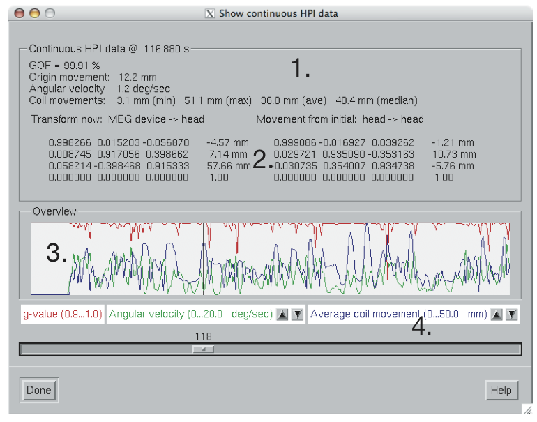

    Continuous HPI data overview.

The newest versions of Neuromag software allow continuous
acquisition of signals from the HPI coils. On the basis of these
data the relative position of the dewar and the head can be computed
a few times per second. The resulting location data, expressed in
the form of unit quaternions (see http://en.wikipedia.org/wiki/Quaternion)
and a translation.

The continuous HPI data can be through the File/View continuous HPI data... menu item, which pops up
a standard file selection dialog. If the file specified ends with ``.fif`` a
fif file containing the continuous coordinate transformation information
is expected. Otherwise, a text log file is read. Both files are
produced by the Neuromag maxfilter software.

Once the data have been successfully loaded, the dialog shown
in :ref:`CACFHFGJ` appears. It contains the following information:

- Currently selected time point and overview
  of the data at the current time point,

- MEG device to MEG head coordinate transformation at the current time
  point and the incremental transformation from the initial timepoint
  to the current file.

- Graphical display of the data.

- Controls for the graphical display.

The overview items are:

**GOF**

    Geometric mean of the goodness of fit values of the HPI coils at
    this time point.

**Origin movement**

    The distance between the head coordinate origins at the first and current
    time points.

**Angular velocity**

    Estimated current angular velocity of the head.

**Coil movements**

    Comparison of the sensor locations between the first and current time
    points. The minimum, maximum, average, and median sensor movements
    are listed.

The graphical display contains the following data:

- The geometric mean of the HPI coil goodness
  of fits (red curve). The scale for this curve is always 0.9...1.0.

- The average coil (sensor) movement value (blue curve). The
  scale is adjustable from the buttons below the display.

- The estimated angular velocity (deg/s, green curve). The scale
  is adjustable from the buttons below the display.

- The current time point indicated with a black cursor.

The slider below the display can be used to select the time
point. If you click on the slider, the current time can be adjusted
with the arrow keys. The current head position with respect to the
sensor array is show in the viewer window if it is visible, see :ref:`CACEFFJF`. Note that a complete set of items listed above
is only available if a data file has been previously loaded, see :ref:`CACBACHB`.

.. _CACCHCBF:

Working with the MRI viewer
###########################

.. _CHDEGEHE:

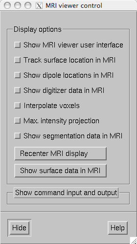

    The MRI viewer control window.

Selecting Show MRI viewer... from
the View menu starts the FreeSurfer MRI
viewer program tkmedit to work
in conjunction with mne_analyze . After
a few moments, both tkmedit with
the current subject's T1 MRI data shown and the MRI viewer
control window shown in :ref:`CHDEGEHE` appear. Note that
the tkmedit user interface is
initially hidden. The surfaces of a subject must be loaded before
starting the MRI viewer.

The MRI viewer control window contains
the following items:

**Show MRI viewer user interface**

    If this item is checked, the tkmedit user
    interface window will be show.

**Track surface location in MRI**

    With this item checked, the cursor in the MRI data window follows the
    current (clicked) location in surface display or viewer. Note that for
    the *viewer* window the surface location will
    inquired from the surface closest to the viewer. The MEG helmet
    surface will not be considered. For example, if you click at an
    EEG electrode location with the scalp surface displayed, the location
    of that electrode on the scalp will be shown. The cortical surface
    locations are inquired from the white matter surface.

**Show dipole locations in MRI**

    If this option is selected, whenever a dipole is displayed in the
    surface view using the dipole list dialog discussed in :ref:`CACGGAIA` the cursor will also move to the same location
    in the MRI data window.

**Show digitizer data in MRI**

    If digitizer data are loaded, this option shows the locations with green
    diamonds in the MRI data.

**Interpolate voxels**

    Toggles trilinear interpolation in the MRI data on and off.

**Max. intensity projection**

    Shows a maximum-intensity projection of the MRI data. This is useful
    in conjunction with the Show digitizer data in MRI option to evaluate the MEG/MRI coordinate
    alignment

**Recenter MRI display**

    Brings the cursor to the center of the MRI data.

**Show surface data in MRI**

    This button creates an MRI data set containing the surface data
    displayed and overlays in with the MRI slices shown in the MRI viewer.

**Show segmentation data in MRI**

    If available, the standard automatically generated segmentation
    volume (mri/aparc+aseg) is overlaid on the MRI using the standard FreeSurfer
    color lookup table ($FREESURFER_HOME/FreeSurferColorLUT.txt). As
    a result, the name of the brain structure or region of corex at
    the current location of the cursor will be reported if the tkmedit user
    interface is visible. After the segmentation is loaded this button
    toggles the display of the segmentation on and off.

**Show command input and output**

    Allows sending tcl commands to tkmedit and
    shows the responses received. The tkmedit tcl scripting
    commands are discussed at https://surfer.nmr.mgh.harvard.edu/fswiki/TkMeditGuide/TkMeditReference/TkMeditScripting.

.. _CACGEAFI:

Working with the average brain
##############################

The FreeSurfer software includes an average subject (fsaverage)
with a cortical surface reconstruction. In some cases, the average
subject can be used as a surrogate if the MRIs of a subject are
not available.

The MNE software comes with additional files which facilitate
the use of the average subject in conjunction with mne_analyze .
These files are located in the directory $MNE_ROOT/mne/setup/mne_analyze/fsaverage:

**fsaverage_head.fif**

    The approximate head surface triangulation for fsaverage.

**fsaverage_inner_skull-bem.fif**

    The approximate inner skull surface for fsaverage.

**fsaverage-fiducials.fif**

    The locations of the fiducial points (LPA, RPA, and nasion) in MRI coordinates,
    see :ref:`CACJJBGF`.

**fsaverage-trans.fif**

    Contains a default MEG-MRI coordinate transformation suitable for fsaverage.
    For details of using the default transformation, see :ref:`CACBACHB`.

.. _CACJEFAI:

Compatibility with cliplab
##########################

The following graphics displays are compatible with the Elekta-Neuromag
report composer cliplab :

- The main surface display area in the
  main window, see :ref:`CACFJICC`.

- The viewer, see :ref:`CACEFFJF`.

- The sample channel display, see :ref:`CACFGHBJ`.

- The topographical data display, see :ref:`CACHBJAC`.

- The SNR time course display, see :ref:`CACJFFEE`.

- The source time course display, see:ref:`CACCCFHH`

The graphics can be dragged and dropped from these windows
to one of the cliplab view areas
using the middle mouse button. Because the topographical display
area has another function (bed channel selection) tied to the middle
mouse button, the graphics is transferred by doing a middle mouse
button drag and drop from the label showing the current time underneath
the display area itself.

.. note:: The cliplab drag-and-drop    functionality requires that you have the proprietary Elekta-Neuromag    analysis software installed. mne_analyze is compatible    with cliplab versions 1.2.13    and later.

.. _CHDEDFAE:

Visualizing the head position
#############################

When mne_analyze is invoked
with the ``--visualizehpi`` option, a simplified user interface shown
in :ref:`CHDJJGII` is displayed. This interface consists only
of the viewer window. This *head position visualization* mode
can be used with existing data files but is most useful for showing
immediate feedback of the head position during experiments with
an Elekta-Neuromag MEG system.

.. _CHDJJGII:

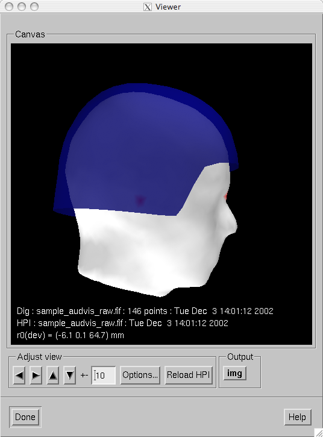

    Snapshot of mne_analyze in the head position visualization mode.

As described in :ref:`mne_analyze`, the head position
visualization mode can be customized with the --dig, --hpi, --scalehead,
and --rthelmet options. For this mode to be useful, the --dig and
--hpi options are mandatory. If existing saved data are viewed,
both of these can point to a average or raw data file. For on-line
operation with the Elekta-Neuromag systems, the following files
in should be used:

``--dig /neuro/dacq/meas_info/isotrak --hpi /neuro/dacq/meas_info/hpi_result``

.. note:: Since MNE software runs only on LINUX and Mac    OS X platforms, one usually needs to NFS mount the volume containing    /neuro directory to another system and access these files remotely.    However, Neuromag has indicated that future versions of their acquisition    software will run on the LINUX platform as well and the complication    of remote operation can then be avoided.

When mne_analyze starts
in the head position visualization mode and the --dig and --hpi
options have been specified, the following sequence operations takes
place:

- The digitizer data, the coordinate transformation
  between the MEG device and head coordinate frames, as well as the
  average head surface provided with the MNE software are loaded.

- If the ``--scalehead`` option is invoked, the average head surface
  is scaled to the approximate size of the subject's head
  by fitting a sphere to the digitizer and to the head surface points
  lying above the plane of the fiducial landmarks, respectively. The
  standard head surface is then scaled by the ration of the radiuses
  of these two best-fitting spheres. Without --scalehead, the standard
  head surface is used as is without scaling.

- The known positions of (scaled) fiducial landmarks are matched
  with those available in the digitizer data. This initial alignment
  is then refined using the ICP algorithm, see :ref:`CACEHGCD`.
  This automatic procedure is found to be accurate enough for the
  visualization purposes.

- Using the coordinate transformation thus established between
  the coordinate system of the scalp surface (MRI coordinates) and
  the MEG head coordinates together with the coordinate transformation
  between the MEG head and device coordinate frames established with
  HPI, the position of the MEG helmet surface is shown in the viewer
  window.

If the ``--rthelmet`` option was present, the room-temperature
helmet surface is shown instead of the MEG sensor surface. The digitizer
and HPI data files are reloaded and the above steps 1. - 4. are
repeated when the Reload HPI button
is pressed. The comment lines in the viewer window show information
about the digitizer and HPI data files as well as the location of the
MEG device coordinate origin in the MEG head coordinate system.

.. note:: The appearance of the viewer visualization can    be customized using the Options... button,    see :ref:`CACHGDEA`. Since only the scalp and MEG device    surfaces are loaded, only a limited number of options is active.    The display can also be saved as an image from the img button,    see :ref:`CACBEBGC`.
