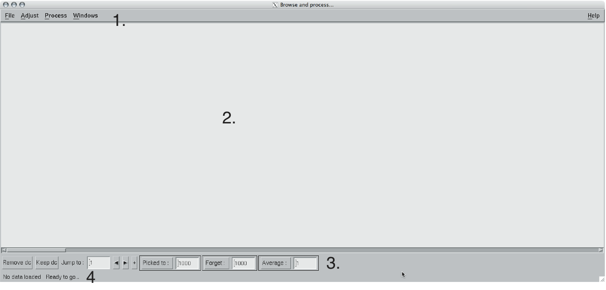
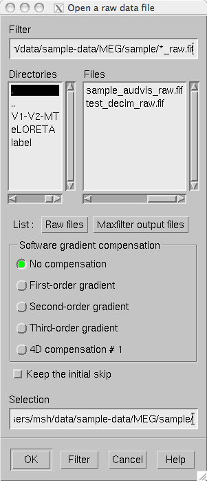
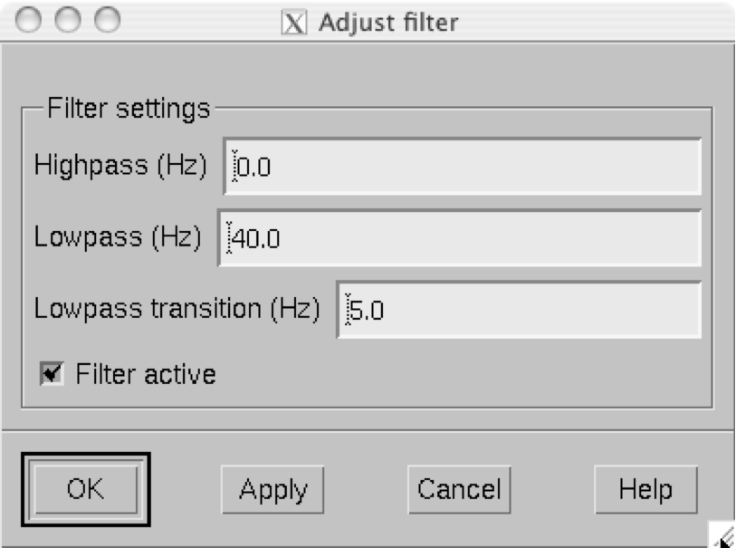
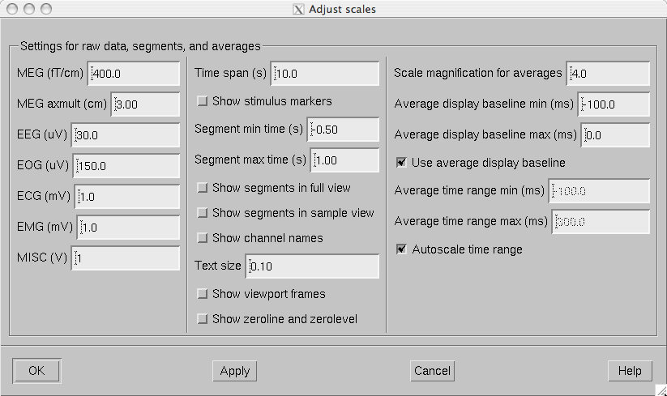
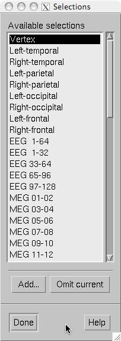
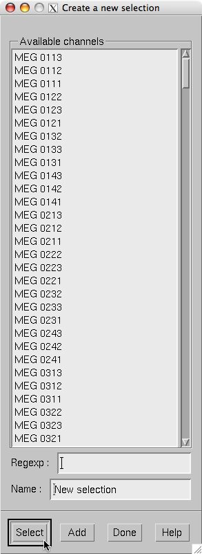
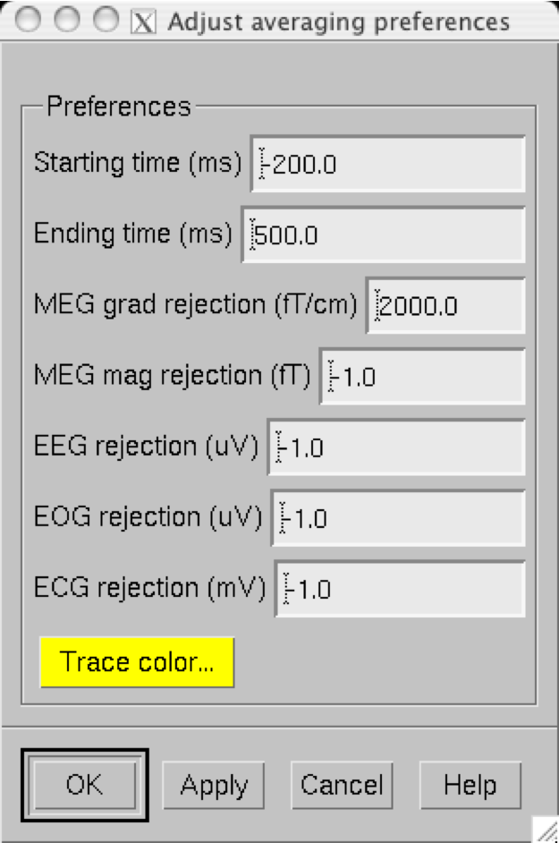
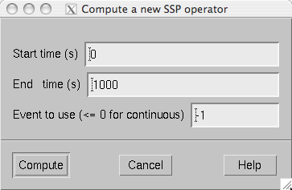
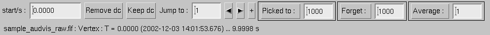
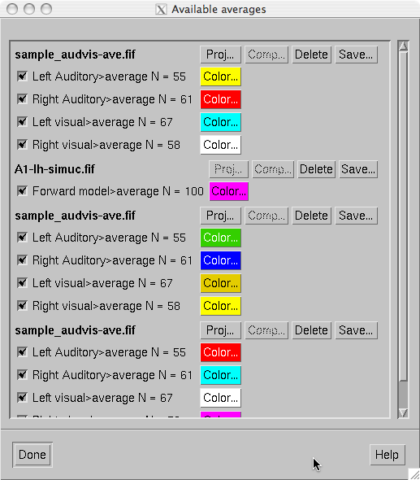

.. _ch_browse:

=====================================
Browsing raw data with mne_browse_raw
=====================================

.. contents:: Contents
   :local:
   :depth: 2

Overview
########

The raw data processor :ref:`mne_browse_raw` is
designed for simple raw data viewing and processing operations. In
addition, the program is capable of off-line averaging and estimation
of covariance matrices. :ref:`mne_browse_raw` can
be also used to view averaged data in the topographical layout.
Finally, :ref:`mne_browse_raw` can communicate
with :ref:`mne_analyze` described in :ref:`ch_interactive_analysis` to
calculate current estimates from raw data interactively.

:ref:`mne_browse_raw` has also
an alias, :ref:`mne_process_raw`. If :ref:`mne_process_raw` is
invoked, no user interface appears. Instead, command line options
are used to specify the filtering parameters as well as averaging
and covariance-matrix estimation command files for batch processing. This
chapter discusses both :ref:`mne_browse_raw` and :ref:`mne_process_raw`.

See command-line documentation of :ref:`mne_browse_raw` and `mne_process_raw`.

The user interface
##################

    The user interface of mne_browse_raw

The mne_browse_raw user
interface contains the following areas:

- The menu bar.

- The data display area.

- Viewing and averaging tools.

- Message line.

The viewing and averaging tools allow quick browsing of the
raw data with triggers, adding new triggers, and averaging on a
single trigger.

The File menu
#############

.. _CACDCHAJ:

Open
====

Selecting Open from file
menu pops up the dialog shown in :ref:`CACBHGFE`.

The Raw files and Maxfilter output buttons change the file name filter to include
names which end with ``_raw.fif`` or ``sss.fif`` ,
respectively, to facilitate selection of original raw files or those
processed with the Neuromag Maxfilter (TM) software

The options under Software gradient compensation allow
selection of the compensation grade for the data. These selections
apply to the CTF data only. The standard choices are No compensation and Third-order gradient. If
other than No compensation is
attempted for non-CTF data, an error will be issued. The compensation
selection affects the averages and noise-covariance matrices subsequently
computed. The desired compensation takes effect independent of the
compensation state of the data in the file, *i.e.*,
already compensated data can be uncompensated and vice versa. For more
information on software gradient compensation please consult :ref:`BEHDDFBI`.

The Keep the initial skip button
controls how the initial segment of data not stored in the raw data
file is handled. During the MEG acquisition data are collected continuously
but saving to the raw data file is controlled by the Record raw button. Initial skip refers to the segment
of data between the start of the recording and the first activation
of Record raw . If Keep initial skip is set, this empty segment is taken into
account in timing, otherwise time zero is set to the beginning of
the data stored to disk.

When a raw data file is opened, the digital trigger channel
is scanned for events. For large files this may take a while.

.. note:: After scanning the trigger channel for events, mne_browse_raw and mne_process_raw produce    a fif file containing the event information. This file will be called <*raw data file name without fif extension*> ``-eve.fif`` . If    the same raw data file is opened again, this file will be consulted    for event information thus making it unnecessary to scan through    the file for trigger line events.

.. note:: You can produce the fif event file by running mne_process_raw as follows: ``mne_process_raw --raw`` <*raw data file*> .    The fif format event files can be read and written with the mne_read_events and mne_write_events functions    in the MNE Matlab toolbox, see :ref:`ch_matlab`.

.. _CACBHGFE:

    The Open dialog.

.. _BABJEJDG:

Open evoked
===========

This menu item brings up a standard file selection dialog
to load evoked-response data from files. All data sets from a file
are loaded automatically and display in the average view window,
see :ref:`CACDADBA`. The data loaded are affected by the
scale settings, see, :ref:`CACBEHCD`, the filter, see :ref:`CACCDBBG`, and the options selected in the Manage averages dialog, see :ref:`CACJFADF`.

.. _CACBDDIE:

Save
====

It is possible to save filtered and projected data into a
new raw data file. When you invoke the save option from the file
menu, you will be prompted for the output file name and a down-sampling
factor. The sampling frequency after down-sampling must be at least
three times the lowpass filter corner frequency. The output will
be split into files which are just below 2 GB so that the fif file
maximum size is not exceed.

If <*filename*> ends
with ``.fif`` or ``_raw.fif`` , these endings are
deleted. After these modifications, ``_raw.fif`` is inserted
after the remaining part of the file name. If the file is split
into multiple parts, the additional parts will be called <*name*> ``-`` <*number*> ``_raw.fif`` .
For downsampling and saving options in mne_process_raw ,
see :ref:`mne_process_raw`.

Change working directory
========================

Brings up a file selection dialog which allows changing of
the working directory.

.. _CACDFJDA:

Read projection
===============

Selecting Read projection... from
the File menu, pops up a dialog
to enter a name of a file containing a signal-space projection operator
to be applied to the data. There is an option to keep existing projection
items.

.. note:: Whenever EEG channels are present in the data,    a projection item corresponding to the average EEG reference is    automatically added.

Save projection
===============

The Save projection... item
in the File menu pops up a dialog
to save the present projection operator into a file. Normally, the
EEG average reference projection is not included. If you want to
include it, mark the Include EEG average reference option.
If your MEG projection includes items for both magnetometers and
gradiometers and you want to use the projection operator file output
from here in the Neuromag Signal processor (graph) software,
mark the Enforce compatibility with graph option.

Apply bad channels
==================

Applies the current selection of bad channels to the currently
open raw file.

Load events (text)
==================

Reads a text format event file. For more information on events,
see :ref:`BABDFAHA`.

Load events (fif)
=================

Reads a fif format event file. For more information on events,
see :ref:`BABDFAHA`.

.. _CACJGIFA:

Save events (text)
==================

Brings up a a dialog to save all or selected types of events
into a text file. This file can be edited and used in the averaging
and covariance matrix estimation as an input file to specify the
time points of events, see :ref:`CACBCEGC`. For more information
on events, see :ref:`BABDFAHA`.

Save events (fif)
=================

Save the events in fif format. These binary event files can
be read and written with the mne_read_events and mne_write_events functions
in the MNE Matlab toolbox, see :ref:`ch_matlab`. For more information
on events, see :ref:`BABDFAHA`.

.. _CACFHAFH:

Load derivations
================

This menu choice allows loading of channel derivation data
files created with the mne_make_derivations utility,
see :ref:`mne_make_derivations`, or using the interactive derivations
editor in mne_browse_raw , see :ref:`CACJIEHI`, Most common use of derivations is to calculate
differences between EEG channels, *i.e.*, bipolar
EEG data. Since any number of channels can be included in a derivation
with arbitrary weights, other applications are possible as well.
Before a derivation is accepted to use, the following criteria have
to be met:

- All channels to be combined into a single
  derivation must have identical units of measure.

- All channels in a single derivation have to be of the same
  kind, *e.g.*, MEG channels or EEG channels.

- All channels specified in a derivation have to be present
  in the currently loaded data set.

Multiple derivation data files can be loaded by specifying
the Keep previous derivations option in
the dialog that specifies the derivation file to be loaded. After
a derivation file has been successfully loaded, a list of available
derivations will be shown in a message dialog.

Each of the derived channels has a name specified when the
derivation file was created. The derived channels can be included
in channel selections, see :ref:`CACCJEJD`. At present, derived
channels cannot be displayed in topographical data displays. Derived
channels are not included in averages or noise covariance matrix
estimation.

.. note:: If the file ``$HOME/.mne/mne_browse_raw-deriv.fif`` exists and    contains derivation data, it is loaded automatically when mne_browse_raw starts    unless the ``--deriv`` option has been used to specify    a nonstandard derivation file, see :ref:`mne_browse_raw`.

Save derivations
================

Saves the current derivations into a file.

Load channel selections
=======================

This choice loads a new set of channel selections. The default
directory for the selections is $HOME/.mne. If this directory does
not exist, it will be created before bringing up the file selection
dialog to load the selections.

.. _CACDDCGF:

Save channel selections
=======================

This choice brings up a dialog to save the current channel
selections. This is particularly useful if the standard set of selections
has been modified as explained in :ref:`CACCJEJD`. The default
directory for the selections is $HOME/.mne. If this directory does
not exist, it will be created before bringing up the file selection
dialog to save the selections. Note that all currently existing
selections will be saved, not just those added to the ones initially
loaded.

Quit
====

Exits the program without questions asked.

The Adjust menu
###############

.. _CACCDBBG:

Filter
======

Selecting Filter... from
the Adjust menu pops up the dialog
shown in :ref:`CACCEEGI`.

.. _CACCEEGI:

    The filter adjustment dialog.

The items in the dialog have the following functions:

**Highpass (Hz)**

    The half-amplitude point of the highpass filter. The width of the transition
    from zero to one can be specified with the ``--highpassw`` command-line
    option, see :ref:`mne_browse_raw`. Lowest feasible highpass value
    is constrained by the length of the filter and sampling frequency.
    You will be informed when you press OK or Apply if
    the selected highpass could not be realized. The default value zero means
    no highpass filter is applied in addition to the analog highpass
    present in the data.

**Lowpass (Hz)**

    The half-amplitude point of the lowpass filter.

**Lowpass transition (Hz)**

    The width of the :math:`\cos^2`-shaped transition
    from one to zero, centered at the Lowpass value.

**Filter active**

    Selects whether or not the filter is applied to the data.

The filter is realized in the frequency domain and has a
zero phase shift. When a filter is in effect, the value of the first
sample in the file is subtracted from the data to correct for an
initial dc offset. This procedure also eliminates any filter artifacts
in the beginning of the data.

.. note:: The filter affects both the raw data and evoked-response    data loaded from files. However, the averages computed in mne_browse_raw and shown    in the topographical display are not refiltered if the filter is    changed after the average was computed.

.. _CACBEHCD:

Scales
======

Selecting Scales... from
the Adjust menu pops up the dialog
shown in :ref:`CACBJGBA`.

.. _CACBJGBA:

    The Scales dialog.

The items in the dialog have the following functions:

**MEG (fT/cm)**

    Sets the scale for MEG planar gradiometer channels in fT/cm. All scale
    values are defined from zero to maximum, *i.e.*,
    the viewport where signals are plotted in have the limits ± <*scale value*> .

**MEG axmult (cm)**

    The scale for MEG magnetometers and axial gradiometers is defined
    by multiplying the gradiometer scale by this number, yielding units
    of fT.

**EEG** (:math:`\mu V`)

    The scale for EEG channels in :math:`\mu V`.

**EOG** (:math:`\mu V`)

    The scale for EOG channels in :math:`\mu V`.

**ECG (mV)**

    The scale for ECG channels in mV.

**EMG (mV)**

    The scale for EMG channels in mV.

**MISC (V)**

    The scale for MISC channels in V.

**Time span (s)**

    The length of raw data displayed in the main window at a time.

**Show stimulus markers**

    Draw vertical lines at time points where the digital trigger channel has
    a transition from zero to a nonzero value.

**Segment min. time (s)**

    It is possible to show data segments in the topographical (full
    view) layout, see below. This parameter sets the starting time point,
    relative to the selected time, to be displayed.

**Segment max. time (s)**

    This parameter sets the ending time point, relative to the current time,
    to be displayed in the topographical layout.

**Show segments in full view**

    Switches on the display of data segments in the topographical layout.

**Show segments in sample view**

    Switches on the display of data segments in a "sidebar" to
    the right of the main display.

**Show channel names**

    Show the names of the channels in the topographical displays.

**Text size**

    Size of the channel number text as a fraction of the height of each viewport.

**Show viewport frames**

    Show the boundaries of the viewports in the topographical displays.

**Show zeroline and zerolevel**

    Show the zero level, *i.e.*, the baseline level
    in the topographical displays. In addition, the zero time point
    is indicated in the average views if it falls to the time range, *i.e.*,
    if the minimum of the time scale is negative and the maximum is
    positive.

**Scale magnification for averages**

    For average displays, the scales are made more sensitive by this
    factor.

**Average display baseline min (ms)**

    Sets the lower time limit for the average display baseline. This
    setting does not affect the averages stored.

**Average display baseline max (ms)**

    Sets the upper time limit for the average display baseline. This
    setting does not affect the averages stored.

**Use average display baseline**

    Switches the application of a baseline to the displayed averages
    on and off.

**Average time range min (ms)**

    Sets the minimum time for the average display. This setting is inactive
    if Autoscale time range is on.

**Average time range max (ms)**

    Sets the maximum time for the average data display. This setting
    is inactive if Autoscale time range is
    on.

**Autoscale time range**

    Set the average display time range automatically to be long enough to
    accommodate all data.

Colors
======

Shows a dialog which allows changes to the default colors
of various display items.

.. _CACJIEHI:

Derivations
===========

Brings up the interactive derivations editor. This editor
can be used to add or modify derived channels, *i.e.*,
linear combinations of signals actually recorded. Channel derivations
can be also created and modified using the mne_make_derivations tool,
see :ref:`mne_make_derivations`. The interactive editor contains two main
areas:

- Interactive tools for specifying a channel
  linear combination. This tool is limited to combining up to five
  channels in each of the derivations. Clicking Add after
  defining the name of the new derivation, the weights of the component
  channels and their names, adds the corresponding arithmetic expression
  to the text area.

- Text area which contains the currently defined derivations
  as arithmetic expressions in a format identical to that used by mne_make_derivations .
  These expressions can be manually edited before accepting the new
  set of derivations. Initially, the text area will contain the derivations
  already defined.

The Define button interprets
the arithmetic expressions in the text area as new derivations and
closes the dialog. The Cancel button
closes the dialog without any change in the derivations.

Recommended workflow for defining derived EEG channels and
associated selections interactively involves the following steps:

- If desired, EEG channels can be relabeled
  with descriptive names using the mne_rename_channels utility,
  see :ref:`mne_rename_channels`. It is strongly recommended that you
  keep a copy of the channel alias file used by mne_rename_channels .
  If necessary, you can then easily return to the original channel
  names by running mne_rename_channels again
  with the ``--revert`` option.

- Load the data file into mne_browse_raw and
  use the interactive derivations editor to create the desired derived
  channels. These are usually differences between the signals in two
  EEG electrodes.

- Save the derivations from the file menu.

- If desired, move the derivations file to the standard location
  (``$HOME/.mne/mne_browse_raw-deriv.fif`` ).

- Create new channel selections employing the original and derived channels
  using the channel selection tool described in :ref:`CACCJEJD`.

- Save the new channel selections from the file menu.

- If desired, change the order of the channels in the selections
  in the selection file by editing it in a text editor and move it
  to the standard location ``$HOME/.mne/mne_browse_raw.sel`` .

.. _CACCJEJD:

Selection
=========

Brings up a dialog to select channels to be shown in the
main raw data display. This dialog also allows modification of the
set of channel selections as described below.

By default, the available selections are defined by the file ``$MNE_ROOT/share/mne/mne_browse_raw/mne_browse_raw.sel`` .
This default channel selection file can be modified by copying the
file into ``$HOME/.mne/mne_browse_raw.sel`` . The format
of this text file should be self explanatory.

.. _CACIHFFH:

    The channel selection dialog.

The channel selection dialog is shown in :ref:`CACIHFFH`.
The number of items in the selection list depends on the contents
of your selection file. If the list has the keyboard focus you can
easily move from one selection to another with the up and down arrow
keys.

The two buttons below the channel selection buttons facilitate
the modification of the selections:

**Add...**

    Brings up the selection dialog shown in :ref:`CACFECED` to
    create new channel selections.

**Omit current**

    Delete the current channel selection. Deletion only affects the
    selections in the memory of the program. To save the changes permanently
    into a file, use Save channel selections... in
    the File menu, see :ref:`CACDDCGF`.

.. _CACFECED:

    Dialog to create a new channel selection.

The components of the selection creation dialog shown in :ref:`CACFECED` have the following functions:

**List of channel names**

    The channels selected from this list will be included in the new channel
    selection. A selection can be extended with the control key. A range
    of channels can be selected with the shift key. The list contains
    both the original channels actually present in the file and the names
    of the channels in currently loaded derivation data, see :ref:`CACFHAFH`.

**Regexp:**

    This provides another way to select channels. By entering here a regular
    expression as defined in IEEE Standard 1003.2 (POSIX.2), all channels
    matching it will be selected and added to the present selection.
    An empty expression deselects all items in the channel list. Some
    useful regular expressions are listed in :ref:`CACHCHDJ`.
    In the present version, regular matching does not look at the derived
    channels.

**Name:**

    This text field specifies the name of the new selection.

**Select**

    Select the channels specified by the regular expression. The same effect
    can be achieved by entering return in the Regexp: .

**Add**

    Add a new channel selection which contains the channels selected from
    the channel name list. The name of the selection is specified with
    the Name: text field.

.. tabularcolumns:: |p{0.2\linewidth}|p{0.45\linewidth}|
.. _CACHCHDJ:
.. table:: Examples of regular expressions for channel selections

    +--------------------+----------------------------------------------+
    | Regular expression | Meaning                                      |
    +====================+==============================================+
    | ``MEG``            | Selects all MEG channels.                    |
    +--------------------+----------------------------------------------+
    | ``EEG``            | Selects all EEG channels.                    |
    +--------------------+----------------------------------------------+
    | ``MEG.*1$``        | Selects all MEG channels whose names end     |
    |                    | with the number 1, *i.e.*, all magnetometer  |
    |                    | channels.                                    |
    +--------------------+----------------------------------------------+
    | ``MEG.*[2,3]$``    | Selects all MEG gradiometer channels.        |
    +--------------------+----------------------------------------------+
    | ``EEG|STI 014``    | Selects all EEG channels and stimulus        |
    |                    | channel STI 014.                             |
    +--------------------+----------------------------------------------+
    | ``^M``             | Selects all channels whose names begin with  |
    |                    | the letter M.                                |
    +--------------------+----------------------------------------------+

.. note:: The interactive tool for creating the channel    selections does not allow you to change the order of the selected    channels from that given by the list of channels. However, the ordering    can be easily changed by manually editing the channel selection    file in a text editor.

.. _CACFGGCF:

Full view layout
================

Shows a selection of available layouts for the topographical
views (full view and average display). The system-wide layout files
reside in ``$MNE_ROOT/share/mne/mne_analyze/lout`` . In
addition any layout files residing in ``$HOME/.mne/lout`` are
listed. The default layout is Vectorview-grad. If there is a layout
file in the user's private layout directory ending with ``-default.lout`` ,
that layout will be used as the default instead. The Default button
returns to the default layout.

The format of the layout files is:

  | <*plot area limits*>
  | <*viewport definition #1*>
  | ...
  | <*viewport definition #N*>

The <*plot area limits*> define
the size of the plot area (:math:`x_{min}\ x_{max}\ y_{min}\ y_{max}`) which should accommodate all view ports. When the layout is used, the
plot area will preserve its aspect ratio; if the plot window has
a different aspect ratio, there will be empty space on the sides.

The viewports define the locations of the individual channels
in the plot. Each viewport definition consists of

  <*number*> :math:`x_0\ y_0` <*width*> <*height*> <*name*> [: <*name*> ] ...

where number is a viewport number (not used by the MNE software), :math:`x_0` and :math:`y_0` are
the coordinates of the lower-left corner of the viewport, <*width*> and <*height*> are
the viewport dimensions, and <*name*> is
a name of a channel. Multiple channel names can be specified by
separating them with a colon.

When a measurement channel name is matched to a layout channel
name, all spaces are removed from the channel names and the both
the layout channel name and the data channel name are converted
to lower case. In addition anything including and after a hyphen
(-) is omitted. The latter convention facilitates using CTF MEG
system data, which has the serial number of the system appended
to the channel name with a dash. Removal of the spaces is important
for the Neuromag Vectorview data because newer systems do not have
spaces in the channel names like the original Vectorview systems
did.

.. note:: The mne_make_eeg_layout utility    can be employed to create a layout file matching the positioning    of EEG electrodes, see :ref:`mne_make_eeg_layout`.

.. _CACDDIDH:

Projection
==========

Lists the currently available signal-space projection (SSP)
vectors and allows the activation and deactivation of items. For
more information on SSP, see :ref:`CACCHABI`.

Compensation
============

Brings up a dialog to select software gradient compensation.
This overrides the choice made at the open time. For details, see :ref:`CACDCHAJ`, above.

.. _CACBIAHD:

Averaging preferences
=====================

.. _CACCFFAH:

    Averaging preferences.

Selecting Averaging preferences... from
the Adjust menu pops up the dialog
shown in :ref:`CACCFFAH`. These settings apply only to the
simple averages calculated with help of tools residing just below
the main raw data display, see :ref:`CACDFGAE`. These settings
are also applied when a covariance matrix is computed to create
a SSP operator as described in :ref:`CACEAHEI` and in the
computation of a covariance matrix from raw data, see :ref:`BABJEIGJ`.

The items in the dialog have the following functions:

**Starting time (ms)**

    Beginning time of the epoch to be averaged (relative to the trigger).

**Ending time (ms)**

    Ending time of the epoch to be averaged.

**Ignore around stimulus (ms)**

    Ignore this many milliseconds on both sides of the trigger when considering
    the epoch. This parameter is useful for ignoring large stimulus
    artefacts, *e.g.*, from electrical somatosensory
    stimulation.

**MEG grad rejection (fT/cm)**

    Rejection criterion for MEG planar gradiometers. If the peak-to-peak
    value of any planar gradiometer epoch exceed this value, it will
    be omitted. A negative value turns off rejection for a particular channel
    type.

**MEG mag rejection (fT)**

    Rejection criterion for MEG magnetometers and axial gradiometers.

**EEG rejection** (:math:`\mu V`)

    Rejection criterion for EEG channels.

**EOG rejection** (:math:`\mu V`)

    Rejection criterion for EOG channels.

**ECG rejection (mV)**

    Rejection criterion for ECG channels.

**MEG grad no signal (fT/cm)**

    Signal detection criterion for MEG planar gradiometers. The peak-to-peak
    value of all planar gradiometer signals must exceed this value,
    for the epoch to be included. This criterion allows rejection of data
    with saturated or otherwise dysfunctional channels.

**MEG mag no signal (fT)**

    Signal detection criterion for MEG magnetometers and axial gradiometers.

**EEG no signal** (:math:`\mu V`)

    Signal detection criterion for EEG channels.

**EOG no signal** (:math:`\mu V`)

    Signal detection criterion for EOG channels.

**ECG no signal (mV)**

    Signal detection criterion for ECG channels.

**Fix trigger skew**

    This option has the same effect as the FixSkew parameter
    in averaging description files, see :ref:`BABIHFBI`.

**Trace color**

    The color assigned for the averaged traces in the display can be adjusted
    by pressing this button.

The Process menu
################

Averaging
=========

The Average... menu item
pops up a file selection dialog to access a description file for
batch-mode averaging. The structure of these files is described
in :ref:`CACBBDGC`. All parameters for the averaging are
taken from the description file, *i.e.*, the
parameters set in the averaging preferences dialog (:ref:`CACBIAHD`) do not effect the result.

Estimation of a covariance matrix
=================================

The Compute covariance... menu
item pops up a file selection dialog to access a description file
which specifies the options for the estimation of a covariance matrix.
The structure of these files is described in :ref:`CACEBACG`.

.. _BABJEIGJ:

Estimation of a covariance matrix from raw data
===============================================

The Compute raw data covariance... menu
item pops up a dialog which specifies a time range for raw data
covariance matrix estimation and the file to hold the result. If
a covariance matrix is computed in this way, the rejection parameters
specified in averaging preferences are in effect. For description
of the rejection parameters, see :ref:`CACBIAHD`. The time
range can be also selected interactively from the main raw data
display by doing a range selection with shift left button drag.

.. _CACEAHEI:

Creating a new SSP operator
===========================

The Create a new SSP operator... menu
choice computes a new SSP operator as discussed in :ref:`BABFFCHF`.

.. _BABHAGHF:

    Time range specification for SSP operator calculation

When Create a new SSP operator... selected,
a window shown in :ref:`BABHAGHF` is popped up. It allows
the specification of a time range to be employed in the calculation
of a raw data covariance matrix. The time range can be also selected
interactively from the main raw data display by doing a range selection
with shift left button drag. Normally, you should use empty room
data for this computation. For the estimation of the covariance
matrix any existing projection will be temporarily switched off. Remember
to inspect your data for bad channels and select an appropriate filter
setting before creating a new SSP operator. The artifact rejection parameters
specified averaging preferences will be applied in the covariance
matrix calculation, see :ref:`CACBIAHD`.

Instead of using continuous raw data, it is also possible
to employ short epochs around triggers (events) in the calculation
of the new SSP operator by specifying a positive event number in
the time specification dialog. This option is very useful, *e.g.*,
to remove MCG/ECG artifacts from the data to facilitate detection
of epileptic spikes:

- Select left or right temporal channels
  to the display.

- Mark several peaks of the MCG signal in the data: click on
  the first one and control click on the subsequent ones to extend
  the selection.

- Select an event number next to the Picked to button in the tool bar, see :ref:`CACDFGAE`,
  and click Picked to . As a result
  the lines marking the events will change color (by default from
  green to blue) indicating transition to user-created events.

- Specify an epoch time range to be employed and the event number selected
  in the previous step for the SSP operator calculation.

Once the parameters are set, click Compute to
calculate a covariance matrix according to you your specifications.
Once the covariance matrix is ready, the parts corresponding to
magnetometer or axial gradiometer, planar gradiometer, and EEG channels
are separated and the corresponding eigenvectors and eigenvalues
are computed. Once complete, a projection selector with eight magnetometer
eigenvectors, five planar gradiometer eigenvectors, three EEG eigenvectors,
as well as the existing projection items is displayed.

Using the projection selector, you can experiment which vectors
have a significant effect on the noise level of the data. You should
strive for using a minimal number of vectors. When the selection
is complete, you can click Accept to
introduce this selection of vectors as the new projection operator. Discard abandons
the set of calculated vectors. Whenever EEG channels are present
in the data, a projection item corresponding to the average EEG
reference is automatically added when a new projection operator
is introduced. More information on the SSP method can be found in :ref:`CACCHABI`.

.. note:: The new projection data created in mne_browse_raw is    not automatically copied to the data file. You need to create a    standalone projection file from File/Save projection... to    save the new projection data and load it manually after the data    file has been loaded if you want to include in any subsequent analysis.

.. note:: The command-line options for mne_process_raw allow    calculation of the SSP operator from continuous data in the batch    mode, see :ref:`mne_process_raw`.

.. _BABDJGGJ:

The Windows menu
################

The Windows menu contains
the following items:

**Show full view...**

    Brings up the topographical display of epochs extracted from the raw
    data, see :ref:`CACDADBA`.

**Show averages...**

    Brings up the topographical display showing averaged data. These data
    may include data averaged in the current mne_browse_raw session
    or those loaded from files, see :ref:`BABJEJDG`.

**Show event list...**

    Brings up a window containing a list of the currently defined events. Clicking
    on an event in the list, the event is selected, a green cursor appears
    at the event, and the event is brought to the middle of the raw
    data display. The event list displayed can be also restricted to user-defined
    events (annotations) and user-defined events can be deleted. For
    further information, see :ref:`BABDFAHA`.

**Show annotator...**

    Brings up a window which allows adding new events to the data with
    annotations or comments. For details, see :ref:`BABDFAHA`.

**Manage averages...**

    Brings up a dialog to control the averaged data sets, see :ref:`CACJFADF`.

**Start mne_analyze...**

    Start interaction between mne_browse_raw and mne_analyze .
    For details, see :ref:`CACGHEGC`.

**Show head position**

    Starts mne_analyze in the head position visualization mode and shows
    the relative position of the MEG sensor array and the head using
    the data in the presently open raw data file. For more details on
    the head position visualization mode, see Section 7.21.**what?? does not exist!**

**Quit mne_analyze...**

    Quits the mne_analyze program
    started with Start mne_analyze...

The Help menu
#############

The contents of the Help menu
is shown in :ref:`help_menu_browse`:

.. _help_menu_browse:

    The Help menu.

**On version...**

    Displays the version and compilation date of the program.

**On license...**

    Displays the license information.

**About current data...**

    Displays essential information about the currently loaded data set.

**Why the beep?**

    In some simple error situations, mne_browse_raw does
    not pop up an error dialog but refuses the action and rings the
    bell. The reason for this can be displayed through this help menu
    item.

The raw data display
####################

The main data displays shows a section of the raw data in
a strip-chart recorder format. The names of the channels displayed
are shown on the left. The selection of channels is controlled from
the selection dialog, see :ref:`CACCJEJD`. The length of
the data section displayed is controlled from the scales dialog
(:ref:`CACBEHCD`) and the filtering from the filter dialog (:ref:`CACCDBBG`). A signal-space projection can be applied
to the data by loading a projection operator (:ref:`CACDFJDA`).
The selection of the projection operator items is controlled from
the projection dialog described in :ref:`CACDDIDH`.

The control and browsing functions of the main data display
are:

**Selection of bad channels**

    If you click on a channel name the corresponding channel is marked bad
    or reinstated as an acceptable one. A channel marked bad is not considered
    in the artefact rejection procedures in averaging and it is omitted
    from the signal-space projection operations.

**Browsing**

    Browsing through the data. The section of data displayed can be selected
    from the scroll bar at the bottom of the display. Additional browsing
    functionality will be discussed n In addition, if the strip-chart
    display has the keyboard focus, you can scroll back and forth with
    the page up and page down keys.

**Selection of time points**

    When you click on the data with the left button, a vertical marker appears.
    If Show segments in full view and/or Show segments in sample view is active in the scales
    dialog (see :ref:`CACBEHCD`), a display of an epoch of data
    specified in the scales dialog will appear. For more information
    on full view, see :ref:`CACDADBA`. Multiple time points can
    be selected by holding the control key down when clicking. If multiple
    time points are selected several samples will be shown in the sample
    and/or full view, aligned at the picked time point. The tool bar
    offers functions to operate on the selected time points, see :ref:`CACDFGAE`.

**Range selection**

    Range selection. If you drag on the signals with the left mouse
    button and the shift key down, a range of times will be selected
    and displayed in the sample and/or full view. Note: All previous
    selections are cleared by this operation.

**Saving a copy of the display**

    The right mouse button invokes a popup menu which allows saving of
    the display in various formats. Best quality is achieved with the Illustrator
    format. This format has the benefit that it is object oriented and
    can be edited in Adobe Illustrator.

**Drag and drop**

    Graphics can be moved to one of the Elekta-Neuromag report composer
    (cliplab ) view areas with the
    middle mouse button.

.. note:: When selecting bad channels, switch the signal-space    projection off from the projection dialog. Otherwise bad channels    may not be easily recognizable.

.. note:: The cliplab drag-and-drop    functionality requires that you have the proprietary Elekta-Neuromag    analysis software installed. mne_browse_raw is    compatible with cliplab versions    1.2.13 and later.

.. _BABIDADB:

Browsing data
=============

If the strip-chart display has
the input focus (click on it, if you are unsure) the keyboard and
mouse can be used to browse the data as follows:

**Up and down arrow keys**

    Activate the previous or next selection in the selection list.

**Left and right arrow keys**

    If a single time point is selected (green line), move the time point forward
    and backward by :math:`\pm 1` ms. If the shift
    key is down, the time point is moved by :math:`\pm 10` ms.
    If the control key is down (with or without shift), the time point
    is moved by :math:`\pm 100` ms. If mne_browse_raw is
    controlling mne_analyze (see :ref:`CACGHEGC`), the mne_analyze displays
    will be updated accordingly. If the picked time point falls outside
    the currently displayed section of data, the display will be automatically
    scrolled backwards or forwards as needed.

**Rotate the mouse wheel or rotate the trackball up/down**

    Activate the previous or next selection in the selection list.

**Rotate the trackball left/right or rotate the wheel with shift down**

    Scroll backward or forward in the data by one screen. With Alt key (Command or Apple key
    in the Mac keyboard), the amount of scrolling will be :math:`1` s instead
    of the length of one screen. If shift key is held down with the
    trackball, both left/right and up/down movements scroll the data
    in time.

.. note:: The trackball and mouse wheel functionality    is dependent on your X server settings. On Mac OSX these settings    are normally correct by default but on a LINUX system some adjustments    to the X server settings maybe necessary. Consult your system administrator    or Google for details.

.. _BABDFAHA:

Events and annotations
######################

.. _BABJGEDF:

Overview
========

In mne_browse_raw and mne_process_raw *events* mark
interesting time points in the data. When a raw data file is opened,
a standard event file is consulted for the list of events. If this
file is not present, the digital trigger channel, defined by the --digtrig option
or the ``MNE_TRIGGER_CH_NAME`` environment variable is
scanned for events. For more information, see the command-line references
for :ref:`mne_browse_raw` and :ref:`mne_process_raw`.

In addition to the events detected on the trigger channel,
it is possible to associate user-defined events to the data, either
by marking data points interactively as described in :ref:`BABCIGGH` or by loading event data from files, see :ref:`BABDGBHI`. Especially if there is a comment associated
with a user-defined event, we will sometimes call it an *annotation*.

If a data files has annotations (user-defined events) associated
with it in mne_browse_raw , information
about them is automatically saved to an annotation file when a data file is closed, *i.e.*,
when you quit mne_browse_raw or
load a new data file. This annotation file is called <*raw data file name without fif extension*> ``-annot.fif`` and
will be stored in the same directory as the raw data file. Therefore,
write permission to this directory is required to save the annotation
file.

Both the events defined by the trigger channel and the user-defined
events have three properties:

- The *time* when the
  event occurred.

- The *value* on the trigger channel just
  before the change and now. For user-defined events the value before
  is always zero and the current value is user defined and does not
  necessarily reflect a change on the trigger channel. The trigger
  channel events may also indicate changes between two non-zero values
  and from a non-zero to zero. The event list described in :ref:`BABFDICC` shows only transitions from zero to a non-zero
  value. Similarly, the Jump to item
  in the tool bar, described in :ref:`CACDFGAE`, only detects
  transitions from zero to a nonzero value.

- An optional *comment* text, which is especially
  helpful in associating user-defined events with real-world activity, *e.g.*,
  the subject closing or opening his/her eyes or an epileptic patient
  showing indications of a seizure.

.. _BABFDICC:

The event list
==============

The Windows/Show event list... menu
choice shows a window containing a list of currently defined events.
The list can be restricted to user-defined events by checking User-defined events only . When an event is selected from the
list, the main display jumps to the corresponding time. If a user-defined
event is selected, it can be deleted with the Delete a user-defined event button.

.. _BABDGBHI:

Loading and saving event files
==============================

Using the Load/Save events choices in the file menu, events
can be saved in text and fif formats, see :ref:`CACBCEGC`,
below. The loading dialogs have the following options:

**Match comment with**

    Only those events which will contain comments and in which the comment
    matches the entered text are loaded. This filtering option is useful, *e.g.*,
    in loading averaging or covariance matrix computation log files,
    see :ref:`BABIHFBI` and :ref:`BABCGEJE`.
    If the word *omit* is entered as the filter,
    only events corresponding to discarded epochs are loaded and the
    reason for rejection can be investigated in detail.

**Add as user events**

    Add the events as if they were user-defined events. As a result,
    the annotation file saved next time mne_browse_raw closes
    this raw file will contain these events.

**Keep existing events**

    By default, the events loaded will replace the currently defined
    ones. With this option checked, the loaded event will be merged
    with the currently existing ones.

The event saving dialogs have the
following options controlling the data saved:

**Save events read from the data file**

    Save only those event which are not designated as user defined. These
    are typically the events corresponding to changes in the digital
    trigger channel. Another possible source for these events is an event
    file manually loaded *without* the Add as user events option.

**Save events created here**

    Save the user-defined events.

**Save all trigger line transitions**

    By default only those events which are associate with a transition from
    zero to non-zero value are saved. These include the user-defined
    events and leading edges of pulses on the trigger line. When this
    option is present, all events included with the two above options are
    saved, regardless the type of transition indicated (zero to non-zero,
    non-zero to another non-zero value, and non-zero value to zero).

.. note:: If you have a text format event file whose content    you want to include as user-defined events and create the automatic    annotation file described in :ref:`BABJGEDF`, proceed as    follows:

- Load the event file with the option Add as user events set.

- Open another data file or quit mne_browse_raw .

- Optionally remove unnecessary events using the event list
  dialog.

The directory in which the raw data file resides now contains
an annotation file which will be automatically loaded each time
the data file is opened. A text format event file suitable for this
purpose can be created manually, extracted from an EDF+ file using
the ``--tal`` option in :ref:`mne_edf2fiff`, or produced by custom
software used during data acquisition.

.. _BABCIGGH:

Defining annotated events
=========================

The Windows/Show annotator... shows
a window to add annotated user-defined events. In this window, the
buttons in first column mark one or more selected time points with
the event number shown in the second column with an associated comment
specified in the third column. Marking also occurs when return is
pressed on any of the second and third column text fields.

When the dialog is brought up for the first time, the file
$HOME/.mne/mne_browse_raw.annot is consulted for the definitions
of the second and third column values, *i.e.*,
event numbers and comments. You can save the current definitions
with the Save defs button and
reload the annotation definition file with Load defs . The annotation definition file may contain comment
lines starting with '%' or '#' and
data lines which contain an event number and an optional comment,
separated from the event number by a colon.

.. note:: If you want to add a user-defined event without    an a comment, you can use the Picked to item    in the tool bar, described in :ref:`CACDFGAE`.

.. _CACBCEGC:

Event files
===========

A text format event file contains information about transitions
on the digital trigger line in a raw data file. Any lines beginning
with the pound sign (``#`` ) are considered as comments.
The format of the event file data is:

 <*sample*> <*time*> <*from*> <*to*> <*text*>

where

** <*sample*>**

    is
    the sample number. This sample number takes into account the initial
    empty space in a raw data file as indicated by the FIFF_FIRST_SAMPLE
    and/or FIFF_DATA_SKIP tags in the beginning of raw data. Therefore,
    the event file contents are independent of the Keep initial skip setting in the open dialog.

** <*time*>**

    is
    the time from the beginning of the file to this sample in seconds.

** <*from*>**

    is
    the value of the digital trigger channel at <*sample*> -1.

** <*to*>**

    is
    the value of the digital trigger channel at <*sample*> .

** <*text*>**

    is
    an optional annotation associated with the event. This comment will
    be displayed in the event list and on the message line when you
    move to an event.

When an event file is read back, the <*sample*> value
will be primarily used to specify the time. If you want the <*time*> to
be converted to the sample number instead, specify a negative value
for <*sample*> .

Each event file starts with a "pseudo event" where
both <*from*> and <*to*> fields
are equal to zero.

.. warning:: In previous versions of the MNE software,    the event files did not contain the initial empty pseudo event.    In addition the sample numbers did not take into account the initial    empty space in the raw data files. The present version of MNE software    is still backwards compatible with the old version of the event    files and interprets the sample numbers appropriately. However,    the recognition of the old and new event file formats depends on    the initial pseudo event and, therefore, this first event should never    be removed from the new event files. Likewise, if an initial pseudo event    with <*from*> and <*to*> fields    equal to zero is added to and old event file, the results will be    unpredictable.

.. note:: If you have created Matlab, Excel or other scripts    to process the event files, they may need revision to include the    initial pseudo event in order for mne_browse_raw and mne_process_raw to    recognize the edited event files correctly.

.. note:: Events can be also stored in fif format. This    format can be read and written with the Matlab toolbox functions mne_read_events and mne_write_events .

.. _CACDFGAE:

The tool bar
############

.. _CACCFEGH:

    The tool bar controls.

The tool bar controls are shown in :ref:`CACCFEGH`.
They perform the following functions:

**start/s**

    Allows specification of the starting time of the display as a numeric value.
    Note that this value will be rounded to the time of the nearest sample
    when you press return. If you click on this text field, you can also
    change the time with the up and down cursor keys (1/10 of the window
    size), and the page up and down (or control up and down cursor)
    keys (one window size).

**Remove dc**

    Remove the dc offset from the signals for display. This does not affect
    the data used for averaging and noise-covariance matrix estimation.

**Keep dc**

    Return to the original true dc levels.

**Jump to**

    Enter a value of a trigger to be searched for. The arrow buttons
    jump to the next event of this kind. A selection is also automatically
    created and displayed as requested in the scales dialog, see :ref:`CACBEHCD`. If the '+' button is active,
    previous selections are kept, otherwise they are cleared.

**Picked to**

    Make user events with this event number at all picked time points.
    It is also possible to add annotated user events with help of the
    annotation dialog. For further information, see :ref:`BABDFAHA`.

**Forget**

    Forget desired user events.

**Average**

    Compute an average to this event.

The tool bar status line shows the starting time and the
length of the window in seconds as well as the cursor time point.
The dates and times in parenthesis show the corresponding wall-clock
times in the time zone where mne_browse_raw is
run.

.. note:: The wall-clock times shown are based on the    information in the fif file and may be offset from the true acquisition    time by about 1 second. This offset is constant throughout the file.    The times reflect the time zone setting of the computer used to    analyze the data rather than the one use to acquire them.

.. _CACDADBA:

Topographical data displays
###########################

Segments of data can shown in a topographical layout in the Full view window, which can be requested from the Scale dialog
or from the Windows menu. Another
similar display is available to show the averaged data. The topographical
layout to use is selected from Adjust/Full view layout... ,
which brings up a window with a list of available layouts. The default
layouts reside in ``$MNE_ROOT/share/mne/mne_analyze/lout`` .
In addition any layout files residing in ``$HOME/.mne/lout`` are listed.
The format of the layout files is the same as for the Neuromag programs xplotter and xfit .
A custom EEG layout can be easily created with the mne_make_eeg_layout utility,
see :ref:`mne_make_eeg_layout`.

Several actions can be performed with the mouse in the topographical data
display:

**Left button**

    Shows the time and the channel name at the cursor at the bottom
    of the window.

**Left button drag with shift key**

    Enlarge the view to contain only channels in the selected area.

**Right button**

    Brings up a popup menu which gives a choice of graphics output formats
    for the current topographical display. Best quality is achieved
    with the Illustrator format. This format has the benefit that it
    is object oriented and can be edited in Adobe Illustrator.

**Middle button**

    Drag and drop graphics to one of the cliplab view
    areas.

.. note:: The cliplab drag-and-drop    functionality requires that you have the proprietary Elekta-Neuromag    analysis software installed. mne_browse_raw is    compatible with cliplab versions    1.2.13 and later.

.. note:: The graphics output files will contain a text    line stating of the time and vertical scales if the zero level/time    and/or viewport frames have been switched on in the scales dialog,    see :ref:`CACBEHCD`.

.. _CACBBDGC:

Description files for off-line averaging
########################################

For averaging tasks more complex than those involving only
one trigger, the averaging parameters are specified with help of
a text file. This section describes the format of this file. A sample
averaging file can be found in ``$MNE_ROOT/share/mne/mne_browse_raw/templates`` .

Overall format
==============

Any line beginning with the pound sign (#) in this description
file is a comment. Each parameter in the description file is defined
by a keyword usually followed by a value. Text values consisting
of multiple words, separated by spaces, must be included in quotation
marks. The case of the keywords in the file does not matter. The
ending ``.ave`` is suggested for the average description
files.

The general format of the description file is::

    average {
        <common parameters>
        category {
            <category definition parameters>
        }
        
        ...
    }

The file may contain arbitrarily many categories. The word ``category`` interchangeable
with ``condition`` .

.. warning:: Due to a bug that existed in some versions    of the Neuromag acquisition software, the trigger line 8 is incorrectly    decoded on trigger channel STI 014. This can be fixed by running mne_fix_stim14 on    the raw data file before using mne_browse_raw or mne_process_raw .    The bug has been fixed on Nov. 10, 2005.

.. _BABIHFBI:

Common parameters
=================

The average definition starts with the common parameters.
They include:

**outfile <*name*>**

    The name of the file where the averages are to be stored. In interactive
    mode, this can be omitted. The resulting average structure can be
    viewed and stored from the Manage averages window.

**eventfile <*name*>**

    Optional file to contain event specifications. If this file is present, the
    trigger events in the raw data file are ignored and this file is
    consulted instead. The event file format is recognized from the
    file name: if it ends with ``.fif`` , the file is assumed
    to be in fif format, otherwise a text file is expected. The text event
    file format is described in :ref:`CACBCEGC`.

**logfile <*name*>**

    This optional file will contain detailed information about the averaging
    process. In the interactive mode, the log information can be viewed
    from the Manage averages window.

**gradReject <*value / T/m*>**

    Rejection limit for MEG gradiometer channels. If the peak-to-peak amplitude
    within the extracted epoch exceeds this value on any of the gradiometer
    channels, the epoch will be omitted from the average.

**magReject <*value / T*>**

    Rejection limit for MEG magnetometer and axial gradiometer channels.
    If the peak-to-peak amplitude within the extracted epoch exceeds
    this value on any of the magnetometer or axial gradiometer channels,
    the epoch will be omitted from the average.

**eegReject <*value / V*>**

    Rejection limit for EEG channels. If the peak-to-peak amplitude within
    the extracted epoch exceeds this value on any of the EEG channels,
    the epoch will be omitted from the average.

**eogReject <*value / V*>**

    Rejection limit for EOG channels. If the peak-to-peak amplitude within
    the extracted epoch exceeds this value on any of the EOG channels,
    the epoch will be omitted from the average.

**ecgReject <*value / V*>**

    Rejection limit for ECG channels. If the peak-to-peak amplitude within
    the extracted epoch exceeds this value on any of the ECG channels,
    the epoch will be omitted from the average.

**gradFlat <*value / T/m*>**

    Signal detection criterion for MEG planar gradiometers. The peak-to-peak
    value of all planar gradiometer signals must exceed this value,
    for the epoch to be included. This criterion allows rejection of data
    with saturated or otherwise dysfunctional channels. The default value
    is zero, *i.e.*, no rejection.

**magFlat <*value / T*>**

    Signal detection criterion for MEG magnetometers and axial gradiometers
    channels.

**eegFlat <*value / V*>**

    Signal detection criterion for EEG channels.

**eogFlat <*value / V*>**

    Signal detection criterion for EOG channels.

**ecgFlat <*value / V*>**

    Signal detection criterion for ECG channels.

**stimIgnore <*time / s*>**

    Ignore this many seconds on both sides of the trigger when considering
    the epoch. This parameter is useful for ignoring large stimulus artefacts, *e.g.*,
    from electrical somatosensory stimulation.

**fixSkew**

    Since the sampling of data and the stimulation devices are usually not
    synchronized, all trigger input bits may not turn on at the same sample.
    If this option is included in the off-line averaging description
    file, the following procedure is used to counteract this: if there is
    a transition from zero to a nonzero value on the digital trigger channel
    at sample :math:`n`, the following sample
    will be checked for a transition from this nonzero value to another
    nonzero value. If such an event pair is found, the two events will
    be jointly considered as a transition from zero to the second non-zero
    value. With the fixSkew option, mne_browse_raw/mne_process_raw behaves
    like the Elekta-Neuromag on-line averaging and Maxfilter (TM) software.

**name <*text*>**

    A descriptive name for this set of averages. If the name contains multiple
    words, enclose it in quotation marks "like this".
    The name will appear in the average manager window listing in the
    interactive version of the program and as a comment in the processed
    data section in the output file.

.. _CACHACHH:

Category definition
===================

A category (condition) is defined by the parameters listed
in this section.

**event <*number*>**

    The zero time point of an epoch to be averaged is defined by a transition
    from zero to this number on the digital trigger channel. The interpretation
    of the values on the trigger channel can be further modified by
    the ignore and mask keywords. If multiple event parameters are present
    for a category, all specified events will be included in the average.

**ignore <*number*>**

    If this parameter is specified the selected bits on trigger channel
    values can be mask (set to zero) out prior to checking for an existence of
    an event. For example, to ignore the values of trigger input lines three
    and eight, specify ``ignore 132`` (:math:`2^2 + 2^7 = 132`).

**mask <*number*>**

    Works similarly to ignore except that a mask specifies the trigger channel
    bits to be included. For example, to look at trigger input lines
    one to three only, ignoring others, specify ``mask 7``
    (:math:`2^0 + 2^1 + 2^2 = 7`).

**prevevent <*number*>**

    Specifies the event that is required to occur immediately before
    the event(s) specified with event parameter(s)
    in order for averaging to occur. Only one previous event number
    can be specified.

**prevignore <*number*>**

    Works like ignore but for the
    events specified with prevevent .
    If prevignore and prevmask are
    missing, the mask implied by ignore and mask is
    applied to prevevent as well.

**prevmask <*number*>**

    Works like mask but for the events
    specified with prevevent . If prevignore and prevmask are
    missing, the mask implied by ignore and mask is
    applied to prevevent as well.

**nextevent <*number*>**

    Specifies the event that is required to occur immediately after
    the event(s) specified with event parameter(s)
    in order for averaging to occur. Only one next event number can
    be specified.

**nextignore <*number*>**

    Works like ignore but for the
    events specified with nextevent .
    If nextgnore and nextmask are
    missing, the mask implied by ignore and mask is
    applied to nextevent as well.

**nextmask <*number*>**

    Works like mask but for the events
    specified with nextevent . If nextignore and nextmask are
    missing, the mask implied by ignore and mask is
    applied to nextevent as well.

**delay <*time / s*>**

    Adds a delay to the time of the occurrence of an event. Therefore,
    if this parameter is positive, the zero time point of the epoch
    will be later than the time of the event and, correspondingly, if
    the parameter is negative, the zero time point of the epoch will
    be earlier than the event. By default, there will be no delay.

**tmin <*time / s*>**

    Beginning time point of the epoch.

**tmax <*time / s*>**

    End time point of the epoch.

**bmin <*time / s*>**

    Beginning time point of the baseline. If both ``bmin`` and ``bmax`` parameters
    are present, the baseline defined by this time range is subtracted
    from each epoch before they are added to the average.

**basemin <*time / s*>**

    Synonym for bmin.

**bmax <*time / s*>**

    End time point of the baseline.

**basemax <*time / s*>**

    Synonym for bmax.

**name <*text*>**

    A descriptive name for this category. If the name contains multiple words,
    enclose it in quotation marks "like this". The
    name will appear in the average manager window listing in the interactive
    version of the program and as a comment averaging category section
    in the output file.

**abs**

    Calculate the absolute values of the data in the epoch before adding it to
    the average.

**stderr**

    The standard error of mean will be computed for this category and included
    in the output fif file.

.. note:: Specification of the baseline limits does not    any more imply the estimation of the standard error of mean. Instead,    the stderr parameter is required    to invoke this option.

.. _CACEBACG:

Description files for covariance matrix estimation
##################################################

Covariance matrix estimation is controlled by a another description
file, very similar to the average definition. A example of a covariance
description file can be found in the directory ``$MNE_ROOT/share/mne/mne_browse_raw/templates`` .

Overall format
==============

Any line beginning with the pound sign (#) in this description
file is a comment. Each parameter in the description file is defined
by a keyword usually followed by a value. Text values consisting
of multiple words, separated by spaces, must be included in quotation
marks. The case of the keywords in the file does not matter. The
ending ``.cov`` is suggested for the covariance-matrix
description files.

The general format of the description file is::

    cov {
        <*common parameters*>
        def {
            <*covariance definition parameters*>
        }
        ...
    }

The file may contain arbitrarily many covariance definitions,
starting with ``def`` .

.. warning:: Due to a bug that existed in some versions    of the Neuromag acquisition software, the trigger line 8 is incorrectly    decoded on trigger channel STI 014. This can be fixed by running mne_fix_stim14 on    the raw data file before using mne_browse_raw or mne_process_raw .    This bug has been fixed in the acquisition software at the Martinos    Center on Nov. 10, 2005.

.. _BABCGEJE:

Common parameters
=================

The average definition starts with the common parameters.
They include:

**outfile <*name*>**

    The name of the file where the covariance matrix is to be stores. This
    parameter is mandatory.

**eventfile <*name*>**

    Optional file to contain event specifications. This file can be
    either in fif or text format (see :ref:`CACBCEGC`). The event
    file format is recognized from the file name: if it ends with ``.fif`` ,
    the file is assumed to be in fif format, otherwise a text file is
    expected. If this parameter is present, the trigger events in the
    raw data file are ignored and this event file is consulted instead.
    The event file format is described in :ref:`CACBCEGC`.

**logfile <*name*>**

    This optional file will contain detailed information about the averaging
    process. In the interactive mode, the log information can be viewed
    from the Manage averages window.

**gradReject <*value / T/m*>**

    Rejection limit for MEG gradiometer channels. If the peak-to-peak amplitude
    within the extracted epoch exceeds this value on any of the gradiometer
    channels, the epoch will be omitted from the average.

**magReject <*value / T*>**

    Rejection limit for MEG magnetometer and axial gradiometer channels.
    If the peak-to-peak amplitude within the extracted epoch exceeds
    this value on any of the magnetometer or axial gradiometer channels,
    the epoch will be omitted from the average.

**eegReject <*value / V*>**

    Rejection limit for EEG channels. If the peak-to-peak amplitude within
    the extracted epoch exceeds this value on any of the EEG channels,
    the epoch will be omitted from the average.

**eogReject <*value / V*>**

    Rejection limit for EOG channels. If the peak-to-peak amplitude within
    the extracted epoch exceeds this value on any of the EOG channels,
    the epoch will be omitted from the average.

**ecgReject <*value / V*>**

    Rejection limit for ECG channels. If the peak-to-peak amplitude within
    the extracted epoch exceeds this value on any of the ECG channels,
    the epoch will be omitted from the average.

**gradFlat <*value / T/m*>**

    Signal detection criterion for MEG planar gradiometers. The peak-to-peak
    value of all planar gradiometer signals must exceed this value,
    for the epoch to be included. This criterion allows rejection of data
    with saturated or otherwise dysfunctional channels. The default value
    is zero, *i.e.*, no rejection.

**magFlat <*value / T*>**

    Signal detection criterion for MEG magnetometers and axial gradiometers
    channels.

**eegFlat <*value / V*>**

    Signal detection criterion for EEG channels.

**eogFlat <*value / V*>**

    Signal detection criterion for EOG channels.

**ecgFlat <*value / V*>**

    Signal detection criterion for ECG channels.

**stimIgnore <*time / s*>**

    Ignore this many seconds on both sides of the trigger when considering
    the epoch. This parameter is useful for ignoring large stimulus artefacts, *e.g.*,
    from electrical somatosensory stimulation.

**fixSkew**

    Since the sampling of data and the stimulation devices are usually not
    synchronized, all trigger input bits may not turn on at the same sample.
    If this option is included in the off-line averaging description
    file, the following procedure is used to counteract this: if there is
    a transition from zero to a nonzero value on the digital trigger channel
    at sample :math:`n`, the following sample
    will be checked for a transition from this nonzero value to another
    nonzero value. If such an event pair is found, the two events will
    be jointly considered as a transition from zero to the second non-zero
    value.

**keepsamplemean**

    The means at individual samples will *not* be
    subtracted in the estimation of the covariance matrix. For details,
    see :ref:`BABHJDEJ`. This parameter is effective only for
    estimating the covariance matrix from epochs. It is recommended
    to specify this option. However, for compatibility with previous
    MNE releases, keepsamplemean is
    not on by default.

.. _BABECIAH:

Covariance definitions
======================

The covariance definitions starting with def specify the
epochs to be included in the estimation of the covariance matrix.

**event <*number*>**

    The zero time point of an epoch to be averaged is defined by a transition
    from zero to this number on the digital trigger channel. The interpretation
    of the values on the trigger channel can be further modified by
    the ignore and mask keywords. If multiple event parameters are present
    in a definition, all specified events will be included. If the event
    parameter is missing or set to zero, the covariance matrix is computed
    over a section of the raw data, defined by the ``tmin`` and ``tmax`` parameters.

**ignore <*number*>**

    If this parameter is specified the selected bits on trigger channel
    values can be mask (set to zero) out prior to checking for an existence of
    an event. For example, to ignore the values of trigger input lines three
    and eight, specify ``ignore 132`` (:math:`2^2 + 2^7 = 132`).

**mask <*number*>**

    Works similarly to ignore except that a mask specifies the trigger channel
    bits to be included. For example, to look at trigger input lines
    one to three only, ignoring others, specify ``mask 7``
    (:math:`2^0 + 2^1 + 2^2 = 7`).

**delay <*time / s*>**

    Adds a delay to the time of the occurrence of an event. Therefore,
    if this parameter is positive, the zero time point of the epoch
    will be later than the time of the event and, correspondingly, if
    the parameter is negative, the zero time point of the epoch will
    be earlier than the time of the event. By default, there will be
    no delay.

**tmin <*time / s*>**

    Beginning time point of the epoch. If the ``event`` parameter
    is zero or missing, this defines the beginning point of the raw
    data range to be included.

**tmax <*time / s*>**

    End time point of the epoch. If the ``event`` parameter
    is zero or missing, this defines the end point of the raw data range
    to be included.

**bmin <*time / s*>**

    It is possible to remove a baseline from the epochs before they
    are included in the covariance matrix estimation. This parameter
    defines the starting point of the baseline. This feature can be
    employed to avoid overestimation of noise in the presence of low-frequency drifts.
    Setting of ``bmin`` and ``bmax`` is always recommended
    for epoch-based covariance matrix estimation.

**basemin <*time / s*>**

    Synonym for bmin.

**bmax <*time / s*>**

    End time point of the baseline, see above.

**basemax <*time / s*>**

    Synonym for bmax.

.. _CACJFADF:

Managing averages
#################

This selection pops up a dialog which allows the management
of computed averages. The controls in the dialog, shown in :ref:`CACEFABD`, allow the following:

- Select which categories (conditions)
  are displayed in the average view.

- Select the colors of the traces.

- Viewing the log information accumulated in the averaging process.

- Saving of averaged data.

- Setting the active vectors for signal-space projection if
  the data were loaded from a file.

- Setting the current software gradient compensation for data
  loaded from a file.

.. _CACEFABD:

    The dialog for managing available averages.

In the example of :ref:`CACEFABD`, the first item
is an average computed within mne_browse_raw ,
the second one contains data loaded from a file with signal-space
projection data available, the third one demonstrates multiple data
sets loaded from a file with neither projection nor software gradient
compensation available, and the last one is a data set loaded from file
with software gradient compensation data present. Note that this
is now a scrolled window and some of the loaded data may be below
or above the current view area.

.. _CACCHABI:

The Signal-Space Projection (SSP) method
########################################

The Signal-Space Projection (SSP) is one approach to rejection
of external disturbances in software. The section presents some
relevant details of this method.

General concepts
================

Unlike many other noise-cancellation approaches, SSP does
not require additional reference sensors to record the disturbance
fields. Instead, SSP relies on the fact that the magnetic field
distributions generated by the sources in the brain have spatial
distributions sufficiently different from those generated by external
noise sources. Furthermore, it is implicitly assumed that the linear
space spanned by the significant external noise patters has a low
dimension.

Without loss of generality we can always decompose any :math:`n`-channel
measurement :math:`b(t)` into its signal and
noise components as

.. math::    b(t) = b_s(t) + b_n(t)

Further, if we know that :math:`b_n(t)` is
well characterized by a few field patterns :math:`b_1 \dotso b_m`,
we can express the disturbance as

.. math::    b_n(t) = Uc_n(t) + e(t)\ ,

where the columns of :math:`U` constitute
an orthonormal basis for :math:`b_1 \dotso b_m`, :math:`c_n(t)` is
an :math:`m`-component column vector, and
the error term :math:`e(t)` is small and does
not exhibit any consistent spatial distributions over time, *i.e.*, :math:`C_e = E \{e e^T\} = I`.
Subsequently, we will call the column space of :math:`U` the
noise subspace. The basic idea of SSP is that we can actually find
a small basis set :math:`b_1 \dotso b_m` such that the
conditions described above are satisfied. We can now construct the
orthogonal complement operator

.. math::    P_{\perp} = I - UU^T

and apply it to :math:`b(t)` yielding

.. math::    b(t) = P_{\perp}b_s(t)\ ,

since :math:`P_{\perp}b_n(t) = P_{\perp}Uc_n(t) \approx 0`. The projection operator :math:`P_{\perp}` is
called the signal-space projection operator and generally provides
considerable rejection of noise, suppressing external disturbances
by a factor of 10 or more. The effectiveness of SSP depends on two
factors:

- The basis set :math:`b_1 \dotso b_m` should
  be able to characterize the disturbance field patterns completely
  and

- The angles between the noise subspace space spanned by :math:`b_1 \dotso b_m` and the
  signal vectors :math:`b_s(t)` should be as close
  to :math:`\pi / 2` as possible.

If the first requirement is not satisfied, some noise will
leak through because :math:`P_{\perp}b_n(t) \neq 0`. If the any
of the brain signal vectors :math:`b_s(t)` is
close to the noise subspace not only the noise but also the signal
will be attenuated by the application of :math:`P_{\perp}` and,
consequently, there might by little gain in signal-to-noise ratio.
:ref:`CACFGIEC` demonstrates the effect of SSP on the Vectorview
magnetometer data. After the elimination of a three-dimensional
noise subspace, the absolute value of the noise is dampened approximately
by a factor of 10 and the covariance matrix becomes diagonally dominant.

Since the signal-space projection modifies the signal vectors
originating in the brain, it is necessary to apply the projection
to the forward solution in the course of inverse computations. This
is accomplished by mne_inverse_operator as
described in :ref:`inverse_operator`. For more information on SSP,
please consult the references listed in :ref:`CEGIEEBB`.

EEG average electrode reference
===============================

In the computation of EEG-based source estimates, the MNE
software employs the average-electrode reference, which means that
the average over all electrode signals :math:`v_1 \dotso v_p` is
subtracted from each :math:`v_j`:

.. math::    v_{j}' = v_j - \frac{1}{p} \sum_{k} v_k\ .

It is easy to see that the above equation actually corresponds
to the projection:

.. math::    v' = (I - uu^T)v\ ,

where

.. math::    u = \frac{1}{\sqrt{p}}[1\ ...\ 1]^T\ .

.. _CACHAAEG:

Covariance matrix estimation
############################

This section describes how the covariance matrices are computed
for raw data and epochs.

Continuous raw data
===================

If a covariance matrix of a raw data is computed the data
are checked for artefacts in 200-sample pieces. Let us collect the
accepted :math:`M` samples from all channels to
the vectors :math:`s_j,\ j = 1, \dotsc ,M`. The estimate of the covariance
matrix is then computed as:

.. math::    \hat{C} = \frac{1}{M - 1} \sum_{j = 1}^M {(s_j - \bar{s})(s_j - \bar{s})}^T

where

.. math::    \bar{s} = \frac{1}{M} \sum_{j = 1}^M s_j

is the average of the signals over all times. Note that no
attempt is made to correct for low frequency drifts in the data.
If the contribution of any frequency band is not desired in the
covariance matrix estimate, suitable band-pass filter should be
applied.

For actual computations, it is convenient to rewrite the
expression for the covariance matrix as

.. math::    \hat{C} = \frac{1}{M - 1} \sum_{j = 1}^M {s_j s_j^T} - \frac{M}{M - 1} \bar{s} \bar{s}^T

.. _BABHJDEJ:

Epochs
======

The calculation of the covariance matrix is slightly more
complicated in the epoch mode. If the bmin and bmax parameters
are specified in the covariance matrix description file (see :ref:`BABECIAH`), baseline correction is first applied to each
epoch.

Let the vectors

.. math::    s_{rpj}\ ;\ p = 1 \dotsc P_r\ ;\ j = 1 \dotsc N_r\ ;\ r = 1 \dotsc R 

be the samples from all channels in the baseline corrected epochs
used to calculate the covariance matrix. In the above, :math:`P_r` is
the number of accepted epochs in category :math:`r`, :math:`N_r` is
the number of samples in the epochs of category :math:`r`,
and :math:`R` is the number of categories.

If the recommended ``--keepsamplemean`` option
is specified in the covariance matrix definition file, the baseline
correction is applied to the epochs but the means at individual
samples are not subtracted. Thus the covariance matrix will be computed
as:

.. math::    \hat{C} = \frac{1}{N_C} \sum_{r,p,j} {s_{rpj} s_{rpj}^T}\ ,

where

.. math::    N_C = \sum_{r = 1}^R N_r P_r\ .

If keepsamplemean is *not* specified,
we estimate the covariance matrix as

.. math::    \hat{C} = \frac{1}{N_C} \sum_{r = 1}^R \sum_{j = 1}^{N_r} \sum_{p = 1}^{P_r} {(s_{rpj} - \bar{s_{rj}}) ((s_{rpj} - \bar{s_{rj}})^T}\ ,

where

.. math::    \bar{s_{rj}} = \frac{1}{P_r} \sum_{p = 1}^{P_r} s_{rpj}

and

.. math::    N_C = \sum_{r = 1}^R {N_r (P_r - 1)}\ ,

which reflects the fact that :math:`N_r` means
are computed for category :math:`r`. It
is easy to see that the expression for the covariance matrix estimate
can be cast into a more convenient form

.. math::    \hat{C} = \frac{1}{N_C} \sum_{r,p,j} {s_{rpj} s_{rpj}^T} - \frac{1}{N_C} \sum_r P_r \sum_j {\bar{s_{rj}} \bar{s_rj}^T}/ .

Subtraction of the means at individual samples is useful
if it can be expected that the evoked response from previous stimulus
extends to part of baseline period of the next one.

Combination of covariance matrix estimates
==========================================

Let us assume that we have computed multiple covariance matrix
estimates :math:`\hat{C_1} \dotso \hat{C_Q}` with corresponding degrees
of freedom :math:`N_1 \dotso N_Q`. We can combine these
matrices together as

.. math::    C = \sum_q {\alpha_q \hat{C}_q}\ ,

where

.. math::    \alpha_q = \frac{N_q}{\sum_q {N_q}}\ .

SSP information included with covariance matrices
=================================================

If a signal space projection was on when a covariance matrix
was calculated, information about the projections applied is included
with the covariance matrix when it is saved. These projection data
are read by mne_inverse_operator and
applied to the forward solution as well as appropriate. Inclusion
of the projections into the covariance matrix limits the possibilities
to use the ``--bad`` and ``--proj`` options in mne_inverse_operator ,
see :ref:`inverse_operator`.

.. _CACGHEGC:

Interacting with mne_analyze
############################

To facilitate interactive analysis of raw data, mne_browse_raw can
run  mne_analyze as a child process.
In this mode, mne_analyze is "remote controlled" by mne_browse_raw and
will also send replies to mne_browse_raw to
keep the two programs synchronized. A practical application of this
communication is to view field or potential maps and cortically-constrained
source estimates computed from raw data instantly.

The subordinate mne_analyze is
started and stopped from Start mne_analyze and Quit mne_analyze in the Windows menu,
respectively. The following settings are communicated between the
two processes:

**The raw data file**

    If a new raw data file is opened and a subordinate mne_analyze is active,
    the name of the raw data file is communicated to mne_analyze and
    a simplified version of the open dialog appears in mne_analyze allowing
    selection of an inverse operator or are MEG/MRI coordinate transformation.
    If a raw data file is already open in mne_browse_raw when mne_analyze is
    started, the open dialog appears immediately.

**Time point**

    When a new time point is selected in mne_browse_raw the mne_analyze time
    point selection is updated accordingly. Time point selection in mne_analyze is
    not transferred to mne_browse_raw .

**Scales**

    The vertical scales are kept synchronized between the two programs.
    In addition, the settings of the sample time limits are communicated
    from mne_browse_raw to mne_analyze .

**Filter**

    The filter settings are kept synchronized.
