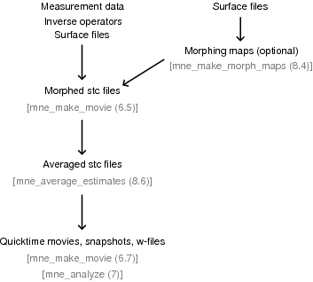

.. _ch_morph:

======================
Morphing and averaging
======================

Overview
########

The spherical morphing of the surfaces accomplished by FreeSurfer can be
employed to bring data from different subjects into a common anatomical
frame. This chapter describes utilities which make use of the spherical morphing
procedure. mne_morph_labels morphs
label files between subjects allowing the definition of labels in
a one brain and transforming them to anatomically analogous labels
in another. mne_average_estimates offers
the capability to compute averages of data computed with the MNE software
across subjects.

.. _CHDJDHII:

The morphing maps
#################

The MNE software accomplishes morphing with help of morphing
maps which can be either computed on demand or precomputed using mne_make_morph_maps ,
see :ref:`CHDBBHDH`. The morphing is performed with help
of the registered spherical surfaces (``lh.sphere.reg`` and ``rh.sphere.reg`` )
which must be produced in FreeSurfer .
A morphing map is a linear mapping from cortical surface values
in subject A (:math:`x^{(A)}`) to those in another
subject B (:math:`x^{(B)}`)

.. math::    x^{(B)} = M^{(AB)} x^{(A)}\ ,

where :math:`M^{(AB)}` is a sparse matrix
with at most three nonzero elements on each row. These elements
are determined as follows. First, using the aligned spherical surfaces,
for each vertex :math:`x_j^{(B)}`, find the triangle :math:`T_j^{(A)}` on the
spherical surface of subject A which contains the location :math:`x_j^{(B)}`.
Next, find the numbers of the vertices of this triangle and set
the corresponding elements on the *j* th row of :math:`M^{(AB)}` so that :math:`x_j^{(B)}` will
be a linear interpolation between the triangle vertex values reflecting
the location :math:`x_j^{(B)}` within the triangle :math:`T_j^{(A)}`.

It follows from the above definition that in general

.. math::    M^{(AB)} \neq (M^{(BA)})^{-1}\ ,

*i.e.*,

.. math::    x_{(A)} \neq M^{(BA)} M^{(AB)} x^{(A)}\ ,

even if

.. math::    x^{(A)} \approx M^{(BA)} M^{(AB)} x^{(A)}\ ,

*i.e.*, the mapping is *almost* a
bijection.

.. _CHDEBAHH:

About smoothing
###############

The current estimates are normally defined only in a decimated
grid which is a sparse subset of the vertices in the triangular
tessellation of the cortical surface. Therefore, any sparse set
of values is distributed to neighboring vertices to make the visualized
results easily understandable. This procedure has been traditionally
called smoothing but a more appropriate name
might be smudging or blurring in
accordance with similar operations in image processing programs.

In MNE software terms, smoothing of the vertex data is an
iterative procedure, which produces a blurred image :math:`x^{(N)}` from
the original sparse image :math:`x^{(0)}` by applying
in each iteration step a sparse blurring matrix:

.. math::    x^{(p)} = S^{(p)} x^{(p - 1)}\ .

On each row :math:`j` of the matrix :math:`S^{(p)}` there
are :math:`N_j^{(p - 1)}` nonzero entries whose values
equal :math:`1/N_j^{(p - 1)}`. Here :math:`N_j^{(p - 1)}` is
the number of immediate neighbors of vertex :math:`j` which
had non-zero values at iteration step :math:`p - 1`.
Matrix :math:`S^{(p)}` thus assigns the average
of the non-zero neighbors as the new value for vertex :math:`j`.
One important feature of this procedure is that it tends to preserve
the amplitudes while blurring the surface image.

Once the indices non-zero vertices in :math:`x^{(0)}` and
the topology of the triangulation are fixed the matrices :math:`S^{(p)}` are
fixed and independent of the data. Therefore, it would be in principle
possible to construct a composite blurring matrix

.. math::    S^{(N)} = \prod_{p = 1}^N {S^{(p)}}\ .

However, it turns out to be computationally more effective
to do blurring with an iteration. The above formula for :math:`S^{(N)}` also
shows that the smudging (smoothing) operation is linear.

.. _CHDBBHDH:

Precomputing the morphing maps
##############################

The utility mne_make_morph_maps was
created to assist mne_analyze and mne_make_movie in
morphing. Since the morphing maps described above take a while to
compute, it is beneficial to construct all necessary maps in advance
before using mne_make_movie .
The precomputed morphing maps are located in ``$SUBJECTS_DIR/morph-maps`` . mne_make_morph_maps creates
this directory automatically if it does not exist. If this directory
exists when mne_analyze or mne_make_movie is run
and morphing is requested, the software first looks for already
existing morphing maps there. Also, if mne_analyze or mne_make_movie have
to recompute any morphing maps, they will be saved to ``$SUBJECTS_DIR/morph-maps`` if
this directory exists.

The names of the files in ``$SUBJECTS_DIR/morph-maps`` are
of the form:

 <*A*> - <*B*> -``morph.fif`` ,

where <*A*> and <*B*> are
names of subjects. These files contain the maps for both hemispheres,
and in both directions, *i.e.*, both :math:`M^{(AB)}` and :math:`M^{(BA)}`, as
defined above. Thus the files <*A*> - <*B*> -``morph.fif`` or <*B*> - <*A*> -``morph.fif`` are
functionally equivalent. The name of the file produced by mne_analyze or mne_make_movie depends
on the role of <*A*> and <*B*> in
the analysis.

If you choose to compute the morphing maps in batch in advance,
use mne_make_morph_maps , which
accepts the following command-line options:

**\---version**

    Show the program version and compilation date.

**\---help**

    List the command-line options.

**\---redo**

    Recompute the morphing maps even if they already exist.

**\---from <*subject*>**

    Compute morphing maps from this subject.

**\---to <*subject*>**

    Compute morphing maps to this subject.

**\---all**

    Do all combinations. If this is used without either ``--from`` or ``--to`` options,
    morphing maps for all possible combinations are computed. If ``--from`` or ``--to`` is
    present, only maps between the specified subject and all others
    are computed.

.. note:: Because all morphing map files contain maps    in both directions, the choice of ``--from`` and ``--to`` options    only affect the naming of the morphing map files to be produced. mne_make_morph_maps creates    directory ``$SUBJECTS_DIR/morph-maps`` if necessary.

.. _CHDCEAFC:

Morphing label data
###################

In some instances it is desirable to use anatomically equivalent
labels for all subjects in a study. This can be accomplished by
creating a set of labels in one subject and morphing them to another
subjects anatomy using the spherical morphing procedure. mne_morph_labels was
created to facilitate this task. It has the following command-line
options:

**\---version**

    Show the program version and compilation date.

**\---help**

    List the command-line options.

**\---from <*subject*>**

    Name of the subject for which the labels were originally defined.

**\---to <*subject*>**

    Name of the subject for which the morphed labels should be created.

**\---labeldir <*directory*>**

    A directory containing the labels to morph.

**\---prefix <*prefix*>**

    Adds <*prefix*> in the beginning
    of the output label names. A dash will be inserted between <*prefix*> and
    the rest of the name.

**\---smooth <*number*>**

    Apply smoothing with the indicated number of iteration steps (see :ref:`CHDEBAHH`) to the labels before morphing them. This is
    advisable because otherwise the resulting labels may have little
    holes in them since the morphing map is not a bijection. By default,
    two smoothsteps are taken.

As the labels are morphed, a directory with the name of the
subject specified with the ``--to`` option is created under
the directory specified with ``--labeldir`` to hold the
morphed labels.

.. _CHDFDIFE:

Averaging
#########

Overview
========

As illustrated in :ref:`CHDDJBDH`, cross-subject averaging
involves three straightforward steps:

- Use mne_make_movie to
  create stc files morphed to a single subject. This requires the
  use of the ``--morph`` option, see :ref:`CBBECEDE`.5.
  The resulting files will have identical selections of vertices on
  the cortical surface of the subject used in averaging. This step
  can be speeded up by precomputing the morphing maps employed in
  the process, see :ref:`CHDBBHDH`.

- Employ mne_average_estimates or
  a Matlab script to read the data from the stc files and to produce
  an output stc file containing the averaged data. The MNE Matlab
  toolbox routines for reading and writing stc files are documented
  in :ref:`ch_matlab`.

- Use mne_analyze or mne_make_movie to
  visualize the result or use the stc files from the previous step
  in your own Matlab routines in further processing.

.. _CHDDJBDH:

    Workflow of the cross-subject averaging process
    
    References in parenthesis indicate sections and chapters of this manual

.. note:: The old utility mne_grand_average has    been removed from the MNE software because of its inefficiency.    All users should adopt the combination of mne_make_movie and mne_average_estimates instead.

.. warning:: With the ``--ico`` option it    is now possible to generate source spaces with equal number of vertices    in each subject. This may lead to the wrong conclusion that stc    data could be averaged without doing the morphing step first. Even    with identical number vertices in the source spaces it is mandatory    to process the data through mne_make_movie to    create corresponding source locations before using mne_average_estimates .

.. _CHDEHFGD:

The averager
============

mne_average_estimates is
the new utility for averaging data in stc files. It requires that
all stc files represent data on one individual's cortical
surface and contain identical sets of vertices. mne_average_estimates uses
linear interpolation to resample data in time as necessary. The
command line arguments are:

**\---version**

    Show the program version and compilation date.

**\---help**

    List the command-line options.

**\---desc <*filenname*>**

    Specifies the description file for averaging. The format of this
    file is described below.

The description file
--------------------

The description file for mne_average_estimates consists
of a sequence of tokens, separated by whitespace (space, tab, or
newline). If a token consists of several words it has to be enclosed
in quotes. One or more tokens constitute an phrase, which has a
meaning for the averaging definition. Any line starting with the
pound sign (#) is a considered to be a comment line. There are two
kinds of phrases in the description file: global and contextual.
The global phrases have the same meaning independent on their location
in the file while the contextual phrases have different effects depending
on their location in the file.

There are three types of contexts in the description file:
the global context, an input context,
and the output context. In the
beginning of the file the context is global for
defining global parameters. The input context
defines one of the input files (subjects) while the output context
specifies the destination for the average.

The global phrases are:

**tmin <*value/ms*>**

    The minimum time to be considered. The output stc file starts at
    this time point if the time ranges of the stc files include this
    time. Otherwise the output starts from the next later available
    time point.

**tstep <*step/ms*>**

    Time step between consecutive movie frames, specified in milliseconds.

**tmax <*value/ms*>**

    The maximum time point to be considered. A multiple of tstep will be
    added to the first time point selected until this value or the last time
    point in one of the input stc files is reached.

**integ  <:math:`\Delta t` /*ms*>**

    Integration time for each frame. Defaults to zero. The integration will
    be performed on sensor data. If the time specified for a frame is :math:`t_0`,
    the integration range will be :math:`t_0 - ^{\Delta t}/_2 \leq t \leq t_0 + ^{\Delta t}/_2`.

**stc <*filename*>**

    Specifies an input stc file. The filename can be specified with
    one of the ``-lh.stc`` and ``-rh.stc`` endings
    or without them. This phrase ends the present context and starts
    an input context.

**deststc <*filename*>**

    Specifies the output stc file. The filename can be specified with
    one of the ``-lh.stc`` and ``-rh.stc`` endings
    or without them. This phrase ends the present context and starts
    the output context.

**lh**

    Process the left hemisphere. By default, both hemispheres are processed.

**rh**

    Process the left hemisphere. By default, both hemispheres are processed.

The contextual phrases are:

**weight <*value*>**

    Specifies the weight of the current data set. This phrase is valid
    in the input and output contexts.

**abs**

    Specifies that the absolute value of the data should be taken. Valid
    in all contexts. If specified in the global context, applies to
    all subsequent input and output contexts. If specified in the input
    or output contexts, applies only to the data associated with that
    context.

**pow <*value*>**

    Specifies that the data should raised to the specified power. For
    negative values, the absolute value of the data will be taken and
    the negative sign will be transferred to the result, unless abs is
    specified. Valid in all contexts. Rules of application are identical
    to abs .

**sqrt**

    Means pow 0.5

The effects of the options can be summarized as follows.
Suppose that the description file includes :math:`P` contexts
and the temporally resampled data are organized in matrices :math:`S^{(p)}`,
where :math:`p = 1 \dotso P` is the subject index, and
the rows are the signals at different vertices of the cortical surface.
The average computed by mne_average_estimates is
then:

.. math::    A_{jk} = |w[\newcommand\sgn{\mathop{\mathrm{sgn}}\nolimits}\sgn(B_{jk})]^{\alpha}|B_{jk}|^{\beta}

with

.. math::    B_{jk} = \sum_{p = 1}^p {\bar{w_p}[\newcommand\sgn{\mathop{\mathrm{sgn}}\nolimits}\sgn(S_{jk}^{(p)})^{\alpha_p}|S_{jk}^{(p)}|^{\beta_p}}

and

.. math::    \bar{w_p} = w_p / \sum_{p = 1}^p {|w_p|}\ .

In the above, :math:`\beta_p` and :math:`w_p` are
the powers and weights assigned to each of the subjects whereas :math:`\beta` and :math:`w` are
the output weight and power value, respectively. The sign is either
included (:math:`\alpha_p = 1`, :math:`\alpha = 1`)
or omitted (:math:`\alpha_p = 2`, :math:`\alpha = 2`)
depending on the presence of abs phrases in the description file.

.. note:: mne_average_estimates requires    that the number of vertices in the stc files are the same and that    the vertex numbers are identical. This will be the case if the files    have been produced in mne_make_movie using    the ``--morph`` option.

.. note:: It is straightforward to read and write stc    files using the MNE Matlab toolbox described in :ref:`ch_matlab` and    thus write custom Matlab functions to realize more complicated custom    group analysis tools.
