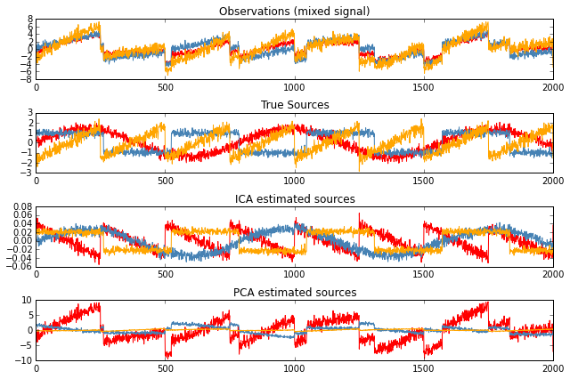

.. _ica:

Independent Component Analysis (ICA)
####################################

.. contents:: Contents
   :local:
   :depth: 2

Many M/EEG signals including biological artifacts reflect non-Gaussian
processes. Therefore PCA-based artifact rejection will likely perform worse at
separating the signal from noise sources.
MNE-Python supports identifying artifacts and latent components using temporal ICA.
MNE-Python implements the :class:`mne.preprocessing.ICA` class that facilitates applying ICA
to MEG and EEG data. It supports FastICA, the infomax, and the extended informax algorithm.
It allows whitening the data using a fast randomized PCA algorithmd. Furthermore,
multiple sensor types are supported by pre-whitening / rescaling. Bad data segments can be excluded
from the model fitting by `reject` parameter in :class:`mne.preprocessing.ICA.fit`.

For convenience, :class:`mne.preprocessing.ICA` implements methods for
    - automated detection of ECG and EOG artifacts
        - :meth:`mne.preprocessing.ICA.find_bads_ecg`
        - :meth:`mne.preprocessing.ICA.find_bads_eog`
    - visualization
        - :meth:`mne.preprocessing.ICA.plot_components` for mapping the spatial sensitvity of a comopnent
        - :meth:`mne.preprocessing.ICA.plot_sources` for component related time series
        - :meth:`mne.preprocessing.ICA.plot_scores` for scores on which component detection is based upon
        - :meth:`mne.preprocessing.ICA.plot_overlay` for showing differences between raw and processed data
    - persistence
        :meth:`mne.preprocessing.ICA.save` for writing the ICA solution into a fif file.
    - integration with MNE-Python object system
        :meth:`mne.preprocessing.ICA.get_sources` for putting component related time series in MNE data structures.

Concepts
========

ICA finds directions in the feature space corresponding to projections with high non-Gaussianity.

- not necessarily orthogonal in the original feature space, but orthogonal in the whitened feature space.
- In contrast, PCA finds orthogonal directions in the raw feature
  space that correspond to directions accounting for maximum variance.
- or differently, if data only reflect Gaussian processes ICA and PCA are equivalent.

**Example**: Imagine 3 instruments playing simultaneously and 3 microphones
recording mixed signals. ICA can be used to recover the sources ie. what is played by each instrument.

ICA employs a very simple model: $X = AS$ where $X$ is our observations, $A$ is the mixing matrix and $S$ is the vector of independent (latent) sources.

The challenge is to recover A and S from X.

First generate simulated data
-----------------------------

.. code:: python

    import numpy as np
    import matplotlib.pyplot as plt
    from scipy import signal

    from sklearn.decomposition import FastICA, PCA

    np.random.seed(0)  # set seed for reproducible results
    n_samples = 2000
    time = np.linspace(0, 8, n_samples)

    s1 = np.sin(2 * time)  # Signal 1 : sinusoidal signal
    s2 = np.sign(np.sin(3 * time))  # Signal 2 : square signal
    s3 = signal.sawtooth(2 * np.pi * time)  # Signal 3: sawtooth signal

    S = np.c_[s1, s2, s3]
    S += 0.2 * np.random.normal(size=S.shape)  # Add noise

    S /= S.std(axis=0)  # Standardize data
    # Mix data
    A = np.array([[1, 1, 1], [0.5, 2, 1.0], [1.5, 1.0, 2.0]])  # Mixing matrix
    X = np.dot(S, A.T)  # Generate observations

Now try to recover the sources
------------------------------

.. code:: python

    # compute ICA
    ica = FastICA(n_components=3)
    S_ = ica.fit_transform(X)  # Get the estimated sources
    A_ = ica.mixing_  # Get estimated mixing matrix

    # compute PCA
    pca = PCA(n_components=3)
    H = pca.fit_transform(X)  # estimate PCA sources

    plt.figure(figsize=(9, 6))

    models = [X, S, S_, H]
    names = ['Observations (mixed signal)',
             'True Sources',
             'ICA estimated sources',
             'PCA estimated sources']
    colors = ['red', 'steelblue', 'orange']

    for ii, (model, name) in enumerate(zip(models, names), 1):
        plt.subplot(4, 1, ii)
        plt.title(name)
        for sig, color in zip(model.T, colors):
            plt.plot(sig, color=color)

    plt.tight_layout()
    plt.show()

:math:`\rightarrow` PCA fails at recovering our "instruments" since the
related signals reflect non-Gaussian processes.
