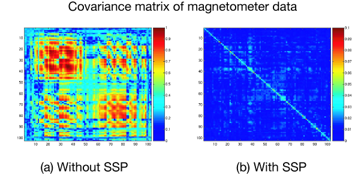

.. _ssp:

Signal-Space Projection (SSP)
#############################

.. contents:: Contents
   :local:
   :depth: 3

The SSP method
==============

The Signal-Space Projection (SSP) is one approach to rejection
of external disturbances in software. Unlike many other noise-cancellation
approaches, SSP does not require additional reference sensors to record the disturbance
fields. Instead, SSP relies on the fact that the magnetic field
distributions generated by the sources in the brain have spatial
distributions sufficiently different from those generated by external
noise sources. Furthermore, it is implicitly assumed that the linear
space spanned by the significant external noise patters has a low
dimension.

What is SSP?
------------

Without loss of generality we can always decompose any :math:`n`-channel
measurement :math:`b(t)` into its signal and
noise components as

.. math::    b(t) = b_s(t) + b_n(t)
   :label: additive_model

Further, if we know that :math:`b_n(t)` is
well characterized by a few field patterns :math:`b_1 \dotso b_m`,
we can express the disturbance as

.. math::    b_n(t) = Uc_n(t) + e(t)\ ,
   :label: pca

where the columns of :math:`U` constitute
an orthonormal basis for :math:`b_1 \dotso b_m`, :math:`c_n(t)` is
an :math:`m`-component column vector, and
the error term :math:`e(t)` is small and does
not exhibit any consistent spatial distributions over time, *i.e.*, :math:`C_e = E \{e e^T\} = I`.
Subsequently, we will call the column space of :math:`U` the
noise subspace. The basic idea of SSP is that we can actually find
a small basis set :math:`b_1 \dotso b_m` such that the
conditions described above are satisfied. We can now construct the
orthogonal complement operator

.. math::    P_{\perp} = I - UU^T
   :label: projector

and apply it to :math:`b(t)` in Equation :eq:`additive_model` yielding

.. math::    b_{s}(t) \approx P_{\perp}b(t)\ ,
   :label: result

since :math:`P_{\perp}b_n(t) = P_{\perp}(Uc_n(t) + e(t)) \approx 0` and :math:`P_{\perp}b_{s}(t) \approx b_{s}(t)`. The projection operator :math:`P_{\perp}` is
called the **signal-space projection operator**.

Why SSP?
--------

It provides considerable rejection of noise, suppressing external disturbances
by a factor of 10 or more. The effectiveness of SSP depends on two
factors:

- The basis set :math:`b_1 \dotso b_m` should
  be able to characterize the disturbance field patterns completely
  and

- The angles between the noise subspace space spanned by :math:`b_1 \dotso b_m` and the
  signal vectors :math:`b_s(t)` should be as close
  to :math:`\pi / 2` as possible.

If the first requirement is not satisfied, some noise will
leak through because :math:`P_{\perp}b_n(t) \neq 0`. If the any
of the brain signal vectors :math:`b_s(t)` is
close to the noise subspace not only the noise but also the signal
will be attenuated by the application of :math:`P_{\perp}` and,
consequently, there might by little gain in signal-to-noise ratio.
:ref:`CACFGIEC` demonstrates the effect of SSP on the Vectorview
magnetometer data. After the elimination of a three-dimensional
noise subspace, the absolute value of the noise is dampened approximately
by a factor of 10 and the covariance matrix becomes diagonally dominant.

Since the signal-space projection modifies the signal vectors
originating in the brain, it is necessary to apply the projection
to the forward solution in the course of inverse computations. This
is accomplished by mne_inverse_operator as
described in :ref:`inverse_operator`. For more information on SSP,
please consult the references listed in :ref:`CEGIEEBB`.

.. _CACFGIEC:

    An example of the effect of SSP

    The covariance matrix :math:`C_n` of noise data on the 102 Vectorview magnetometers was computed (a) before and (b) after the application of SSP with three-dimensional noise subspace. The plotted quantity is :math:`\sqrt {|(C_n)_{jk}|}`. Note that the vertical scale in (b) is ten times smaller than in (a).

.. _BABFFCHF:

Estimation of the noise subspace
--------------------------------

As described above, application of SSP requires the estimation
of the signal vectors :math:`b_1 \dotso b_m` constituting
the noise subspace. The most common approach, also implemented in mne_browse_raw is
to compute a covariance matrix of empty room data, compute its eigenvalue
decomposition, and employ the eigenvectors corresponding to the
highest eigenvalues as basis for the noise subspace. It is also
customary to use a separate set of vectors for magnetometers and
gradiometers in the Vectorview system.

Average reference
-----------------

The EEG average reference is the mean signal over all the sensors. It is typical in EEG analysis to subtract the average reference from all the sensor signals :math:`b^{1}(t), ..., b^{n}(t)`. That is:

.. math::	{b}^{j}_{s}(t) = b^{j}(t) - \frac{1}{n}\sum_{k}{b^k(t)}
   :label: eeg_proj

where the noise term :math:`b_{n}^{j}(t)` is given by

.. math:: 	b_{n}^{j}(t) = \frac{1}{n}\sum_{k}{b^k(t)}
   :label: noise_term

Thus, the projector vector :math:`P_{\perp}` will be given by :math:`P_{\perp}=\frac{1}{n}[1, 1, ..., 1]`

.. Warning:: When applying SSP, the signal of interest can also be sometimes removed. Therefore, it's always a good idea to check how much the effect of interest is reduced by applying SSP. SSP might remove *both* the artifact and signal of interest.

The API
=======

Once a projector is applied on the data, it is said to be `active`.

The proj attribute
------------------

It is available in all the basic data containers: ``Raw``, ``Epochs`` and ``Evoked``. It is ``True`` if at least one projector is present and all of them are `active`.

Computing projectors
--------------------

In MNE-Python SSP vectors can be computed using general
purpose functions :func:`mne.compute_proj_epochs`,
:func:`mne.compute_proj_evoked`, and :func:`mne.compute_proj_raw`.
The general assumption these functions make is that the data passed contains
raw, epochs or averages of the artifact. Typically this involves continues raw
data of empty room recordings or averaged ECG or EOG artifacts.

A second set of highlevel convenience functions is provided to compute projection vector for typical usecases. This includes :func:`mne.preprocessing.compute_proj_ecg` and :func:`mne.preprocessing.compute_proj_eog` for computing the ECG and EOG related artifact components, respectively. For computing the EEG reference signal, the function :func:`mne.set_eeg_reference` can be used.

.. warning:: It is best to compute projectors only on channels that will be
             used (e.g., excluding bad channels). This ensures that
             projection vectors will remain ortho-normalized and that they
             properly capture the activity of interest.

.. _remove_projector:

Adding/removing projectors
--------------------------

To explicitly add a ``proj``, use ``add_proj``. For example::

    >>> projs = mne.read_proj('proj_a.fif')
    >>> evoked.add_proj(projs)

If projectors are already present in the raw `fif` file, it will be added to the ``info`` dictionary automatically. To remove existing projectors, you can do::

	>>> evoked.add_proj([], remove_existing=True)

Applying projectors
-------------------

Projectors can be applied at any stage of the pipeline. When the ``raw`` data is read in, the projectors are not applied by default but this flag can be turned on. However, at the ``epochs`` stage, the projectors are applied by default.

To apply explicitly projs at any stage of the pipeline, use ``apply_proj``. For example::

	>>> evoked.apply_proj()

The projectors might not be applied if data are not :ref:`preloaded <memory>`. In this case, it's the ``_projector`` attribute that indicates if a projector will be applied when the data is loaded in memory. If the data is already in memory, then the projectors applied to it are the ones marked as `active`. As soon as you've applied the projectors, it will stay active in the remaining pipeline.

.. Warning:: Once a projection operator is applied, it cannot be reversed.
.. Warning:: Projections present in the info are applied during inverse computation whether or not they are `active`. Therefore, if a certain projection should not be applied, remove it from the info as described in Section :ref:`remove_projector`

Delayed projectors
------------------

The suggested pipeline is ``proj=True`` in epochs (it's computationally cheaper than for raw). When you use delayed SSP in ``Epochs``, projectors are applied when you call :func:`mne.Epochs.get_data` method. They are not applied to the ``evoked`` data unless you call ``apply_proj()``. The reason is that you want to reject epochs with projectors although it's not stored in the projector mode.

.. topic:: Examples:

    * :ref:`sphx_glr_auto_tutorials_plot_artifacts_correction_ssp.py`: SSP sensitivities in sensor space
    * :ref:`sphx_glr_auto_examples_forward_plot_forward_sensitivity_maps.py`: SSP sensitivities in source space
