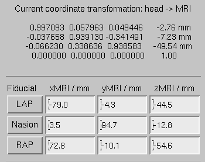

:orphan:

.. _ch_sample_data:

===================
The sample data set
===================

.. contents:: Contents
   :local:
   :depth: 2

Purpose
#######

This Chapter gives a detailed description of the processing
of a sample data set, which can be employed to familiarize with
the workflow described in :ref:`cookbook`.

.. note:: Going through the analysis exercise in    this chapter is not a substitute for reading other chapters of this    manual and understanding the concepts underlying MNE software.

.. _sample_data_overview:

Overview
########

The MNE software is accompanied by a sample data set which
includes the MRI reconstructions created with FreeSurfer and the
an MEG/EEG data set. These data were acquired with the Neuromag
Vectorview system at MGH/HMS/MIT Athinoula A. Martinos Center Biomedical
Imaging. EEG data from a 60-channel electrode cap was acquired simultaneously with
the MEG. The original MRI data set was acquired with a Siemens 1.5 T
Sonata scanner using an MPRAGE sequence.

.. note:: These data are provided solely for the purpose of getting familiar
          with the MNE software. They should not be redistributed to third
          parties. The data should not be used to evaluate the performance
          of the MEG or MRI system employed.

In the MEG/EEG experiment, checkerboard patterns were presented
into the left and right visual field, interspersed by tones to the
left or right ear. The interval between the stimuli was 750 ms. Occasionally
a smiley face was presented at the center of the visual field.
The subject was asked to press a key with the right index finger
as soon as possible after the appearance of the face. A listing
of the corresponding trigger codes is provided in :ref:`BABDHIFJ`

.. _BABDHIFJ:

.. table:: Trigger codes for the sample data set.

    =========  =====  ==========================================
    Name              #Contents
    =========  =====  ==========================================
    LA         1      Response to left-ear auditory stimulus
    RA         2      Response to right-ear auditory stimulus
    LV         3      Response to left visual field stimulus
    RV         4      Response to right visual field stimulus
    smiley     5      Response to the smiley face
    button     32     Response triggered by the button press
    =========  =====  ==========================================

Setting up
##########

The sample dataset can be downloaded automatically by doing::

    >>> mne.datasets.sample.data_path(verbose=True)

Contents of the data set
########################

The sample data set contains two main directories: ``MEG/sample`` (the MEG/EEG
data) and ``subjects/sample`` (the MRI reconstructions).
An overview of the data provided is given in Tables :ref:`CHDDDIHE` and :ref:`CHDDEGGC`. In addition to
subject sample , the MRI surface
reconstructions from another subject, morph ,
are provided to demonstrate the morphing capabilities of the MNE software.

.. _CHDDDIHE:

.. table:: Contents of the MEG/sample directory.

    ========================  =====================================================================
    File                      Contents
    ========================  =====================================================================
    sample/audvis_raw.fif     The raw MEG/EEG data
    audvis.ave                A template script for off-line averaging
    auvis.cov                 A template script for the computation of a noise-covariance matrix
    ========================  =====================================================================

.. _CHDDEGGC:

.. table:: Overview of the contents of the subjects/sample directory.

    =======================  ======================================================================
    File / directory         Contents
    =======================  ======================================================================
    bem                      Directory for the forward modelling data
    bem/watershed            BEM surface segmentation data computed with the watershed algorithm
    bem/inner_skull.surf     Inner skull surface for BEM
    bem/outer_skull.surf     Outer skull surface for BEM
    bem/outer_skin.surf      Skin surface for BEM
    sample-head.fif          Skin surface in fif format for mne_analyze visualizations
    surf                     Surface reconstructions
    mri/T1                   The T1-weighted MRI data employed in visualizations
    =======================  ======================================================================

The following preprocessing steps have been already accomplished
in the sample data set:

- The MRI surface reconstructions have
  been computed using the FreeSurfer software.

- The BEM surfaces have been created with the watershed algorithm,
  see :ref:`BABBDHAG`.

- The MEG/EEG raw data file has been checked with the utilities described
  in :ref:`BABCDBDI` and :ref:`BABCDFJH`.

Setting up subject-specific data
################################

.. _CHDBBAEJ:

Structural MRIs
===============

To set up the structural MRIs for processing with the Neuromag
MRI viewer, MRIlab, say

``mne_setup_mri``

This command sets up the directories ``subjects/sample/mri/T1-neuromag`` and ``subjects/sample/mri/brain-neuromag`` .
For more information, see :ref:`BABCCEHF`.

.. _CHDIGEJG:

Source space
============

The source space with a 5-mm grid spacing is set up by saying:

``mne_setup_source_space --ico -6``

This command sets up the source-space related files in directory ``subjects/sample/bem`` as
described in :ref:`setting_up_source_space`.

.. _CHDJDGBD:

Boundary-element models
=======================

The geometry calculations for the single-layer boundary-element
model are accomplished with the command:

``mne_setup_forward_model --homog --surf --ico 4``

This command sets up the homogeneous BEM-model related files
in directory ``subjects/sample/bem`` as described in :ref:`CIHDBFEG`. In
addition to the homogeneous BEM, you also need the three-layer BEM model,
which can be used for both EEG and MEG:

``mne_setup_forward_model --surf --ico 4``

The above commands employ the ``inner_skull.surf`` , ``outer_skull.surf`` ,
and ``outer_skin.surf`` triangulation files located in ``subjects/sample/bem`` .
The option ``--ico 4`` will create a model with 5120 triangles
on each surface. Depending on the speed of your computer, the three-layer
model may take quite a while to set up.

Setting up a custom EEG layout
##############################

A data specific EEG layout will facilitate viewing of the
EEG data. The MNE programs mne_browse_raw and mne_analyze look
for user-specific layouts in ``$HOME/.mne/lout`` . Thus,
you can create an EEG layout for the sample data set with the following
commands:

``mkdir -p $HOME/.mne/lout``

``cd $SAMPLE/MEG/sample``

``mne_make_eeg_layout --fif sample_audvis_raw.fif --lout $HOME/.mne/lout/sample-EEG.lout``

Please refer to :ref:`mne_make_eeg_layout` for more information
on mne_make_eeg_layout .

.. note:: It is usually sufficient to create one EEG layout    for each electrode cap you are using in your experiment rather than    using a different layout file for each data file generated using    the same cap.

Previewing the data
###################

Previewing your raw data before proceeding to averaging and
computation of the current estimates is most important to avoid
unintentional errors caused by noisy or dysfunctional channels,
frequent eye blinks, inappropriate bandpass filtering etc.

One possible routemap for the preview session is outlined
below:

- Go to the MEG/EEG data directory: ``cd $SAMPLE/MEG/sample`` .

- Launch mne_browse_raw .

- Open the raw data file ``sample_audvis_raw.fif`` from File/Open... .

- Switch all SSP vectors off from Adjust/Projection... .

- Set the lowpass filter corner to a high value, e.g., 150 Hz
  from Adjust/Filter... .

- Browse through all channels using the selections available
  under Adjust/Selection... and
  look for very noisy or flat channels. You should be able to readily
  identify two such channels among all MEG and EEG channels. You may
  need to click Remove DC to reliably
  associate the noisy or flat waveform with the channel name on the
  left. Also, experiment with switching the EEG average reference
  projection on and off and you will notice that the EEG bad channel
  cannot be seen after the projection.

- Mark the channels you identified in step 6. bad for this viewing
  session by clicking on their channel names on the left. You can
  save the bad channel selection to the file from File/Apply bad channels . Bad channel marking can be removed
  by clicking on their channel names again and selecting File/Apply bad channels . Alternatively, you can use the utility mne_mark_bad_channels to
  set a bad channel selection, see :ref:`mne_mark_bad_channels`.

- Switch the projections back on and change filter to a 40-Hz
  lowpass.

- Compute a preliminary average for the left-ear auditory stimulus:

  - Open the averaging preferences dialog
    (Adjust/Averaging preferences... .

  - Set the time scale to -100...300 ms.

  - Click on the text next to Average: in
    the main window and press return. After a while, a topographical
    display appears with the averaged responses. Notice that the bad
    channels are not displayed.

  - Change to different layouts from Adjust/Full view layout... . Inspect both the MEG and EEG waveforms.

- Compute a preliminary average for the right-ear auditory stimulus:

  - Open the averaging preferences.

  - Click on the Trace color... button
    and change the trace color to something different from the default
    yellow.

  - Change the text next to Average: to
    2 and press return. Average to the right-ear tones will be computed.
    Compare the to sets of averages and verify that all channels show
    reasonable data.

- Go to Windows/Manage averages... and
  delete the preliminary averages just computed.

After these steps, you are ready to proceed to the actual
analysis.

Off-line averaging
##################

Go to directory ``$SAMPLE/MEG/sample`` . With help
of :ref:`CACBBDGC`, familiarize yourself with the averaging
script ``audvis.ave`` .

Using the averaging script interactively
========================================

You can invoke an averaging script in mne_browse_raw from Process/Average... .
Select the ``audvis.ave`` script from the file selection
box that appears. Once averaging is complete, you can inspect the
details of the averaged responses in the Averages window,
which appears automatically. You can redisplay it from Windows/Show averages... . The window, which appears when you
select Adjust/Manage averages... allows
you to:

- Select which conditions (categories)
  are displayed.

- Change the trace colors.

- Inspect the averaging log.

- Save the averaged data.

- Delete this set of averages.

.. note:: If you decide to save the averages in the interactive    mode, use the name ``sample_audvis-ave.fif`` for the result.

Using the averaging script in batch mode
========================================

The batch-mode version of mne_browse_raw , mne_process_raw can
be used for averaging as well. Batch mode averaging can be done
with the command:

``mne_process_raw --raw sample_audvis_raw.fif `` ``--lowpass 40 --projoff `` ``--saveavetag -ave --ave audvis.ave``

See :ref:`mne_process_raw` for command-line options.

As a result of running the averaging script a file called ``sample_audvis-ave.fif`` is
created. It contains averages to the left and right ear auditory
as well as to the left and right visual field stimuli.

.. _CHDHBGGH:

Viewing the off-line average
############################

The average file computed in the previous section can be
viewed in  mne_browse_raw .

To view the averaged signals, invoke mne_browse_raw :

``cd $SAMPLE/MEG/sample``

``mne_browse_raw &``

This Section gives only very basic information about the
use of mne_browse_raw for viewing
evoked-response data. Please consult :ref:`ch_browse` for more
comprehensive information.

Loading the averages
====================

mne_browse_raw loads all
the available data from an average file at once:

- Select Open evoked... from
  the File menu.

- Select the average file ``sample_audvis-ave.fif`` file
  from the list and click OK .

- A topographical display of the waveforms with gradiometer
  channels included appears.

Inspecting the auditory data
============================

Select the left and right ear auditory stimulus responses
for display:

- Select Manage averages... from
  the Adjust menu.

- Click off all other conditions except the auditory ones.

Set the time scale and baseline:

- Select Scales... from
  the Adjust menu.

- Switch off Autoscale time range and
  set the Average time range from -200
  to 500 ms.

- Switch on Use average display baseline and
  set Average display baseline from
  -200 to 0 ms.

- Click OK .

You can display a subset of responses from the topographical display
by holding the shift key down and dragging with the mouse, left
button down. When you drag on the response with just the left button
down, the signal timing, and channel name are displayed at the bottom. If
the left mouse button is down and you press shift down the time
is give both in absolute units and relative to the point where shift
was pressed down.

Observe the following:

- The main deflection occurs around 100 ms
  over the left and right temporal areas.

- The left-ear response (shown in yellow) is stronger on the
  right than on the left. The opposite is true for the right-ear response,
  shown in red.

Inspecting the visual data
==========================

Go back to the Manage averages... dialog
and switch all other conditions except the visual ones.

Observe the following:

- The left and right visual field responses
  are quite different in spatial distribution in the occipital area.

- There is a later response in the right parietal area, almost
  identical to both visual stimuli.

.. note:: If you have the Neuromag software available,    the averaged data can be also viewed in the Neuromag data plotter    (xplotter ). See :ref:`BABGFDJG` for    instructions on how to use the Neuromag software at the MGH Martinos    Center.

Computing the noise-covariance matrix
#####################################

Another piece of information derived from the raw data file
is the estimate for the noise-covariance matrix, which can be computed
with the command:

``mne_process_raw --raw sample_audvis_raw.fif --lowpass 40 --projon --savecovtag -cov --cov audvis.cov``

Using the definitions in ``audvis.cov`` , this command
will create the noise-covariance matrix file ``sample_audvis-cov.fif`` .
In this case the projections are set on. The projection information
is then attached to the noise-covariance matrix and will be automatically
loaded when the inverse-operator decomposition is computed.

.. note:: You can study the contents of the covariance    matrix computation description file ``audvis.cov`` with the help of :ref:`CACEBACG`.

.. _CHDIJBIG:

MEG-MRI coordinate system alignment
###################################

The mne_analyze module
of the MNE is one option for the coordinate alignment. It uses a
triangulated scalp surface to facilitate the alignment.

.. _CHDEDCAE:

Initial alignment
=================

Follow these steps to make an initial approximation for the
coordinate alignment.

- Go to directory ``MEG/sample`` .

- Launch mne_analyze

- Select File/Load digitizer data... and
  load the digitizer data from ``sample_audvis_raw.fif`` .

- Load an inflated surface for subject sample from File/Load surface...

- Bring up the viewer window from View/Show viewer...

- Click Options... in the
  viewer window. Make the following selections:

  - Switch left and right cortical surface
    display off.

  - Make the scalp transparent.

  - Switch Digitizer data on.

- After a while, the digitizer points will be shown. The color
  of the circles indicates whether the point is inside (blue) or outside
  (red) of the scalp. The HPI coils are shown in green and the landmark
  locations in light blue or light red color. The initial alignment
  is way off!

- Switch the Digitizer data off
  to get the big circles out of the way.

- Bring up the coordinate alignment window from Adjust/Coordinate alignment...

- Click on the RAP (Right
  Auricular Point) button. It turns red, indicating that you should
  select the point from the viewer window. Click at the approximate
  location of this point in the viewer. The button jumps up, turns
  to normal color, and the MRI coordinates of the point appear in
  the text fields next to the button.

- Proceed similarly for the other two landmark points: Nasion
  and LAP (Left Auricular Point).

- Press Align using fiducials .
  Notice that the coordinate transformation changes from a unit transformation
  (no rotation, no origin translation) to a one determined by the
  identified landmark locations. The rotation matrix (upper left 3
  x 3 part of the transformation) should have positive values close
  to one on the diagonal. Three is a significant rotation around the
  x axis as indicated by elements (3,2) and (2,3) of the rotation
  matrix. The *x* and *y* values
  of the translation should be small and the *z* value
  should be negative, around -50 mm. An example of an initial
  coordinate transformation is shown in :ref:`CHDFIHAC`.

- Make the Digitizer data again
  visible from the options of the viewer window. Note that the points
  are now much closer to the scalp surface.

.. _CHDFIHAC:

    Example of an initial coordinate alignment.

Refining the coordinate transformation
======================================

Before proceeding to the refinement procedure, it is useful
to remove outlier digitizer points. When you rotate the image in
the viewer window, you will notice that there is at least one such
point over the right cheek. To discard this point:

- Click on Discard in
  the Adjust coordinate alignment window.

- Enter 10 for the distance of the points to be discarded.

- Click done. The outlier point disappears.

The coordinate transformation can be adjusted manually with
the arrow buttons in the middle part of the Adjust coordinate alignment dialog. These buttons move
the digitizer points in the directions indicated by the amount listed
next to each of the buttons.

An automatic iterative procedure, Iterative Closest Point
(ICP) matching is also provided. At each iteration step

- For each digitizer point, transformed
  from MEG to the MRI coordinate frame, the closest point on the triangulated
  surface is determined.

- The best coordinate transformation aligning the digitizer
  points with the closest points on the head surface is computed.

In step 2 of the iteration, the nasion is assigned five times
the weight of the other points since it can be assumed that the
nasion is the easiest point to identify reliably from the surface
image.

The ICP alignment can be invoked by entering the desired
number of iterations next to the ICP align button
followed by return or simply pressing the ICP align button.
The iteration will converge in 10 to 20 steps.

.. warning:: Use the ICP alignment option in mne_analyze with    caution. The iteration will not converge to a reasonable solution    unless and initial alignment is performed first according to :ref:`CHDEDCAE`. Outlier points should be excluded as described    above. No attempt is made to compensate for the possible distance    of the digitized EEG electrode locations from the scalp.

Saving the transformation
=========================

To create a MRI fif description file which incorporates the
coordinate transformation click Save MRI set in
the Adjust coordinate alignment dialog.
This will create the MRI set file in the ``$SUBJECTS_DIR/sample/mri/T1-neuromag/sets`` directory,
which was created by mne_setup_mri_data ,
see :ref:`CHDBBAEJ`. The file will be called

``COR-`` <*username*>- <*date*>- <*time*> .fif

where <*username*> is
your login name.

You can also save transformation to a fif file through the Save... button.
If the file does not exist, it will only contain the coordinate
transformation. If the file exists it will be inserted to the appropriate
context. An existing transformation will not be replaced unless Overwrite existing transform is checked in the save dialog.

Once you have saved the coordinate transformation, press Done and
quit mne_analyze (File/Quit ).

.. note:: If you dismiss the alignment dialog before    saving the transformation, it will be lost.

The forward solution
####################

To compute the forward solution, say:

``cd $SAMPLE/MEG/sample``

``mne_do_forward_solution --mindist 5 --spacing oct-6 --bem sample-5120-5120-5120 --meas sample_audvis-ave.fif``

This produces an EEG and MEG forward solution with source
space points closer than 5 mm to the inner skull surface omitted.
The source space created in :ref:`CHDIGEJG` will be employed.
As the output from this command will indicate The forward solution
will be stored in file ``sample_audvis-ave-oct-6-fwd.fif`` .

This command uses the three-layer BEM model ``sample-5120-5120-5120-bem-sol.fif`` created
in :ref:`CHDJDGBD`. If you want to use the single-compartment
BEM ``sample-5120-bem-sol.fif`` usable for MEG data only
say:

``cd $SAMPLE/MEG/sample``

``mne_do_forward_solution --mindist 5 --spacing oct-6 --meas sample_audvis-ave.fif --bem sample-5120 --megonly``

The inverse operator decomposition
##################################

The inverse operator information, necessary for the computation
of the MNEs and dSPMs is accomplished by the command:

``mne_do_inverse_operator --fwd sample_audvis-ave-oct-6-fwd.fif --depth --loose 0.2 --meg --eeg``

This produces a depth-weighted inverse operator decomposition
with 'loose' orientation constraint applied. More
details on the convenience script mne_do_inverse_operator are
provided in :ref:`CIHCFJEI`.

The above command employs both EEG and MEG data. To create
separate solution for EEG and MEG, run the commands:

``mne_do_inverse_operator --fwd sample_audvis-ave-oct-6-fwd.fif --depth --loose 0.2 --meg``

and

``mne_do_inverse_operator --fwd sample_audvis-ave-oct-6-fwd.fif --depth --loose 0.2 --eeg``

.. note:: If you were using a single-compartment BEM to    compute the forward solution, you can only compute the MEG inverse    operator.

Interactive analysis
####################

The most exciting part of this exercise is to explore the
data and the current estimates in mne_analyze .
This section contains some useful steps to get you started. A lot
of information about the capabilities of mne_analyze is
given in :ref:`ch_interactive_analysis`. Batch-mode processing with
mne_make_movie is discussed in :ref:`movies_and_snapshots`. Cross-subject
averaging is covered in :ref:`ch_morph`.

Before launching mne_analyze it
is advisable to go to the directory ``MEG/sample`` . The
current working directory can be also changed from mne_analyze .

Getting started
===============

Launch mne_analyze . Select Help/On GLX... , which brings up a window containing Open
GL rendering context information. If first line in the information
dialog that pops up says Nondirect rendering context instead of Direct rendering context you will experience slow graphics
performance. To fix this, your system software, graphics adapter
or both need to be updated. Consult a computer support person for
further information.

Load surfaces
=============

It is reasonable to start the analysis by loading the display
surfaces: choose the inflated surface for subject sample from
the dialog that appears when you select File/Load surface... .

Load the data
=============

Select File/Open... . Select ``sample_audvis-ave.fif`` as
your data file and select the Left auditory data
set. Select the inverse operator ``sample_audvis-ave-oct-6-meg-eeg-inv.fif`` and
press OK . After a while the signals
appear in the sample waveform and topographical displays. Click
on the N100m peak in the auditory response. A dSPM map appears in
the main surface display.

Show field and potential maps
=============================

Select Windows/Show viewer... .
After a while the viewer window appears. Click on the N100m peak
again. Once the field map preparation computations are complete,
the magnetic field and potential maps appear. Investigate the viewer
window options with help of :ref:`CACEFFJF`.

Show current estimates
======================

The options affecting the current estimates are accessible
from Adjust/Estimate parameters... .
With help of :ref:`CACBHDBF`, investigate the effects of the
parameter settings.

Labels and timecourses
======================

While in directory ``MEG/sample`` , create a directory
called ``label`` :

``mkdir label``

Using the information in :ref:`CACJCFJJ`, create two
labels ``A-lh.label`` and ``A-rh.label`` in the
approximate location of the left and right auditory cortices. Save
these labels in the newly created ``label`` directory.

Load all labels from the ``label`` directory and
investigate the timecourses in these two labels as well as at individual
vertices. Information on label processing can be found from :ref:`CACCCFHH`.

Morphing
========

Goto to ``$SUBJECTS_DIR`` and create the directory ``morph-maps`` .
Load the inflated surface for subject morph as
the morphing surfaces. Try switching between the original and morphing
surfaces. More information about morphing is available in :ref:`CACGBEIB` and
in :ref:`ch_morph`.

There is also a left-hemisphere occipital patch file available
for subject morph . Load a righ-hemifield
visual response instead of the auditory one and investigate mapping
of the current estimates on the patch.
