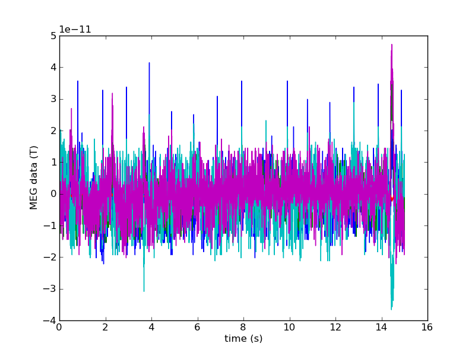
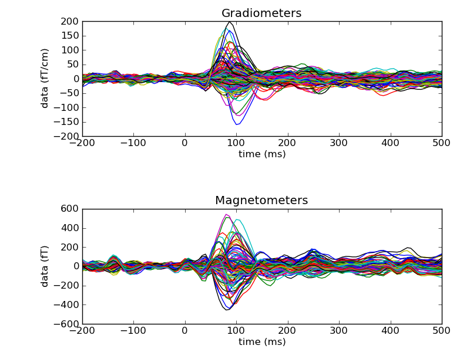
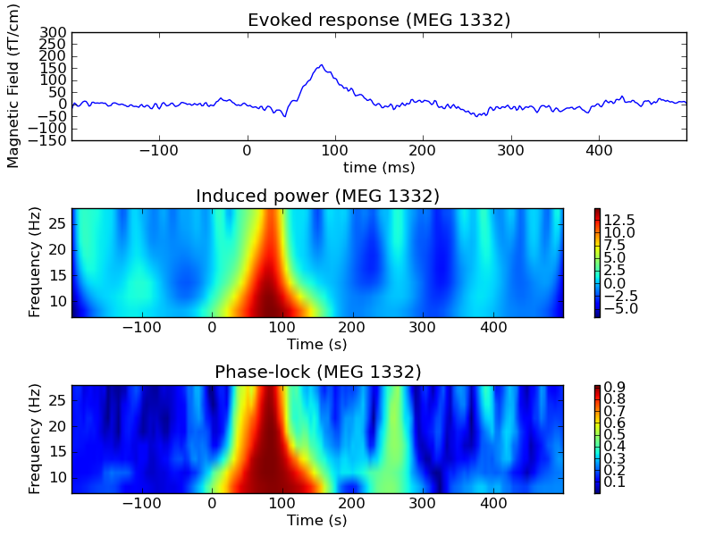

.. _mne_python_tutorial:

=========================================================
Tutorial: MEG and EEG data processing with MNE and Python
=========================================================

Python offers transparent scripting on top of MNE.
It was designed to be an alternative to the MNE matlab toolbox
but now it can do much more (customize events, compute
contrasts, statistics, time-frequency analysis etc.)
It uses the same files as standard MNE unix commands:
no need to convert your files to a new system or database.

What you're not supposed to do with MNE Python
----------------------------------------------

    - **Forward modeling**: BEM computation and mesh creation (see :ref:`ch_forward`)
    - **Raw data visualization** done with *mne_browse_raw* (see :ref:`ch_browse`)
    - **MNE source estimates visualization** done with *mne_analyze* (see :ref:`ch_interactive_analysis`)

What you can do with MNE Python
-------------------------------

    - **Epoching**: Define epochs, baseline correction etc.
    - **Averaging** to get Evoked data
    - **Linear inverse solvers** (dSPM, MNE)
    - **Time-frequency** analysis with Morlet wavelets (induced power, phase lock value) also in the source space
    - **Compute contrasts** between conditions, between sensors, across subjects etc.
    - **Non-parametric statistics** in time, space and frequency (including cluster-level)
    - **Scripting** (batch and parallel computing)

.. note:: Package based on the FIF file format from Neuromag but can work with CTF and 4D after conversion to FIF.

Installation of the required materials
---------------------------------------

See :ref:`getting_started` with Python.

Get the code
^^^^^^^^^^^^

  You can manually get the latest version of the code at:

  https://github.com/mne-tools/mne-python

  Then from the mne-python folder (containing a setup.py file) you can install with::

      python setup.py install

  You can also install the latest release with easy_install::

      easy_install -U mne

  or with pip::

      pip install mne --upgrade

  For the latest development version (the most up to date)::

      pip install -e git+https://github.com/mne-tools/mne-python#egg=mne-dev

From raw data to evoked data
----------------------------

.. _ipython: http://ipython.scipy.org/

Now, launch `ipython`_ (Advanced Python shell)::

  $ ipython -pylab -wthread

First, load the mne package:

    >>> import mne

If you'd like to turn information status messages off:

    >>> mne.set_log_level('WARNING')

But it's generally a good idea to leave them on:

    >>> mne.set_log_level('INFO')

By default these print to the console, but look at mne.set_log_file() to save output to a file.

Access raw data
^^^^^^^^^^^^^^^

    >>> from mne.datasets import sample
    >>> data_path = sample.data_path()
    >>> raw_fname = data_path + '/MEG/sample/sample_audvis_filt-0-40_raw.fif'
    >>> print raw_fname
    ./MNE-sample-data/MEG/sample/sample_audvis_filt-0-40_raw.fif

.. note:: The MNE sample dataset should be downloaded automatically but be patient (approx. 2GB)

Read data from file:

    >>> raw = mne.fiff.Raw(raw_fname) # doctest:+ELLIPSIS
    Opening raw data ...
    Ready.
    >>> print raw
    Raw (n_channels x n_times : 376 x 41700)

Look at the channels in raw:

    >>> print raw.ch_names # doctest:+ELLIPSIS
    ['MEG 0113', 'MEG 0112', ...]

Read and plot a segment of raw data

    >>> start, stop = raw.time_as_index([100, 115])  # 100 s to 115 s data segment
    >>> data, times = raw[:, start:stop]
    Reading 15015 ... 17266  =     99.998 ...   114.989 secs...
    [done]
    >>> print data.shape
    (376, 2252)
    >>> print times.shape
    (2252,)
    >>> data, times = raw[2:20:3, start:stop]  # take some Magnetometers
    Reading 15015 ... 17266  =     99.998 ...   114.989 secs...
    [done]

Save a segment of 150s of raw data (MEG only):

    >>> picks = mne.fiff.pick_types(raw.info, meg=True, eeg=False, stim=True)
    >>> raw.save('sample_audvis_meg_raw.fif', tmin=0, tmax=150, picks=picks) # doctest: +ELLIPSIS
    Reading ...

Define and read epochs
^^^^^^^^^^^^^^^^^^^^^^

First extract events:

    >>> events = mne.find_events(raw, stim_channel='STI 014')
    Reading 0 ... 41699  =      0.000 ...   277.709 secs...
    [done]
    319 events found
    Events id: [ 1  2  3  4  5 32]
    >>> print events[:5]
    [[6994    0    2]
     [7086    0    3]
     [7192    0    1]
     [7304    0    4]
     [7413    0    2]]

Events are stored as 2D numpy array where the first column is the time instant
and the last one is the event number. It is therefore easy to manipulate.

Define epochs parameters:

    >>> event_id = 1  # the event number in events
    >>> tmin = -0.2  # start of each epoch (200ms before the trigger)
    >>> tmax = 0.5  # end of each epoch (500ms after the trigget)

Exclude some channels (bads + 2 more):

    >>> exclude = raw.info['bads'] + ['MEG 2443', 'EEG 053']

The variable raw.info['bads'] is just a python list.

Pick the good channels:

    >>> picks = mne.fiff.pick_types(raw.info, meg=True, eeg=True, eog=True, stim=False, exclude=exclude)

Alternatively one can restrict to magnetometers or gradiometers with:

    >>> mag_picks = mne.fiff.pick_types(raw.info, meg='mag', eog=True, exclude=exclude)
    >>> grad_picks = mne.fiff.pick_types(raw.info, meg='grad', eog=True, exclude=exclude)

Define the baseline period:

    >>> baseline = (None, 0)  # means from the first instant to t = 0

Define peak-to-peak rejection parameters for gradiometers, magnetometers and EOG:

    >>> reject = dict(grad=4000e-13, mag=4e-12, eog=150e-6)

Read epochs:

    >>> epochs = mne.Epochs(raw, events, event_id, tmin, tmax, proj=True, picks=picks, baseline=baseline, preload=False, reject=reject)
    Created an SSP operator (subspace dimension = 4)
    4 projection items activated
    72 matching events found
    >>> print epochs
    Epochs (n_events : 72 (good & bad), tmin : -0.2 (s), tmax : 0.5 (s), baseline : (None, 0))

Get single epochs:

    >>> epochs_data = epochs.get_data() # doctest: +ELLIPSIS
    Reading ...
    >>> print epochs_data.shape
    (55, 365, 106)

epochs_data is a 3D array of dimension (55 epochs, 365 channels, 106 time instants).

Scipy supports read and write of matlab files. You can save your single trials with:

    >>> from scipy import io
    >>> io.savemat('epochs_data.mat', dict(epochs_data=epochs_data), oned_as='row')

or if you want to keep all the information about the data you can save your epochs
in a fif file:

    >>> epochs.save('sample-epo.fif') # doctest: +ELLIPSIS
    Reading ...

and read them later with:

    >>> saved_epochs = mne.read_epochs('sample-epo.fif') # doctest: +ELLIPSIS
    Reading ...

Compute evoked responses by averaging and plot it:

    >>> evoked = epochs.average() # doctest: +ELLIPSIS
    Reading ...
    >>> print evoked
    Evoked (comment : Unknown, time : [-0.199795, 0.499488], n_epochs : 55, n_channels x n_times : 364 x 106)
    >>> from mne.viz import plot_evoked
    >>> plot_evoked(evoked) # doctest:+SKIP

.. topic:: Exercise

  1. Extract the max value of each epoch

  >>> max_in_each_epoch = [e.max() for e in epochs] # doctest:+ELLIPSIS
  Reading ...
  >>> print max_in_each_epoch[:4] # doctest:+ELLIPSIS
  [1.93751...e-05, 1.64055...e-05, 1.85453...e-05, 2.04128...e-05]

It is also possible to read evoked data stored in a fif file:

    >>> evoked_fname = data_path + '/MEG/sample/sample_audvis-ave.fif'
    >>> evoked1 = mne.fiff.Evoked(evoked_fname, setno=0, baseline=(None, 0), proj=True)
    Reading ./MNE-sample-data/MEG/sample/sample_audvis-ave.fif ...
        Read a total of 4 projection items:
            PCA-v1 (1 x 102) active
            PCA-v2 (1 x 102) active
            PCA-v3 (1 x 102) active
            Average EEG reference (1 x 60) active
        Found the data of interest:
            t =    -199.80 ...     499.49 ms (Left Auditory)
            0 CTF compensation matrices available
            nave = 55 - aspect type = 100
    Created an SSP operator (subspace dimension = 4)
    4 projection items activated
    SSP projectors applied...
    Applying baseline correction ... (mode: mean)

Or another one stored in the same file:

    >>> evoked2 = mne.fiff.Evoked(evoked_fname, setno=1, baseline=(None, 0), proj=True) # doctest: +ELLIPSIS
    Reading ...

Compute a contrast:

    >>> contrast = evoked1 - evoked2
    >>> print contrast
    Evoked (comment : Left Auditory - Right Auditory, time : [-0.199795, 0.499488], n_epochs : 116, n_channels x n_times : 376 x 421)

Time-Frequency: Induced power and phase-locking values
^^^^^^^^^^^^^^^^^^^^^^^^^^^^^^^^^^^^^^^^^^^^^^^^^^^^^^

Define parameters:

    >>> import numpy as np
    >>> n_cycles = 2  # number of cycles in Morlet wavelet
    >>> frequencies = np.arange(7, 30, 3)  # frequencies of interest
    >>> Fs = raw.info['sfreq']  # sampling in Hz

Compute induced power and phase-locking values:

    >>> from mne.time_frequency import induced_power
    >>> power, phase_lock = induced_power(epochs_data, Fs=Fs, frequencies=frequencies, n_cycles=2, n_jobs=1)

Inverse modeling: MNE and dSPM on evoked and raw data
^^^^^^^^^^^^^^^^^^^^^^^^^^^^^^^^^^^^^^^^^^^^^^^^^^^^^

Import the required functions:

    >>> from mne.minimum_norm import apply_inverse, read_inverse_operator

Read the inverse operator:

    >>> fname_inv = data_path + '/MEG/sample/sample_audvis-meg-oct-6-meg-inv.fif'
    >>> inverse_operator = read_inverse_operator(fname_inv) # doctest: +ELLIPSIS
    Reading ...

Define the inverse parameters:

    >>> snr = 3.0
    >>> lambda2 = 1.0 / snr ** 2
    >>> method = "dSPM"

Compute the inverse solution:

    >>> stc = apply_inverse(evoked, inverse_operator, lambda2, method)
    Preparing the inverse operator for use...
        Scaled noise and source covariance from nave = 1 to nave = 55
        Created the regularized inverter
        Created an SSP operator (subspace dimension = 3)
        Created the whitener using a full noise covariance matrix (3 small eigenvalues omitted)
        Computing noise-normalization factors (dSPM)...
    [done]
    Picked 305 channels from the data
    Computing inverse...
    (eigenleads need to be weighted)...
    combining the current components...
    (dSPM)...
    [done]

Save the source time courses to disk:

    >>> stc.save('mne_dSPM_inverse')
    Writing STC to disk...
    [done]

Now, let's compute dSPM on a raw file within a label:

    >>> fname_label = data_path + '/MEG/sample/labels/Aud-lh.label'
    >>> label = mne.read_label(fname_label)

Compute inverse solution during the first 15s:

    >>> from mne.minimum_norm import apply_inverse_raw
    >>> start, stop = raw.time_as_index([0, 15])  # read the first 15s of data
    >>> stc = apply_inverse_raw(raw, inverse_operator, lambda2, method, label, start, stop)
    Preparing the inverse operator for use...
        Scaled noise and source covariance from nave = 1 to nave = 1
        Created the regularized inverter
        Created an SSP operator (subspace dimension = 3)
        Created the whitener using a full noise covariance matrix (3 small eigenvalues omitted)
        Computing noise-normalization factors (dSPM)...
    [done]
    Picked 305 channels from the data
    Computing inverse...
    Reading 0 ... 2251  =      0.000 ...    14.991 secs...
    [done]
    (eigenleads need to be weighted)...
    combining the current components...
    [done]

Save result in stc files:

    >>> stc.save('mne_dSPM_raw_inverse_Aud')
    Writing STC to disk...
    [done]

What else can you do?
^^^^^^^^^^^^^^^^^^^^^

    - morph stc from one brain to another for group studies
    - estimate power in the source space
    - estimate noise covariance matrix from Raw and Epochs
    - detect heart beat QRS component
    - detect eye blinks and EOG artifacts

Want to know more ?
^^^^^^^^^^^^^^^^^^^

Browse :ref:`examples-index` gallery.
