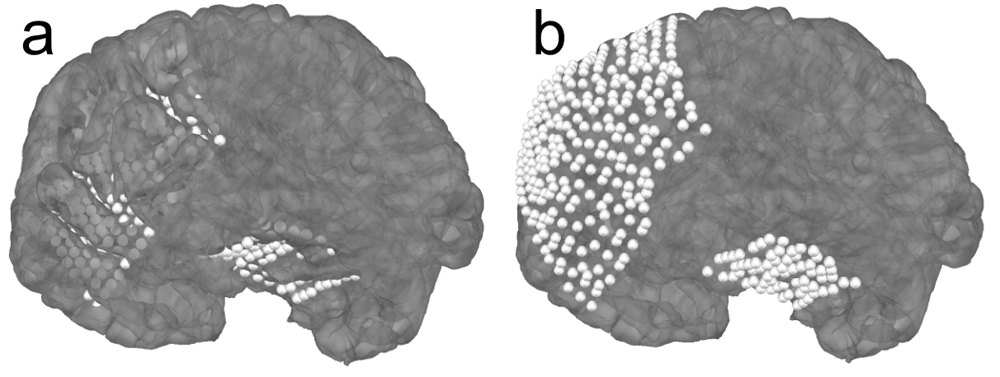
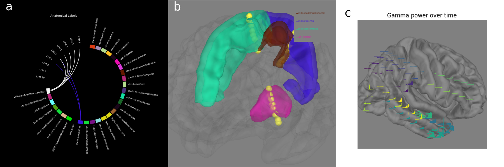

# Summary

Intracranial electrophysiology analysis requires precise location and anatomical labeling of electrode recording contacts before a signal processing analysis of the data can be interpreted. Signal processing techniques are common to other electrophysiology modalities such as magnetoencephalography (MEG) and electroencephalography (EEG) so ideally locating and labelling intracranial electrodes would be an integrated part of a single analysis software. This functional module necessary for intracranial electrophysiology analysis was added to MNE-Python [@GramfortEtAl2013a:2013] so that the suite of signal processing and analysis tools in this package can be used more easily by intracranial electrophysiology researchers.

For brain electrophysiology research using stereoelectroencephalography (sEEG) and electrocorticography (ECoG), the raw electrophysiology, neurosurgical planning and neuroimaging needs to be integrated before meaningful interpretation of signal processing analyses can occur. Typically, for a patient with an intracranial electrophysiology recording, a pre-operative magnetic resonance (MR) image is collected which provides detailed individual brain anatomy, a post-operative computed tomography (CT) image is collected which provides a high-resolution image with 3D contact locations (though this can also be provided by a post-operative MR) and the surgical plans link the names of the contacts in the recording with their positions.

To integrate these electrophysiology and imaging data, first, the CT must be aligned to the MR in order to associate the positions of the electrode contacts with the brain areas that they were recording from. In MNE-Python, these are aligned using a mutual information histogram-matching approach using Dipy [@GaryfallidisEtAl2014:2014] that works without manual pre-alignment.

{ width=100% }

Next, electrode contact locations are selected in merged CT-MR coordinates using a graphical user interface (GUI) implemented in PyQt. In the GUI, users click or scroll though slices to find the location of contacts. When the user navigates to the location of a channel, the channel name can be selected from a menu of the names from the recording file, and then the user can mark the channel as associated with that location. The channel is then rendered in the 3D view as well as colored on the slice plots.

{ width=100% }

{ width=100% }

Located electrode contacts in merged CT-MR coordinates for an individual subject can be morphed to a template brain for group analysis. This is done using a symmetric diffeomorphic registration [SDR; @GaryfallidisEtAl2014:2014]. This non-linear mapping tends to be more accurate than a linear transformation such as the Talairach transform [@DaleEtAl1999:1999] as shown in Figure 4.

{ width=100% }

For ECoG electrodes, "brain shift", caused by changes in pressure during the craniotomy, can also be accounted for using MNE-Python. This shift causes grid and strip electrodes to be deeper in the post-operative CT than they were in the pre-operative MR. This makes it so that the electrodes are inside the pial surface in the pre-operative MRI. In MNE-Python, this is compensated for by projecting the grid to the leptomenigial surface.

{ width=100% }

Once the electrode locations are found both in relation to individual subject anatomy and in relation to a template brain, there are several visualization functions specific to sEEG and ECoG in MNE-Python. For sEEG, plotting the anatomical labels that the electrode shaft passes through in order can be helpful in indicating which areas are being recorded from as shown in Figure 6. Furthermore, these areas can be rendered in different colors in 3D for precise visualization of the trajectory and location of the electrodes as shown in Figure 7. For ECoG, viewing a time series superimposed on a view of the 3D rendering enables the data to be displayed in relation to nearby channels, as shown in Figure 8.

{ width=100% }

{ width=100% }

{ width=100% }

# Statement of need

Integrating intracranial electrode location and analysis into MNE-Python allows researchers to generate analyses and see results from raw data in an all-in-one package that follows modern coding best practices, including unit tests, continuous integration, and thorough documentation. This integration provides immediate access to a wide variety of algorithms for different analyses of interest.

Previous work on intracranial software has typically come in the form of standalone packages [@HamiltonEtAl2017:2017, @GroppeEtAl2017:2017]. However, these are difficult to maintain as the group of developers and number of users tends to be relatively smaller, thereby hampering software maintenance as the developers transition to other projects. MNE-Python is a general-purpose electrophysiology analysis package which makes it easier to retain a larger core group of developers and makes it more likely that this package and the intracranial functionality will be maintained and improved upon long-term. MNE-Python also has stability due to the funding it receieves directly for development from instutitions such as NIH and the Chan-Zuckerberg open-source initiative.

Other general purpose packages provide similar functionality [@OostenveldEtAl2011:2011, @TadelEtAl2011:2011] but are in MATLAB and so can be difficult for researchers to integrate into analyses that are scripted in Python, and often require a MATLAB license for full functionality. Previous work in Python also provides similar functionality [@HamiltonEtAl2017:2017] but was not designed for sEEG electrode location. Adding the ability to control various aspects of the visualization (e.g., electrode contact marker size, opacity, multiple views, etc.) makes this task much easier, both for sEEG and ECoG. Additionally, compared to this previous work, MNE-Python: utilizes an SDR morph, which is orders of magnitude faster (approximately 15 minutes compared to 15 hours) and comparibly accurate [@GaryfallidisEtAl2014:2014]; has a "snap to center" of the electrode contact feature to both increase accuracy and repeatability (this feature uses the center of mass of all voxels that monotonically decrease from the highest intensity voxel nearby the selected location); has an integrated 3D view which updates upon selection; and uses a predetermined list of channel names from the recording file to speed up the localization process and eliminate matching errors. In general, the intracranial electrode location and analysis in MNE-Python is implemented using modern coding best practices, is feature complete for intracranial analysis, has user-friendly features, and is poised to be a well-maintained tool into the future.

# Acknowledgements

We acknowledge Liberty Hamilton for her work [@HamiltonEtAl2017:2017] which was especially helpful to use as a comparison and to build off conceptually in the development of this project.

# References